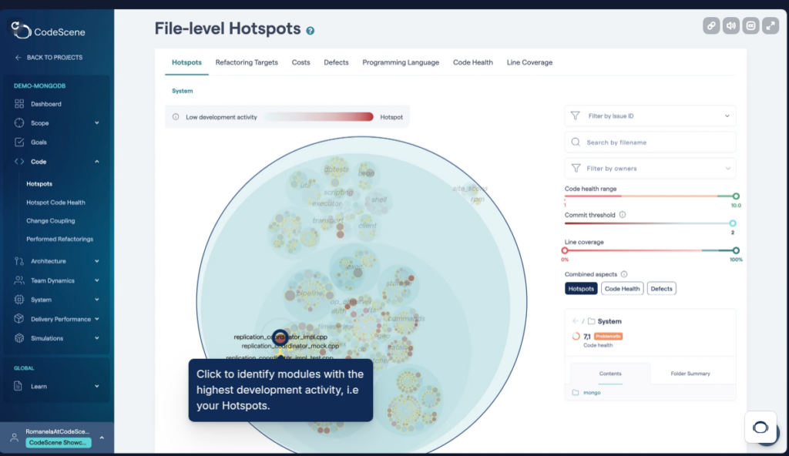
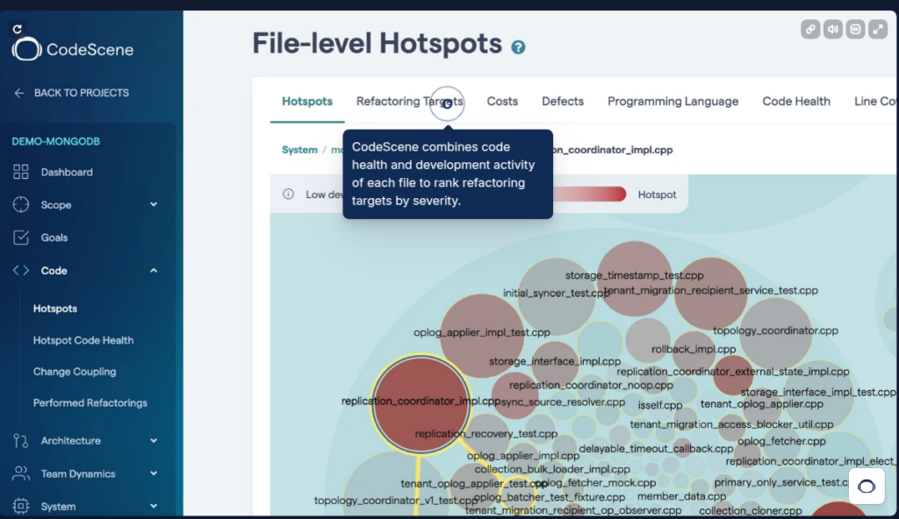
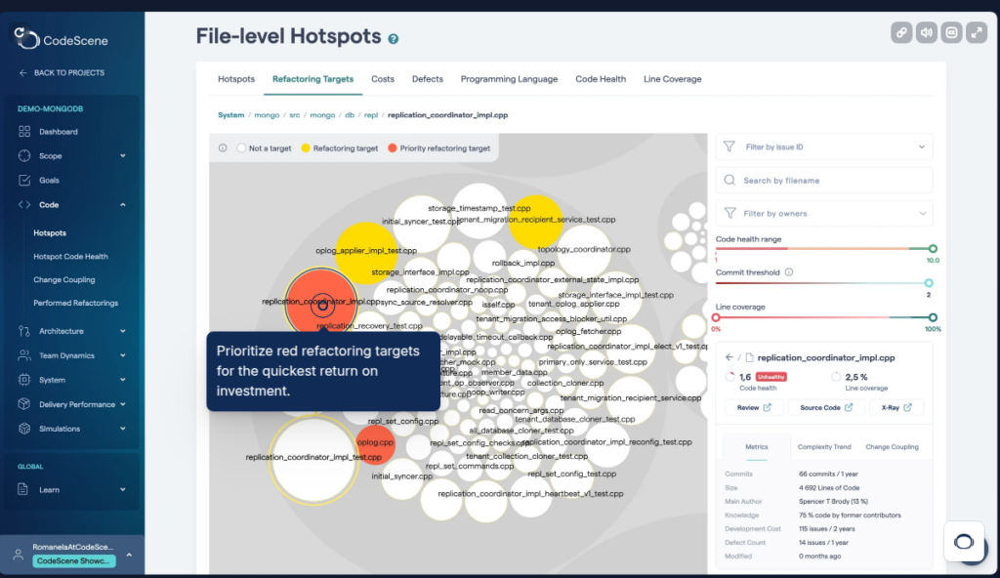
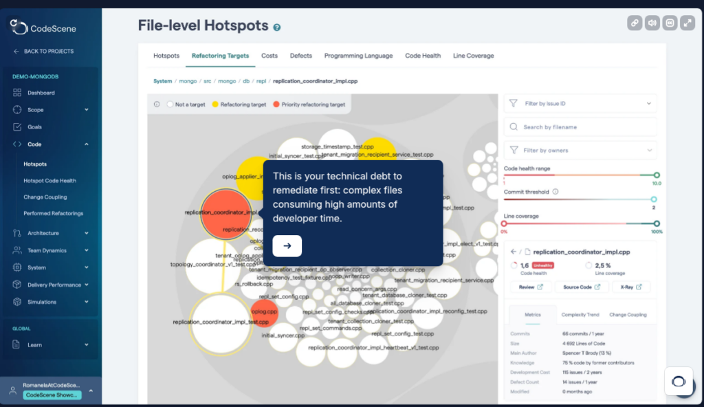
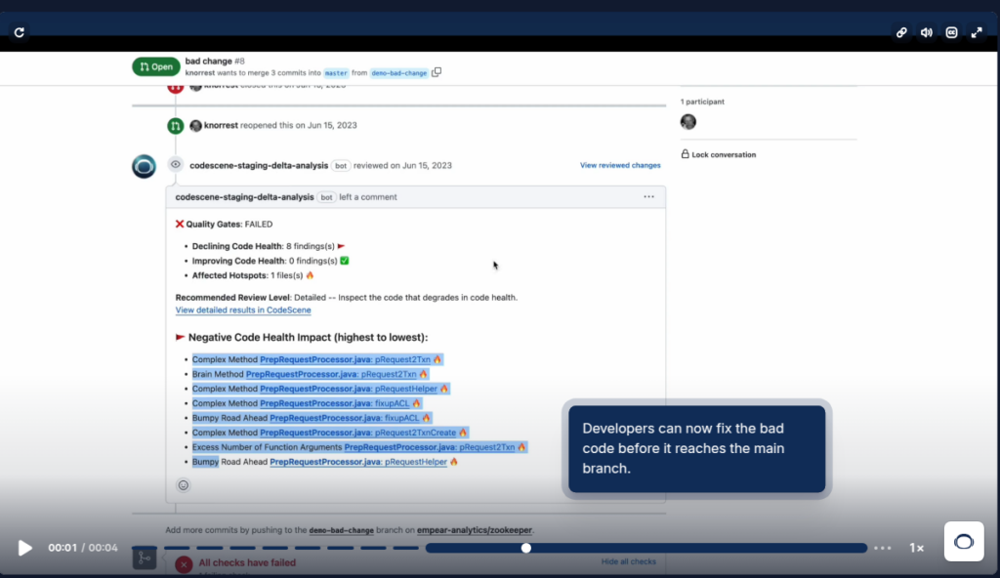
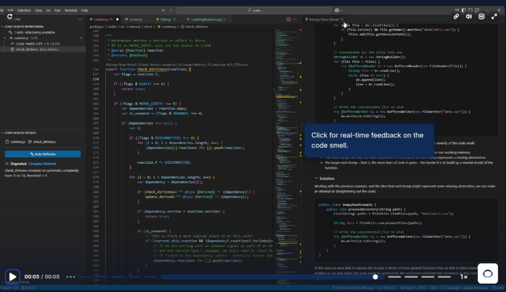

## 技術負債が与えるビジネスインパクトに関する研究

「Code Red: The Business Impact of Code Quality– A Quantitative Study of 39 Proprietary Production Codebases」という研究で内部品質の低いコードがビジネスに与える影響について調査がされています。

[https://arxiv.org/pdf/2203.04374](https://arxiv.org/pdf/2203.04374)

具体的には、「高品質のコードを解決するよりも2倍以上の時間がかかり、低品質のコードは欠陥密度が15倍高い」ということが報告されています。

> コード品質は依然として抽象的な概念であり、ビジネスレベルでは浸透していません。そのため、ソフトウェア企業はコード品質を犠牲にしてでも、市場投入までの時間や新機能の追加を優先しています。その結果、技術的負債が膨れ上がり、開発者の時間の最大42%が無駄になっていると推定されています。同時に、世界的にソフトウェア開発者の不足が深刻化しており、開発者の生産性がソフトウェアビジネスの鍵を握っているといえます。当社のミッションは、コード品質を単なる技術的な側面ではなく、ビジネス上の懸念事項として扱うようにすることです。当社の第一の目標は、コードの品質が、1) 報告された欠陥の数、2) 問題解決までの時間、3) 期限内の問題解決の予測可能性にどのような影響を与えるかを理解することです。私たちは、ソースコード分析、バージョン管理マイニング、Jiraからの問題情報の組み合わせに基づくCodeSceneツールを使用して、さまざまな分野の39の独自開発のコードベースを分析しました。30,737のファイルのアクティビティを分析した結果、低品質のコードには高品質のコードの15倍の欠陥が含まれていることが分かりました。さらに、低品質のコードの問題解決には、平均して開発時間の124%増が必要であることも分かりました。最後に、低品質コードの問題解決には、最大サイクル時間が9倍長くなるという形で、より高い不確実性が伴うことを報告します。この研究は、コードの品質が技術的な懸念事項として無視できないことを示す証拠を提供しています。欠陥が15分の1になり、開発速度が2倍になり、問題解決の時間が大幅に予測可能になるため、高品質コードのビジネス上の利点は明白であるはずです。
> 
> Code quality remains an abstract concept that fails to get traction at  
> the business level. Consequently, software companies keep trading  
> code quality for time-to-market and new features. The resulting  
> technical debt is estimated to waste up to 42% of developers’ time.  
> At the same time, there is a global shortage of software developers,  
> meaning that developer productivity is key to software businesses.  
> Our overall mission is to make code quality a business concern, not  
> just a technical aspect. Our first goal is to understand how code  
> quality impacts 1) the number of reported defects, 2) the time to  
> resolve issues, and 3) the predictability of resolving issues on time.  
> We analyze 39 proprietary production codebases from a variety  
> of domains using the CodeScene tool based on a combination of  
> source code analysis, version-control mining, and issue information from Jira. By analyzing activity in 30,737 files, we find that low  
> quality code contains 15 times more defects than high quality code.  
> Furthermore, resolving issues in low quality code takes on average  
> 124% more time in development. Finally, we report that issue resolutions in low quality code involve higher uncertainty manifested  
> as 9 times longer maximum cycle times. This study provides evidence that code quality cannot be dismissed as a technical concern.  
> With 15 times fewer defects, twice the development speed, and  
> substantially more predictable issue resolution times, the business  
> advantage of high quality code should be unmistakably clear.
> 
> [https://arxiv.org/pdf/2203.04374](https://arxiv.org/pdf/2203.04374)

## 「LoC」では内部品質を正しく定義できない

この研究では、コードの内部品質の状態を定義するための尺度の妥当性についても検証しています。

例えばLoC(Lines of Code)という「コードあたりの行数」を表した尺度があります。

この尺度は結構一般的で「LoCが高いファイルほどファイルが巨大なので複雑」「すなわちLoCが高い場合は複雑性が高く品質が低いコードである」という考えのもので利用されていたりするようです。

しかし、この研究内で「LoCと問題解決にかかる時間」について調査したところ、強い相関は見られなかったそうです。

> コード品質の評価基準については、数多くの研究が行われている \[5, 52\]。
> 
> 主に、ソフトウェアソリューションの包括性を伝えるため、または開発タスクにどれだけの作業が必要かを伝えるために使用されるが、行数（LoC）の測定基準は、コード品質の測定基準にもしばしば関わっている\[2\]。
> 
> その根底にある仮定は、ファイルの行数が多いほど、そのファイルは複雑であるということである。また、我々の研究の範囲内では、大きなファイルに変更を加えることは、通常、小さなファイルに変更を加えるよりも多くの労力を必要とするという仮定を立てている。
> 
> この仮説を検証するために、私たちは、私たちのデータセット（セクション4.2でさらに詳しく説明）において、LoCが問題解決時間の予測に使用できるかどうかを調査することで、研究の準備を行いました。
> 
> 私たちは、追加されたLoCと、対応するファイルにおける平均的な問題解決時間との間に、低いピアソンの相関関係（r=0.13）があることを発見しました。
> 
> There are numerous studies on code quality metrics \[5, 52\].
> 
> Al-though primarily used to communicate how comprehensive a soft-ware solution is or how much work a development task would require, Lines of Code (LoC) metrics are often involved also in code quality metrics \[2\].
> 
> An underlying assumption is that the higher LoC a file has file, the more complex it is. Also within the scope of our research, we assume that making a change in a large file would typically require more effort than in a smaller file.
> 
> To verify that assumption, we prepared our research by investigating if LoC could be used to predict issue resolution times in our data set (further de-scribed in Section 4.2).
> 
> We found a low Pearson correlation (r=0.13) between added LoC and the average issue resolution time in corre-sponding files.

## CodeHealthと問題解決時間に相関がある

そこで内部品質を定義する際に利用されたツールが「CodeSene」というツールです。

[https://codescene.com](https://codescene.com)

このツールではCodeHealthというメトリクスがあり、この研究の中で「CodeHealthと問題解決時間に高い相関があった」として、Code Sceneというツールを利用することになったと言っています。

> CodeSceneのCode HealthがLoCを超える予測値を追加していることを確認するために、私たちのデータセットの問題解決時間との相関を分析しました。LoCと同様に、未加工のCode Healthスコア（10.0から、1.0まで）と、対応するファイルの平均問題解決時間との間のピアソン相関を計算しました。その結果、より高い相関（r=-0.58）が見つかり、Code Healthは本研究に有効な指標であると結論づけました。
> 
> To confirm that CodeScene’s Code Health adds predictive value  
> beyond LoC, we analyzed its correlation with issue resolution times  
> for our data set. Analogous to LoC counterpart, we calculated the  
> Pearson correlation between the raw Code Health scores (10.0 down  
> to 1.0) and the average issue resolution times in corresponding files.  
> We found a higher degree of correlation (r=-0.58) and conclude that  
> Code Health is a valid metric for this study.

## CodeSceneでできること

以下にCodeSceneでできることを紹介します。

### 開発が集中しているホットスポットとなるファイルを可視化

### CodeHealthの深刻度によってリファクタリングした方が良い対象を可視化

## リファクタリングによる投資対効果が早期に見込めるコードを可視化

## 多大な開発工数を割いており、まず返済すべき技術的負債を可視化

### GitHubのPRでCodeHealthを高めるように自動レビュー

## IDE上でCodeHealthを高めるようにレビュー

## とはいえ、要求から仕様が複雑になっているのかの区別はつけられなさそうなので注意

ただこの手のツールで気になる点が「複雑な要求を満たすために仕様が複雑化している場合」を考慮して助言してくれない点です。

ツール側がめっちゃ複雑ですよと言ってくる部分はそもそも要求が複雑なのでどうしよもない場合は、ツールの言ってくることは当たり前の内容になります。

この状態が続くと、開発者側がツールの助言を無視するようになっていくので、「ツール導入したのにあんまり意味ねぇや」となりそうな点に注意したいですね。
