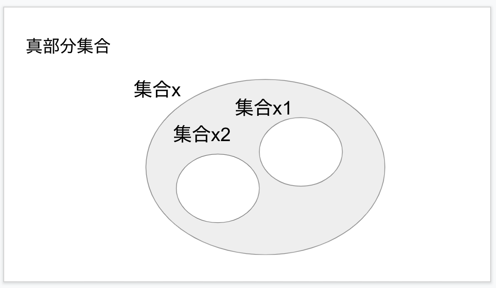
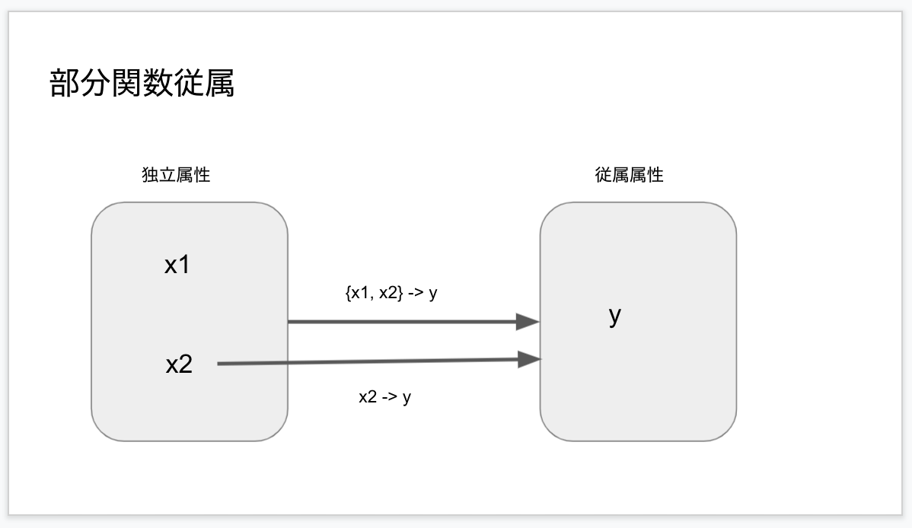
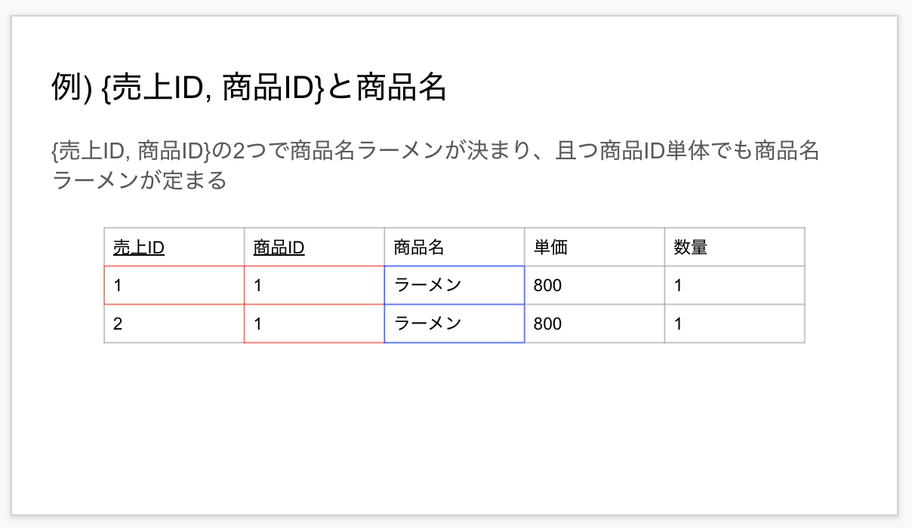
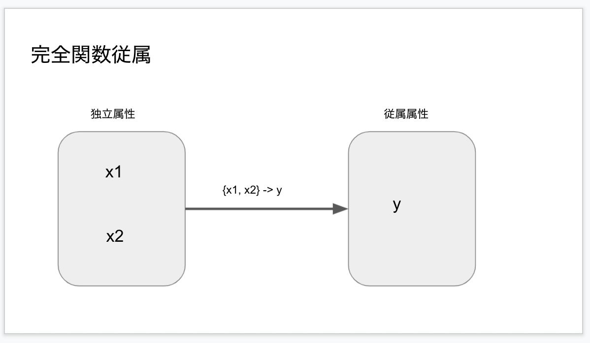
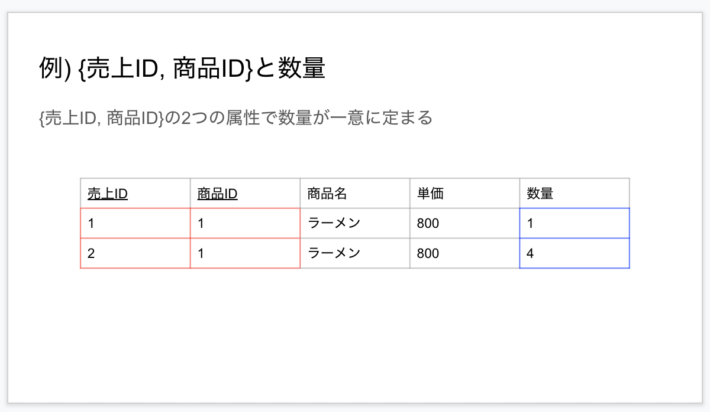
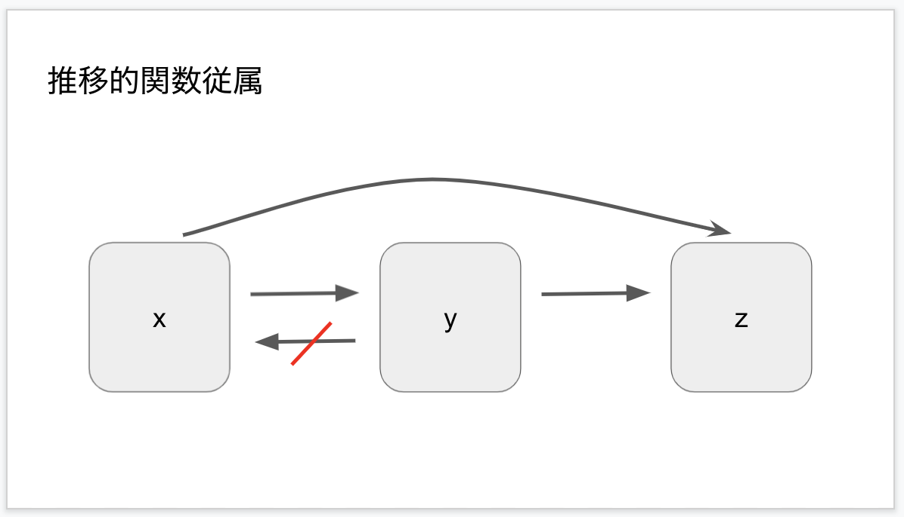
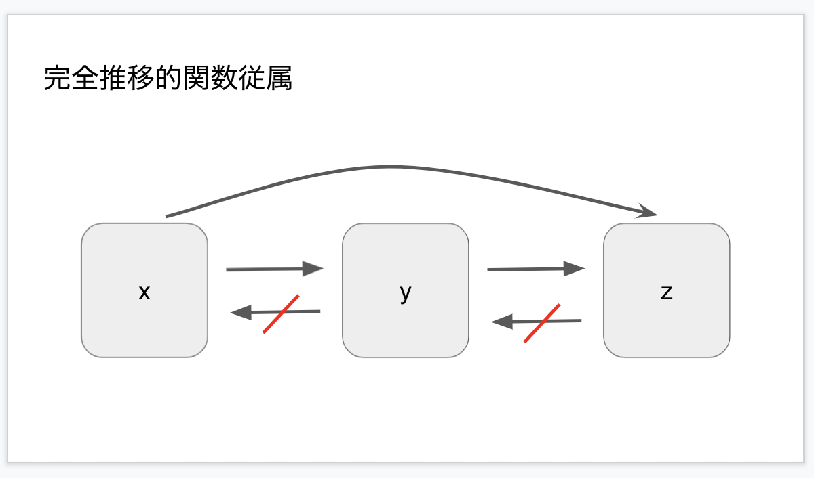
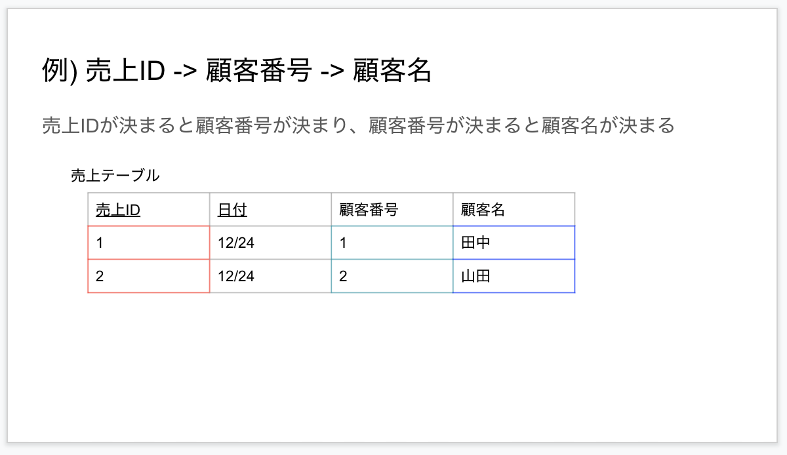

## 関数従属

- 概要…ある属性xの値が決めると他の属性yの値が一意に決まる関係のことを関数従属と呼ぶ。属性xのことを独立属性(決定項)といい、属性yを従属属性(従属項)という。関数従属に着目することで、正規化することが重要。

- 表記
    - x -> y (xならばyと読む) : xに対して単一のyが決まる場合の表記
    
    - x ->-> y : xに対して集合yが決まる場合の表記

- 独立属性(決定項)…ある値を決める値。属性xのこと

- 従属属性 (従属項)…独立属性によって決まる値。属性yの事

- 例) 顧客ID(決定項)が決まる時, 顧客名(従属項)が一意に決まる

## 真部分集合

- 集合x1がxの部分集合であり、x1=x出ない真に, x1はxの真部分集合という。

## 部分関数従属

- x ->yの関係において、yがxの真部分集合にも関数従属する時, yはxに部分関数従属するという。

- {x1, x2} -> yが成り立ち、かつx2->yが成り立つ場合、{x1, x2}とyの間に部分関数従属が存在する

- 例) 売り上げ明細票(売り上げID, 商品ID, 商品名, 単価, 数量)というテーブルで、売り上げIDと商品IDの2つを主キーとしたとき、{売り上げID, 商品ID}-> 商品名, 商品ID->商品名の2つが成り立つので、{売り上げID, 商品ID}と商品名の間には部分関数従属の関係が存在する

## 完全関数従属

- x -> yの関係において、yがxのどの真部分集合にも関数従属しないこと

- {x1, x2} -> yのみが成り立つケースが完全関数従属。x2->yも成り立つ場合は完全関数従属ではなく部分関数従属となる。

- 例) 完全関数従属が成り立つ場合  
    

## 推移的関数従属

- 間接的に関数従属している関係のこと

- 例えば、属性x, y zに対して、x->y, y->zが成り立ち, y->xが成り立たないとき, zはxに推移的関数従属しているという。

- さらにz->yが成り立たない場合は,zはxに完全推移的関数従属しているという。

- 例) 推移的関数従属の図  
    

## 参考

- ミック, 達人に学ぶデータベース設計徹底指南書, 2012, [https://amzn.to/41QyqdE](https://amzn.to/41QyqdE)

- 大滝 みや子, 平成30年度\[春期\]\[秋期\]応用情報技術者合格教本, [https://amzn.to/4bSUedc](https://amzn.to/4bSUedc)
