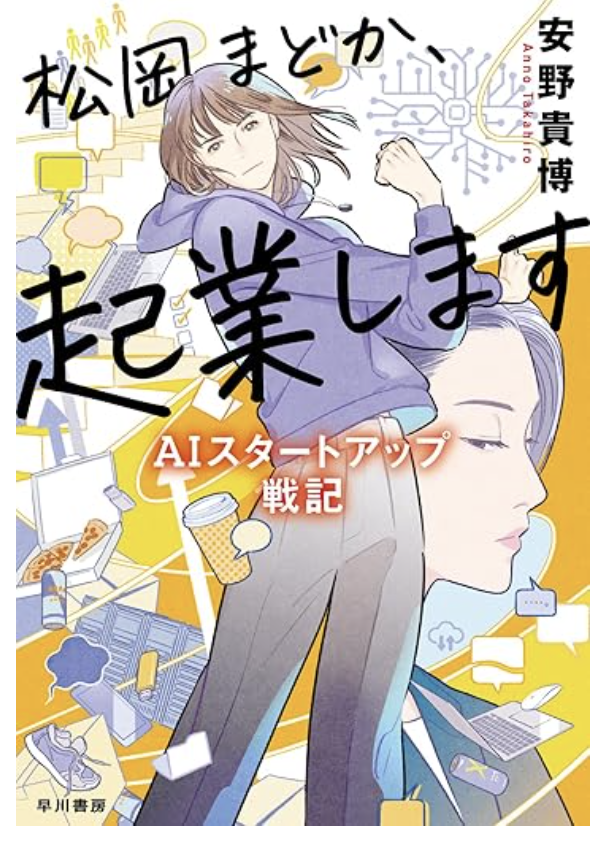
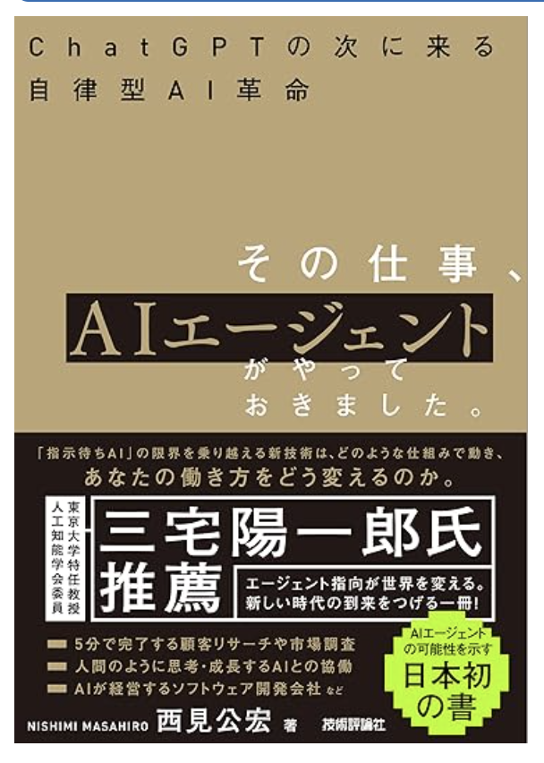

## はじめに

2024年の年の瀬にシュッと読んだ本がなかなか面白く、テーマも生成AIと皆さんのお仕事にも少し役立ちそうな気がしたので、せっかくなのでブログで共有します。

## 概要

この小説は新卒で生成AIスタートアップを立ち上げるSF小説です。

> 日本有数の大企業・リクディード社のインターン生だった女子大生の松岡まどかはある日突然、内定の取り消しを言い渡される。さらに邪悪な起業スカウトに騙されて、1年以内に時価総額10億円の会社をスタートアップで作れなければ、自身が多額の借金を背負うことに。万策尽きたかに思われたが、リクディード社で彼女の教育役だった三戸部歩が松岡へ協力を申し出る。実は松岡にはAI技術の稀有な才能があり、三戸部はその才覚が業界を変革することに賭けたのだった――たったふたりから幕を開ける、AIスタートアップお仕事小説！

## 読みどころ(1) スタートアップ起業の臨場感が味わえる

この小説の一番の読みどころは、「スタートアップ企業の臨場感が味わえること」です。

「サービスを考えて、プロトタイピングして、資金調達して、うまくいかなくてピボットして、ピボット前のサービスを開発していたエンジニアと揉めて、資金が底をつきそうで絶望しつつも死ぬ気で頑張って、、」といった具合で**短い期間で目まぐるしく状況が変化**します。

私はスタートアップ起業したことはありませんが、**サービスを立ち上げる大変さや人間ドラマ**がリアルに伝わってきて、とても面白いです。

## 読みどころ(2) 数年後の生成AIエージェントへの期待感が膨らむ

他に読みどころがあるポイントは、「**数年先の生成AIが進化した未来を感じられること**」です。

この小説の主人公は、自分で生成AIをトレーニング&チューニングして、**自分好みのAIエージェントを複数体所持**しています。

そのAIエージェントに声をかけて、「プログラムを書かせたり」「メルカリの値引き交渉をさせたり」「ウーバーイーツを頼んでもらったり」「悩みを聞いてもらったり」と絶妙に現時点の生成AIでできそうなことをして暮らしています。

また、これらの**生成AIのエージェント同士で議論させることで単体での性能が低いAIのアウトプットの質を向上**させたりといったこともしています。

ちなみにこの考え方は**マルチエージェント**というもので、「**今後の生成AIのトレンドの一つになりそうだ**」とサムアルトマンも言ってるそうです。

以下の書籍でマルチエージェントAIを使ったプロダクトについて詳しく解説されており、実際にマルチエージェント的なアプローチで**会社組織を作って複数のAIエージェントに様々な役割を振ってタスクを実行**させる例などが紹介されているので、読んでみてください。

## おわりに

久しぶりに自分に刺さる面白い小説に出会った気がしました。

自分は大学院の研究で「中央銀行デジタル通貨の決済アルゴリズムの開発」と「マルチエージェントシミュレーションによる評価」をしていたので、「ついに精度の高いAIエージェントでマルチエージェントできる未来が到来したか、、」と胸が高鳴りました。

この本を読んだ後に「仕事に対するモチベ」や「AIに対する知識欲」も高まったので、皆さんもぜひ読んでみてください。
