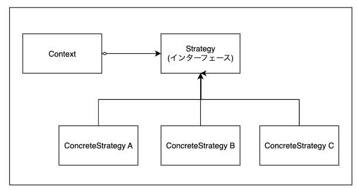
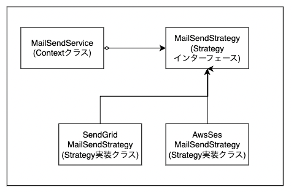

## はじめに

今回はGOFのデザインパターンであるStrategyパターンを利用して、外部メールサービスを簡単に切り替えられるようにしました。

## 背景

仕事先では外部メールサービスとしてSendGridというサービスを利用していました。

このサービスはtwilloが提供するグローバルなサービスで非常に使い勝手が良いものでした。

しかし、月間250万件以上のメールを送信することになると、基本料金から超過した高い料金を払わないといけなくなり、コスト的に懸念がありました。

## 課題

そこで、メールサービスを業界で格安でありAWS SESに切り替えたいとなりました。

しかし、過去にメールに関する障害が起こっていたことから、Biz側の反応的にメールサービスを切り替えるなどとんでもないという状況でした。

具体的には、過去に某D社のキャリアメールに対して、メールが到達しないことがあり、サービス利用ができないということがありました。

## 解決策

そこで、「新旧のメールサービスを簡単に切り替えられるようにするので、リリース後でも10分以内に簡単に元に戻せる」ということを伝えたうえで、

「メール送信コストが月数百万以上下がる見込みがありますよ」というメリットをBiz側に伝えて、メールサービス移行の下地づくりを始めました。

具体的には「Strategyパターンを利用して環境変数で簡単にメールサービスを切り替えられる」ようにしました。

## Strategyパターン

Strategyパターンとは「アルゴリズムの集合を定義し、各アルゴリズムをカプセル化して、それらを交換可能にする」パターンです。

具体的には、Strategyというインターフェースを実装する複数のConcreteStrategyというクラスを定義し、ContextというクラスからStrategyを呼び出すようにすることで、簡単にConcreteStrategyの処理を切り替えられるようにするというものです。



Strategyパターン(GOF本を元に作成)

今となってはインターフェースを普通に使っているだけじゃないかと思いますが、90年代にStrategyパターンという名前で登場した設計パターンらしいです。

(蛇足ですが、90年代に登場したデザインパターンはフレームワークやライブラリレベルで使えるものが増えてきたことで、あえて今使うことはあまりないなと感じています。例えば、Builderパターンはlombokというライブラリで簡単に利用できるので自分で1から実装することはないですよね。)

## 外部メールサービスの切り替え

このStrategyパターンを適応して、以下のように外部メールサービスを切り替え容易になるように設計しました。

具体的にはContextクラスとしてMailSendServiceクラスを定義して、メール送信はこのエンドポイントとなるクラスを呼び出すようにします。

次にこのContextクラスからMailSendStrategyインターフェースを実装したStrategy実装クラス SendGridMailSendStrategy・AwsSesMailSendStrategyを呼び出すようにすることで、外部メール送信呼び出しを切り替えられるようにしています。



Strategyパターンを利用した外部メールサービス送信の設計

実装のイメージとしては以下の通りです。

### MailSendService

```
import org.springframework.beans.factory.annotation.Autowired;
import org.springframework.beans.factory.annotation.Value;
import org.springframework.stereotype.Service;
import org.springframework.context.ApplicationContext;

@Service
public class MailSendService {
    private final MailSendStrategy mailStrategy;

    @Autowired
    public MailSendService(ApplicationContext context, @Value("${mail.service}") String service) {
                // 実際はgetBeanとか使わずに実装しましたが、イメージは以下のとおりです。
        this.mailStrategy = context.getBean(service, MailSendStrategy.class);
    }

    public void send(MailParam mailParam) {
        mailStrategy.send(mailParam);
    }
}
```

### MailSendStrategy

```
public interface MailSendStrategy {
    void send(MailParam mailParam);
}
```

### SendGridMailSendStrategy

```
import org.springframework.stereotype.Component;

@Component("sendGridMailStrategy")
public class SendGridMailSendStrategy implements MailSendStrategy {
    @Override
    public void send(MailParam mailParam) {
        // SendGridのAPIを呼び出す実装
        System.out.println("Sending via SendGrid: " + mailParam.getContent());
    }
}
```

### AwsSesSendMailStrategy

```
import org.springframework.stereotype.Component;

@Component("awsSesMailStrategy")
public class AwsSesMailStrategy implements MailSendStrategy {
    @Override
    public void send(MailParam mailParam) {
        // AWS SESのAPIを呼び出す実装
        System.out.println("Sending via AWS SES: " + mailParam.getContent());
    }
}
```

## おわりに

今回は外部サービスの移行をStrategyパターンを利用することで、安全に移行する方法についてご紹介しました。

このパターンを適応することで段階的に外部サービスの検証を進めつつ、必要であれば元の外部サービスに切り戻せるようにしました。

みなさんも、似たようなケースで段階的にアルゴリズムを安全に切り替える必要がある場合はぜひ使ってみてください

## 参考

- 構造計画研究所, SendGrid 料金プラン https://sendgrid.kke.co.jp/plan/

- p335「オブジェクト指向における再利用のためのデザインパターン」, [https://amzn.to/4ixLQ51](https://amzn.to/4ixLQ51)
