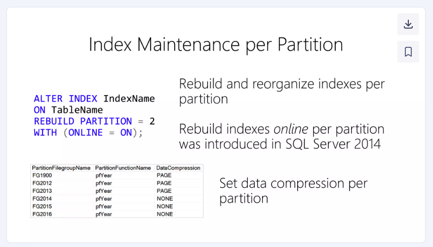

## はじめに

今回は、7億行ものデータ行を持つテーブルの日付カラムにパーティションを導入することで、delete文が高速になるかどうかを検証しました。

また、検証対象テーブルのファイルグループを、デフォルトでデータが格納されるPRIMARY以外にすることで、さらに高速化の効果が得られるかについても調査しました。

## \[検証環境\] 利用DB、スペック、対象テーブル

検証環境のDBとしてはRDS(SQL Server)を利用しました。SQL Serverのバージョンは2019年のものです。

また、インスタンスサイズは「db.m5.8xlarge」「db.m5.4xlarge」の2つで検証を行いました。

検証対象のテーブルは取引履歴を積む「transaction\_history(仮称)」というテーブルであり、合計で7.5億行にも及ぶ巨大なテーブルです。

また、このテーブル行数の内訳として、2022年の期間では280万行、2023年の期間では2.5億行、2024年の期間では4億9000万行が格納されています。

またデータ量としてはパーティションを入れた場合は「2,193,809,496 KB」、パーティションを入れなかった場合は「2,129,243,664 KB」ほどでした。

| name | rows | reserved | data | index\_size | unused |
| --- | --- | --- | --- | --- | --- |
| transaction\_history (パーティションあり) | 746,806,712 | 2,193,809,496 KB | 1,960,964,592 KB | 231,407,032 KB | 1,437,872 KB |
| transaction\_history(パーティションなし) | 746,806,712 | 2,129,243,664 KB | 1,970,969,736 KB | 157,915,976 KB | 357,952 KB |

## \[検証準備\] パーティション化されたテーブルの作成

また検証対象のテーブルとパーティション関数、パーティションスキーマは以下の通りです。

### パーティション関数

パーティションは日付カラムに設定しており、少し細かめに月毎に分けています。

```
DECLARE @StartYear INT = 2023;
DECLARE @EndYear INT = 2043;
DECLARE @SQL NVARCHAR(MAX) = 'CREATE PARTITION FUNCTION [MonthlyTransactionPartitionFunction] (DATE) AS RANGE RIGHT FOR VALUES ('

-- 月と年の範囲を生成
WHILE @StartYear <= @EndYear
BEGIN
    DECLARE @Month INT = 1;
    WHILE @Month <= 12
    BEGIN
        -- 日付の文字列を生成（年-月-01）
        SET @SQL += '''' + CAST(@StartYear AS VARCHAR(4)) + '-' + RIGHT('0' + CAST(@Month AS VARCHAR(2)), 2) + '-01'', ';
        SET @Month += 1;
    END
    SET @StartYear += 1;
END

-- 最後のコンマを取り除く
SET @SQL = LEFT(@SQL, LEN(@SQL) - 1);

-- SQL文を完成させる
SET @SQL += ');';

-- SQL文を実行
EXEC sp_executesql @SQL;
```

### パーティションスキーマ

```
-- パーティションスキーマの作成
CREATE PARTITION SCHEME MonthlyTransactionPartitionScheme
AS PARTITION MonthlyTransactionPartitionFunction
ALL TO ([PRIMARY]);
```

### CREATE TABLE

```
CREATE TABLE transaction_history (
	[id] [bigint] IDENTITY(1,1) NOT NULL, 
        -- 取引日時を格納するdate型のカラム 
	[transaction_date] [date] NOT NULL,
	[other_column1] [bigint] NOT NULL,
	... 
	[other_column1] [nvarchar](max) NULL,
	CONSTRAINT PK_partitioned_transaction_history PRIMARY KEY CLUSTERED ([id], [transaction_date] ASC)
) ON MonthlyTransactionPartitionScheme(transaction_date);
```

## \[検証\] deleteクエリの性能検証

### 実行した検証クエリ

検証クエリは以下の通りで、transaction\_historyテーブルに対してインデックス列transaction\_dateを用いたdelete文を実行しました。

```
delete transaction_history
where transaction_date = '2025-02-07'
```

### 結果. 160万行の削除行数に対して、パーティション化されたテーブルは47秒で実行完了した

その結果、160万件の削除行数に対して、パーティション化されたテーブルは47秒程度で実行が完了しました。

これはパーティション化されていないテーブルに対して4.7倍高速であり、実行計画からもpartitioned = trueとしてパーティションが利用されていることが確認できたことから、パーティション導入による性能改善が有意に現れていました。

ただし、検証対象テーブルのファイルグループをPRIMARY以外にした場合は特に高速化の効果は出ていませんでした。

| テーブル名 | 削除行数 | 削除時間(秒) | パーティション利用有無 | インスタンスサイズ | ファイルグループ |
| --- | --- | --- | --- | --- | --- |
| transaction\_history | 1,674,905 | 221 |  | db.m5.8xlarge | PRIMARY |
| transaction\_history | 1,648,302 | 47 | o | db.m5.8xlarge | PRIMARY |
| transaction\_history | 1,610,000 | 210 |  | db.m5.4xlarge | PRIMARY |
| transaction\_history | 1,610,000 | 46 | o | db.m5.4xlarge | PRIMARY |
| transaction\_history | 1,610,000 | 65 | o | db.m5.4xlarge | OTHER\_FILE\_GROUP |
| transaction\_history | 1,610,000 | 64 | o | db.m5.4xlarge | OTHER\_FILE\_GROUP |

## 考察. なぜdeleteが高速化したか？

ここでなぜdeleteが高速化したかについて考えてみます。

通常deleteを実行する場合、対象のテーブルに作成されたindexも更新する必要があります。

しかし、パーティション化されたテーブルでは、インデックスも同時にパーティション化されるので、削除時のオーバーヘッドはパーティション化された範囲内に局所化されます。

以下の資料で、SQL Serverではパーティションごとにインデックスのメンテナンスが可能であることについて言及していますが、これが可能なのも裏側ではパーティションごとにインデックスが管理されているためだと思われます。



[https://www.slideshare.net/slideshow/table-partitioning-in-sql-server/46336281](https://www.slideshare.net/slideshow/table-partitioning-in-sql-server/46336281)

この、「パーティションによるインデックス更新のオーバーヘッドの局所化」について例を挙げて考えてみます。

例えば、パーティション化されていない7億行のテーブルを削除した場合はインデックスの更新で7億行に対して作成されたインデックスを更新するためオーバーヘッドが大変大きいです。

一方で、月毎にパーティション化されている場合は、その月の行数に対して作成されたインデックスのみを更新することになるため、オーバーヘッドは比較的小さくなります。

このため、パーティション化されたテーブルではインデックス更新のオーバーヘッドが小さくなり、結果としてdeleteが高速化されたのではないか？というのが筆者の見立てです。

※ 実際、実行計画ではindex deleteというオペレーションにおいて、partitioned = trueが付いており、パーティションによる影響を受けていそうでした。

## まとめ

今回の検証で、テーブルにパーティションを導入することでdelete文がどの程度高速になるのかを調査しました。

その結果、4~5倍程度高速になることが確認できました。

このようにパーティション化テーブルでは特定のパーティションにおけるデータ削除が高速になるため、「RDBのデータアーカイブのための削除」といった運用タスクの効率化が期待できそうかなと思いました。
