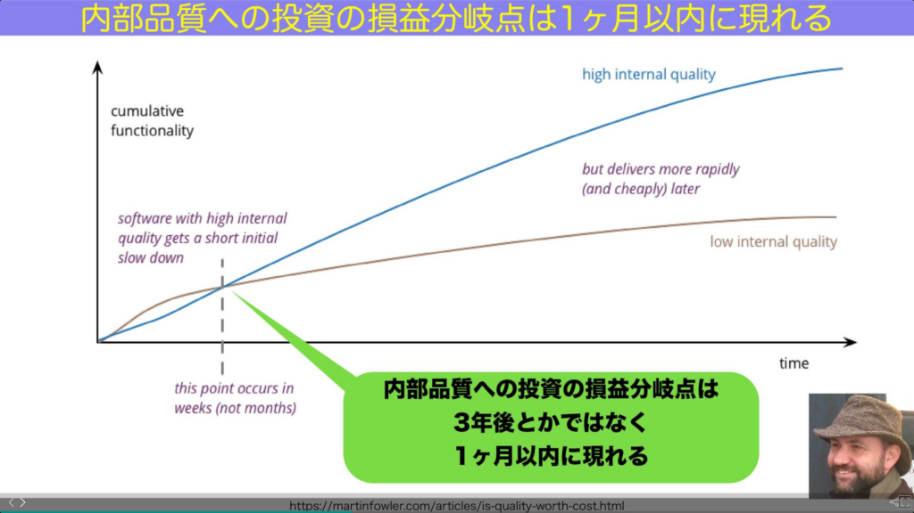

## t\_wadaさんの名講演「質とスピード」

t\_wadaさんの名講演として「質とスピード」というプレゼンがあります。。

https://speakerdeck.com/twada/quality-and-speed-aws-dev-day-2023-tokyo-edition?slide=48

このプレゼンで主張されている「質とスピードはトレードオフじゃない」という意見についてはとても賛同できるものの、一部根拠が薄いと感じた点があります。

## 「内部品質への投資の損益分岐点は1ヶ月以上前に現れる」の論拠は何か？

このスライドの中に「内部品質への投資の損益分岐点は1ヶ月以上前に現れる」というスライドがあります。

このスライドで表示されているグラフはマーチン・ファウラーさんのブログ（[https://martinfowler.com/articles/is-quality-worth-cost.html](https://martinfowler.com/articles/is-quality-worth-cost.html)）から引用されているものであり、「内部品質が高い場合と低い場合で比べると時間と共に内部品質を高く保ったほうが、そうでない場合よりも容易に機能追加しやすくなる分岐点がある」ことを示しています。

## 損益分岐点を定量的に測定することは難しい

しかし、このグラフのすぐそばの記述でマーチン・ファウラーさんは、縦軸の生産性を測定することが難しいため、このグラフの損益分岐点を定量的に測定することは難しいと言っています。

> この時点で、なぜこれが疑似グラフなのかに突き当たる。 ソフトウェアチームが提供した機能を測定する方法はない。 このようにアウトプット、ひいては生産性を測定することができないため、（これも測定が困難な）内部品質の低さがもたらす結果を確かな数字で示すことができない。 アウトプットを測定できないことは、専門的な仕事ではよくあることだ。弁護士や医者の生産性はどうやって測定するのだろうか？
> 
> At this point we run into why this is a pseudo-graph. There is no way of measuring the functionality delivered by a software team. This inability to measure output, and thus productivity, makes it impossible to put solid numbers on the consequences of low internal quality (which is also difficult to measure). An inability to measure output is pretty common among professional work - how do we measure the productivity of lawyers or doctors?
> 
> [https://martinfowler.com/articles/is-quality-worth-cost.html](https://martinfowler.com/articles/is-quality-worth-cost.html)

## 「内部品質への投資の損益分岐点は1ヶ月以上前に現れる」はマーチン・ファウラーさんの主張ではない

つまりt\_wadaさんのスライドで書かれている「内部品質への投資の損益分岐点は1ヶ月以上前に現れる」は同じスライドに表示されているマーチン・ファウラーさんの主張とは異なることになります。

## 「熟練の開発者に聞きましょう」

じゃあ生産性はどうはかるのか？という感じですが、マーチン・ファウラーさん的には熟練の開発者の意見を聞きましょうということらしいです。

> 私がどこで線が交差するかを評価する方法は、知り合いの熟練した開発者の意見を聞くことだ。そして、その答えは多くの人を驚かせる。開発者たちは、質の低いコードは数週間以内に作業速度を著しく低下させることに気づく。だから、社内の品質とコストのトレードオフが適用される場所には、あまり走路はない。小規模なソフトウェア開発であっても、優れたソフトウェア・プラクティスに注意を払うことは有益である。
> 
> The way I assess where lines cross is by canvassing the opinion of skilled developers that I know. And the answer surprises a lot of folks. Developers find poor quality code significantly slows them down within a few weeks. So there's not much runway where the trade-off between internal quality and cost applies. Even small software efforts benefit from attention to good software practices, certainly something I can attest from my experience.  

## 内部品質の影響を測定した研究もあるそう

ただ、マーチン・ファウラーさんのブログの追記で、内部品質の低さがもたらす影響の測定に関する研究について取り上げられていました。

[https://arxiv.org/abs/2203.04374](https://arxiv.org/abs/2203.04374)

> 内部品質の低さがもたらす影響の測定
> 
> 前述したように、内部品質や生産性を測定する方法がよく分かっていないため、内部品質の重要性について定量的な証拠を得ることは難しい。しかし近年、そのような試みが増えてきている。
> 
> 特に興味深い論文として、アダム・トルンヒル（Adam Tornhill）とマーカス・ボルグ（Markus Borg）の研究がある。彼らは独自のツールCodeSceneを使って、39のプロプライエタリなコードベースにあるファイルの健全性レベルを判定している。彼らは、低品質の問題を解決するには、高品質のコードを解決するよりも2倍以上の時間がかかり、低品質のコードは欠陥密度が15倍高いことを発見した。
> 
> Measuring the effects of low internal quality
> 
>   
> As I mentioned above, we don't really know how to measure internal quality, or productivity, and so it's difficult to get quantifiable evidence for the importance of internal quality. However in recent years, there has been increasing efforts to try.
> 
> One particularly interesting paper that I've come across is this study from [Adam Tornhill and Markus Borg](https://arxiv.org/abs/2203.04374). They use their proprietary tool, CodeScene, to determine the health level of files in 39 proprietary code bases. They found that resolving issues in low quality took more than twice as long as doing so in high quality code, and that low quality code had 15 times higher defect density.

具体的には「高品質のコードを解決するよりも2倍以上の時間がかかり、低品質のコードは欠陥密度が15倍高い」とのことです。

この研究自体は価値があると思うものの、「1ヶ月」という数字はどこから来たのか不明ですね、、

この論文についてもまた読んで内容をまとめてみたい思います。
