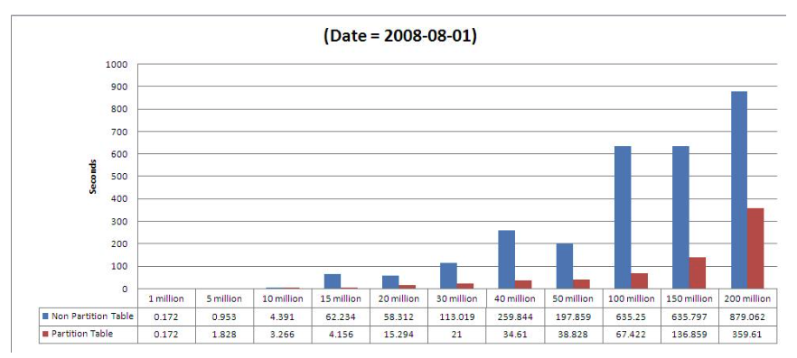
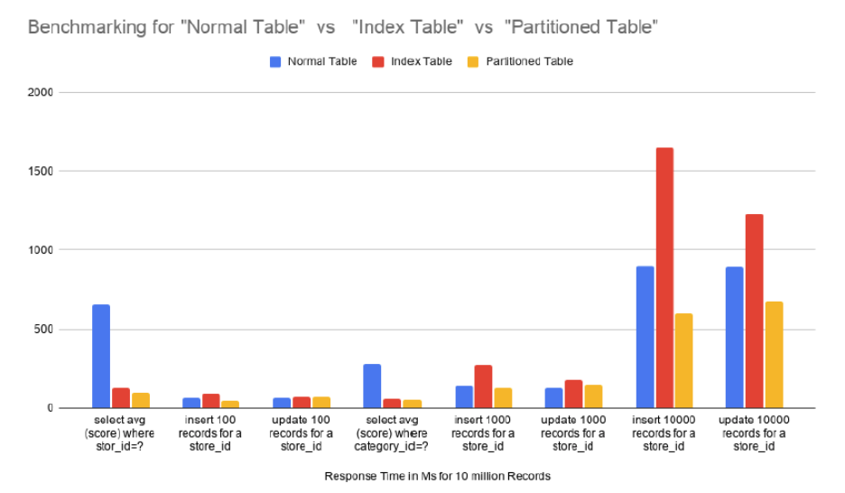
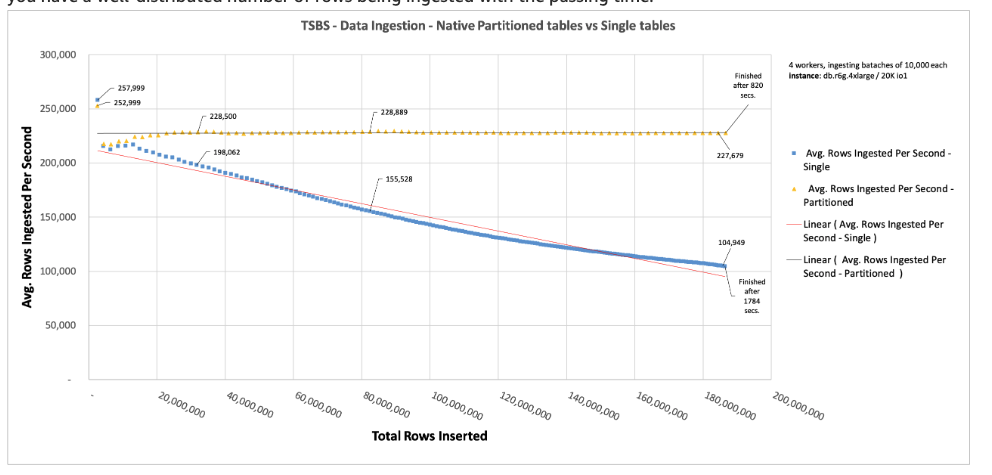

## 事例: 4億行のテーブルに対してselectクエリ実行した場合

4億行で比較したところ、7秒かかるクエリが1秒まで短縮された

https://www.youtube.com/watch?v=f\_N-4\_Qa8-g

## 事例: 20億行のテーブルに対して、selectを実行した場合

20億行のテーブルに対して、selectを実行した場合、パーティションがある場合はない場合に比べて半分の速度でクエリ成功した。

> Search on specified date “2008-08-01”  
> Records Retrieved = 741825  
> Partition Table = 359.61 seconds  
> Non Partition Table = 879.062 seconds

[https://mkyong.com/database/performance-testing-on-partition-table-in-postgresql-part-3](https://mkyong.com/database/performance-testing-on-partition-table-in-postgresql-part-3)

## 事例: 1000万行のテーブルに対して、select/update/insertした場合

1000万行のテーブルに対して、select/update/insertした場合、通常のテーブル・インデックス付き・パーティション付きテーブルのそれぞれでクエリの実行速度を検証

[https://www.talentica.com/blogs/partitioning-database-a-divide-and-rule-strategy](https://www.talentica.com/blogs/partitioning-database-a-divide-and-rule-strategy)

## 事例: 2億行のテーブルにinsert文を実行した場合

秒間の挿入量はパーティション化されたテーブルでは一定だが、そうでないものは1/2程度にパフォーマンスが落ちていく

[https://aws.amazon.com/blogs/database/speed-up-time-series-data-ingestion-by-partitioning-tables-on-amazon-rds-for-postgresql](https://aws.amazon.com/blogs/database/speed-up-time-series-data-ingestion-by-partitioning-tables-on-amazon-rds-for-postgresql)

## 補足: インデックスのメンテナンスはパーティションごとに可能

indexのメンテナンスはパーティションごとに行われる

[https://www.slideshare.net/slideshow/table-partitioning-in-sql-server/46336281#1](https://www.slideshare.net/slideshow/table-partitioning-in-sql-server/46336281#1)
