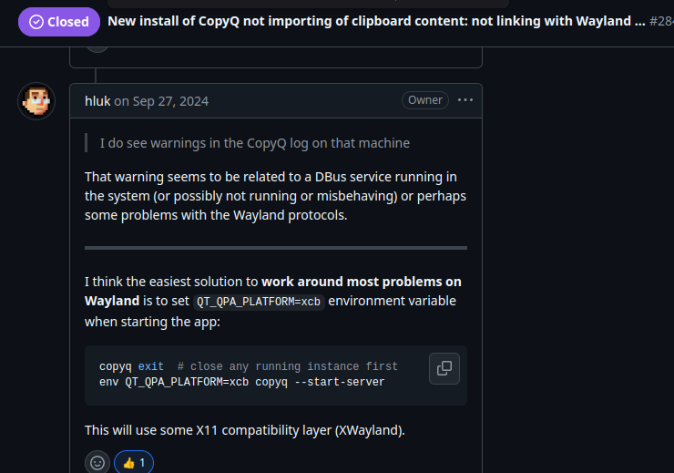
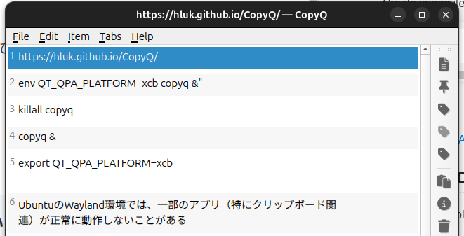

## クリップボードマネージャーのCopyQをインストールした

ubuntuでもMac OSのCrippyのようにコピーした履歴を簡単に呼び出せるようにしたく、CopyQというアプリをDesktopのApp Centerからインストールした。

[https://hluk.github.io/CopyQ](https://hluk.github.io/CopyQ)

## 問題: クリップボードの履歴にコピーされない

しかしCtrl + CでコピーしてもCopyQの画面には何もコピーしたテキストが表示されなかった。

そこで色々調べてみると、UbuntuのWayland環境では、一部のアプリ（特にクリップボード関連）が正常に動作しないことがあるのでXcb環境として実行する必要があるとのこと。



「New install of CopyQ not importing of clipboard content: not linking with Wayland clipboard? 」[https://github.com/hluk/CopyQ/issues/2847](https://github.com/hluk/CopyQ/issues/2847)

## 解決方法: Xcbとして実行する

具体的には`` `.bashrc`以下の環境変数を入れておいた状態で ``\`copyq &\`を実行してcopyqを起動するとCtrl+Cでクリップボードにコピーできるようになる。

```
$ export QT_QPA_PLATFORM=xcb
```



あるいはcopyqの既存のプロセスをキルした状態で、環境変数を指定してcopyqを起動することでもxcbとして実行できるそう。

```
$ killall copyq
$ env QT_QPA_PLATFORM=xcb copyq &
```
