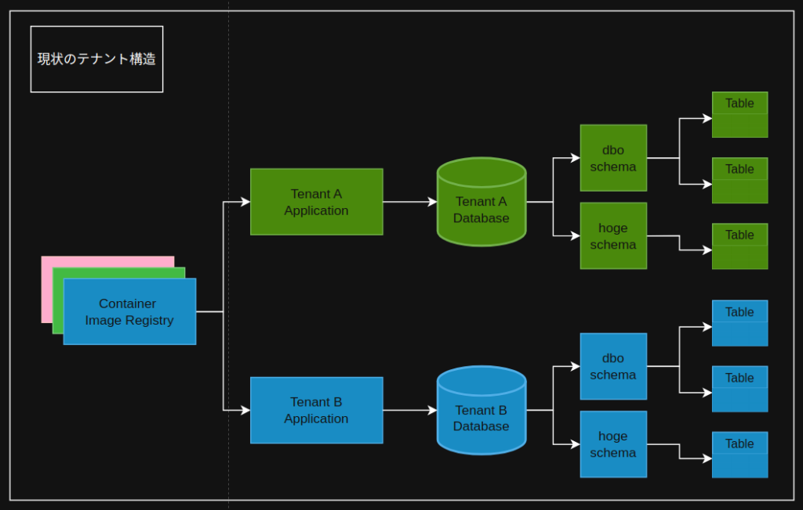
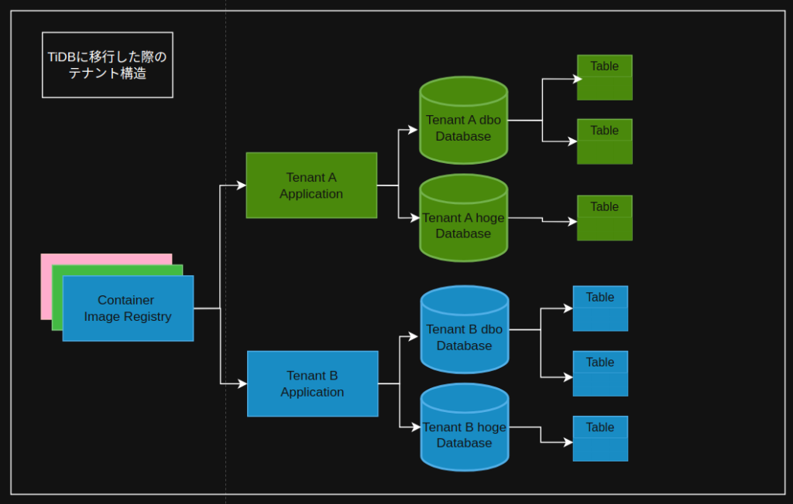

## 現状のテナント分離構造「インスタンスレベル分離」

私が関わっているプロダクトでは図のような「インスタンスレベル分離」というテナント分離構造になっています。



具体的にはテナント毎にアプリケーションが別れており、DBクラスタ(SQL Server)も同様にテナント毎に別れている状況です。

DBからテナントのデータが別れているのでセキュアではあるのですが、管理が煩雑になりやすいなと言う感じですかね。

[https://tany.dev/posts/multitenancy](https://tany.dev/posts/multitenancy)

## TiDBにDB移行した場合のテナント分離構造「スキーマレベル分離」

ここからTiDBにDB移行した場合のテナント分離構造について考えてみます。

TiDBに移行する場合、1つのTiDBクラスタで複数のテナントのデータを管理するようにしたいので、テナント分離構造的には**「スキーマレベル分離」**という方法が適していると思います。

他には「行レベル分離」「テーブルレベル分離」という方法もありますが、アプリの修正幅や既存テナントとの兼ね合いがあるので今回は考えていません。

ただTiDBはMySQLに互換性のあるDBなのでSQL Serverやポスグレでいうところのスキーマという機能が存在しません。

そのため、テナント構造は以下の図のようになり、スキーマ部分がDBになり、それぞれのDBの名称にテナント名のプレフィックスをつける形になりそうです。



## プレフィックスによるスキーマレベル分離を採用する場合に必要な修正

このようにテナント識別子のプレフィックスをDB名につけてスキーマレベル分離を実現しようとした場合、アプリとしては以下の修正が必要になります

1. DML実行前にテナント識別子を書き換える

3. DDL実行前にテナント識別子を書き換える

### DML実行前にテナント識別子を書き換える「VisitListenerを使った方法」

```
import org.jooq.Configuration;
import org.jooq.DSLContext;
import org.jooq.Name;
import org.jooq.QueryPart;
import org.jooq.Schema;
import org.jooq.VisitContext;
import org.jooq.impl.DefaultVisitListener;
import org.jooq.impl.DSL;
import org.jooq.impl.SQLDataType;
import org.jooq.impl.DSL;

import java.sql.Connection;
import java.sql.DriverManager;

public class MultiTenantVisitListener extends DefaultVisitListener {
    private final String tenantPrefix;

    public MultiTenantVisitListener(String tenantPrefix) {
        this.tenantPrefix = tenantPrefix;
    }

    @Override
    public void visitStart(VisitContext context) {
        QueryPart part = context.queryPart();
        if (part instanceof Name) {
            Name name = (Name) part;
            // ここではスキーマ名として扱いたいので、単一の識別子かチェック
            String schemaName = name.toString();
            // "dbo" または "hoge" と一致する場合に置き換える
            if ("dbo".equalsIgnoreCase(schemaName) || "hoge".equalsIgnoreCase(schemaName)) {
                Schema newSchema = DSL.schema(tenantPrefix + schemaName);
                context.queryPart(newSchema);
            }
        }
    }
}
```

```
// データベース接続（例として MySQL を使用）
Connection connection = DriverManager.getConnection("jdbc:mysql://localhost:3306/mydb", "user", "password");

// DSLContext の生成
Configuration configuration = DSL.using(connection, org.jooq.SQLDialect.MYSQL).configuration();

// MultiTenantVisitListener をテナント識別子 "tenant_a_" で登録
configuration.set(new MultiTenantVisitListener("tenant_a_"));

// DSLContext の作成
DSLContext dsl = DSL.using(configuration);

// 例: "dbo" スキーマの "mytable" を参照するクエリを作成
var query = dsl.select().from(DSL.table(DSL.name("dbo", "mytable")));
System.out.println(query.getSQL());

// 同様に "hoge" スキーマの場合
var query2 = dsl.select().from(DSL.table(DSL.name("hoge", "othertable")));
System.out.println(query2.getSQL());
```

### DML実行前にテナント識別子を書き換える「RenderMappingを使う方法」

```
import org.jooq.DSLContext;
import org.jooq.SQLDialect;
import org.jooq.conf.MappedSchema;
import org.jooq.conf.RenderMapping;
import org.jooq.conf.Settings;
import org.jooq.impl.DSL;

import java.sql.Connection;
import java.sql.DriverManager;

public class RenderMappingExample {
    public static void main(String[] args) throws Exception {
        // データベース接続設定（例として MySQL を使用）
        String url = "jdbc:mysql://localhost:3306/mydb";
        String user = "username";
        String password = "password";
        Connection connection = DriverManager.getConnection(url, user, password);
        
        // RenderMapping の設定
        RenderMapping renderMapping = new RenderMapping()
            .withSchemata(
                // 論理スキーマ "dbo" を "tenant_a_dbo" にマッピング
                new MappedSchema().withInput("dbo").withOutput("tenant_a_dbo"),
                // 論理スキーマ "hoge" を "tenant_a_hoge" にマッピング
                new MappedSchema().withInput("hoge").withOutput("tenant_a_hoge")
            );
        
        Settings settings = new Settings().withRenderMapping(renderMapping);
        
        // DSLContext の生成時に設定を渡す
        DSLContext dsl = DSL.using(connection, SQLDialect.MYSQL, settings);
        
        // 例：論理スキーマ "dbo" の "mytable" へのクエリを作成
        String sql1 = dsl.select().from(DSL.table(DSL.name("dbo", "mytable"))).getSQL();
        System.out.println("SQL1: " + sql1);
        
        // 例：論理スキーマ "hoge" の "othertable" へのクエリを作成
        String sql2 = dsl.select().from(DSL.table(DSL.name("hoge", "othertable"))).getSQL();
        System.out.println("SQL2: " + sql2);
    }
}
```

### DDL実行前にテナント識別子を書き換える「プレースホルダーの置換」

```
-- 例: Flyway のマイグレーションスクリプト内で
CREATE TABLE ${tenant_prefix}dbo.mytable (
    id INT NOT NULL,
    name VARCHAR(100),
    PRIMARY KEY (id)
);
```
