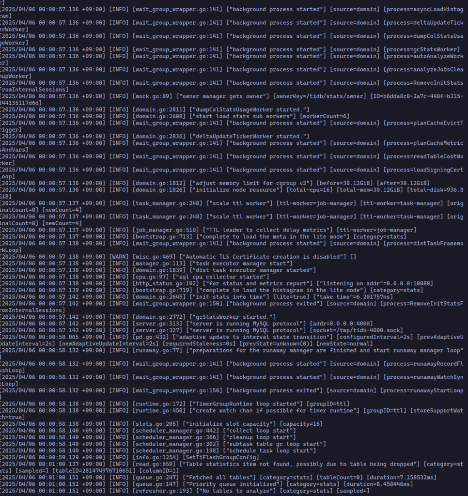

[https://pingcap.github.io/tidb-dev-guide](https://pingcap.github.io/tidb-dev-guide)

## TiDBで利用されているバージョンのGoをインストールする

まずTiDBで使われているGoのバージョンを以下のコマンドで取得して、そのバージョンのGoをインストールしてくださいとのことでした。

```
curl -s -S -L https://github.com/pingcap/tidb/blob/master/go.mod | grep -Eo "\"go [[:digit:]]+.[[:digit:]]+\""
```

ただこのコマンドだと何も表示されませんでした、、、

詳しく調べるとGoのバージョンがx.xの場合は取得できそうな正規表現なのですが、x.x.xの場合は取得できていなさそうだったので以下のコマンドで代わりに実行しました。

```
curl -s -S -L https://github.com/pingcap/tidb/blob/master/go.mod | grep -Eo "go [[:digit:]]+(\.[[:digit:]]+)+"

go 1.23.8
```

その結果**go 1.23.8**というバージョンでした。

ちなみにもう少し詳しく正規表現の挙動について調べてみたところ、やはり修正前だとx.x.xの場合は値が取得できていなかったみたいようです。  
  
\## 修正前  
$ echo "\\"go 1.23\\"" | grep -Eo "\\"go \[\[:digit:\]\]+.\[\[:digit:\]\]+\\""  
"go 1.23"  
$ echo "\\"go 1.23.7\\"" | grep -Eo "\\"go \[\[:digit:\]\]+.\[\[:digit:\]\]+\\""  
  
\## 修正後  
$ echo "\\"go 1.23\\"" | grep -Eo "go \[\[:digit:\]\]+(.\[\[:digit:\]\]+)+"  
go 1.23  
$ echo "\\"go 1.23.8\\"" | grep -Eo "go \[\[:digit:\]\]+(.\[\[:digit:\]\]+)+"  
go 1.23.8

以下のPRを出して修正しました  
[https://github.com/pingcap/tidb-dev-guide/pull/263](https://github.com/pingcap/tidb-dev-guide/pull/263)

私はubuntu24を使っており、miseというツールがインストールしてあったので、それでgoの1.23.8をインストールして利用するようにしました。

[https://mise.jdx.dev/demo.html](https://mise.jdx.dev/demo.html)

```
$ mise exec go@1.23.8 -- go -v
mise go@1.23.8 ✓ installed                                                                                                                 flag provided but not defined: -v
Go is a tool for managing Go source code.

$ mise use --global go@1.23.8
mise ~/.config/mise/config.toml tools: go@1.23.8

$ go version
go version go1.23.8 linux/amd64
```

## TiDBをソースコードからビルドして実行

まずリポジトリをクローンします

```
$ git clone https://github.com/pingcap/tidb.git
```

次にビルドし

```
$ cd tidb
$ make

CGO_ENABLED=1  GO111MODULE=on go build -tags codes  -ldflags '-X "github.com/pingcap/tidb/pkg/parser/mysql.TiDBReleaseVersion=v9.0.0-beta.1.pre-511-gd9fb3a5337" -X 
...
go: downloading k8s.io/utils v0.0.0-20230726121419-3b25d923346b
Build TiDB Server successfully!
```

以下のコマンドで実行します。そうすると4000ポートでTiDBが起動します。

```
$ ./bin/tidb-server
```



4000ポートを見るとtidb-serverが動いていることがわかります。

```
$ sudo lsof -i :4000
COMMAND       PID USER   FD   TYPE  DEVICE SIZE/OFF NODE NAME
tidb-serv 1172267 york   12u  IPv6 9290631      0t0  TCP *:4000 (LISTEN)
```
