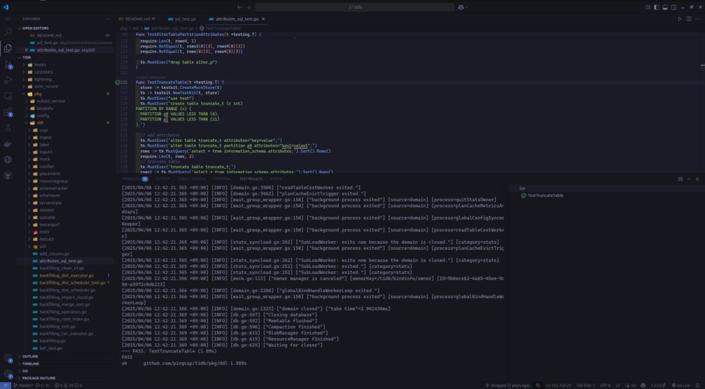

[https://pingcap.github.io/tidb-dev-guide/get-started/setup-an-ide.html](https://pingcap.github.io/tidb-dev-guide/get-started/setup-an-ide.html)

## IDEの準備

まずVsCodeをインストールし、TiDBのリポジトリのルートで以下のコマンドを実行し、おすすめの設定を反映します。

```
mkdir -p .vscode

echo "{
    \"go.testTags\": \"intest,deadlock\"
}" > .vscode/settings.json
```

またVsCodeのプラグインとして「Go」「TiDE」「GitHub Pull Request」というもののインストールがおすすめされているので、お好みでいれる。

## 既存のテストコードの実行

それでは試しにテストコードを実行してみましょう

pkg/ddl/attributes\_sql\_test.goを開いて、pkg/ddl/attributes\_sql\_test.goを実行してみます。



下のTestResultに「PASS: TestTruncateTable (1.89s)」と出ましたね！

無事既存のテスト実行までできました。

ただテストが動いただけですが、TiDBのソースが自分のマシン上で動くのは嬉しいですね〜
