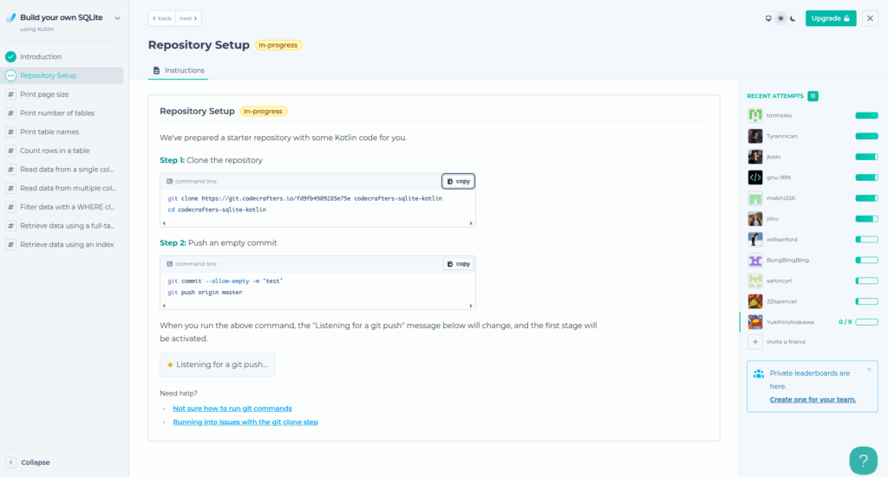
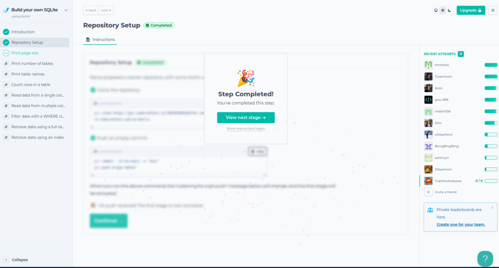
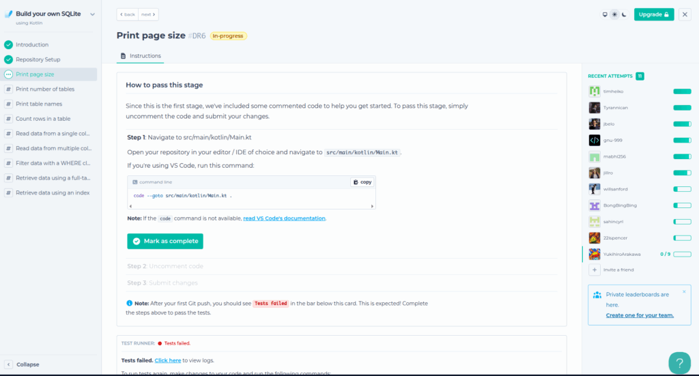
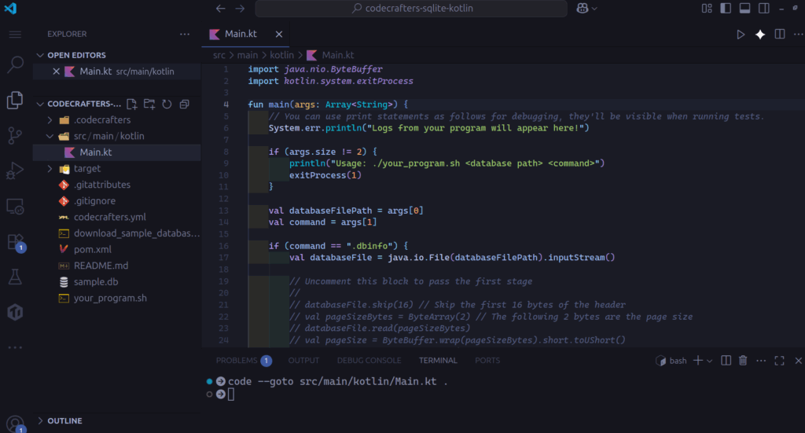
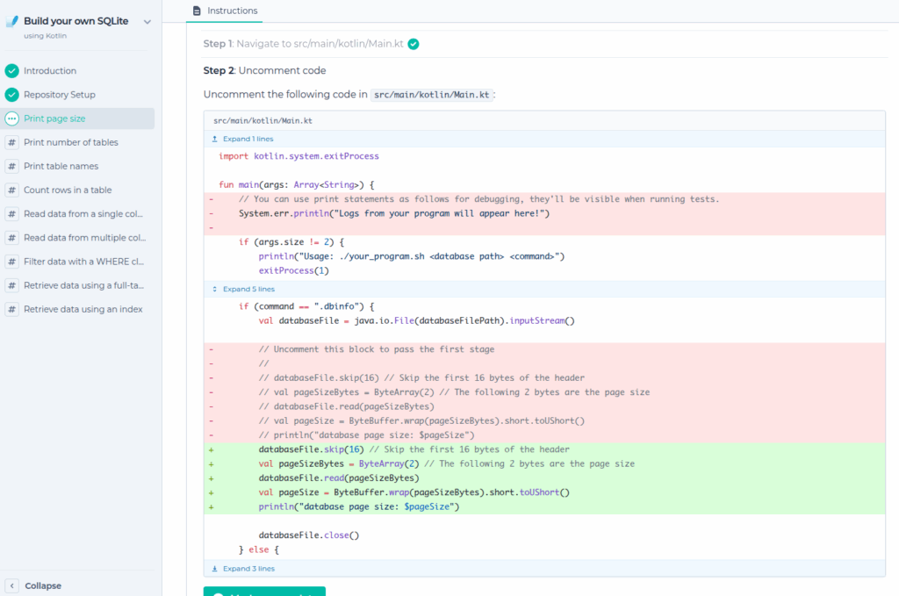
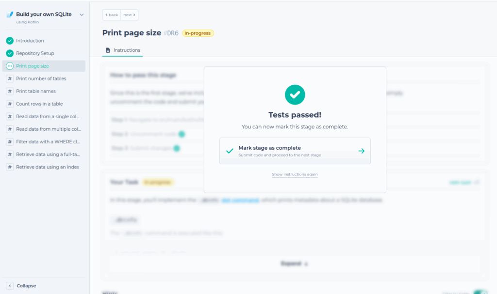
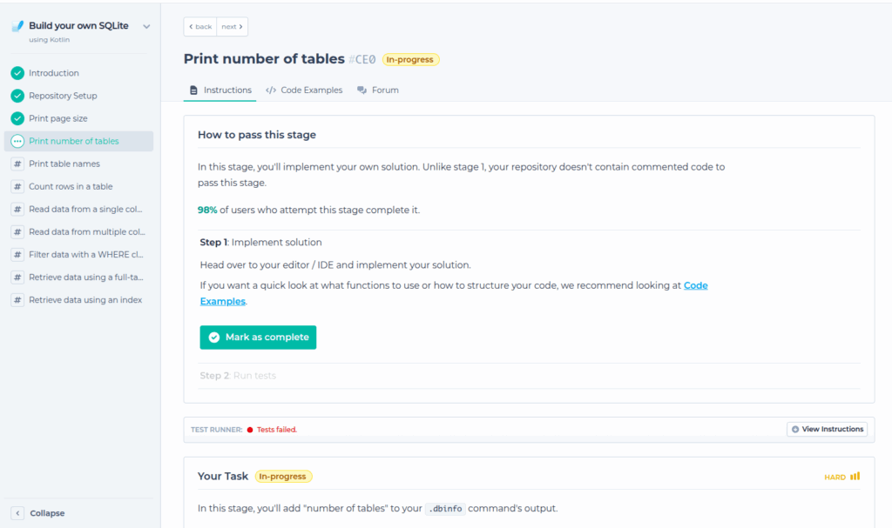
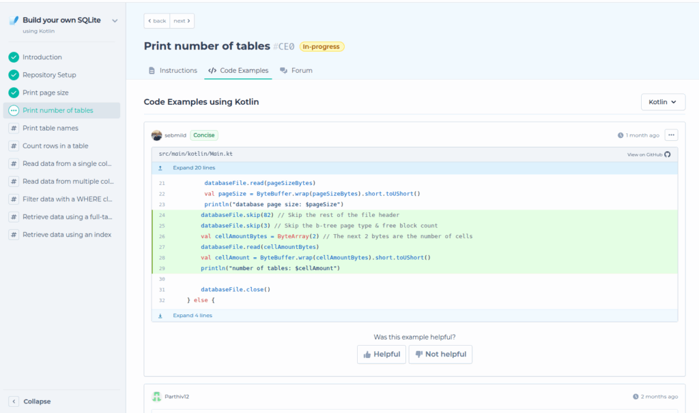
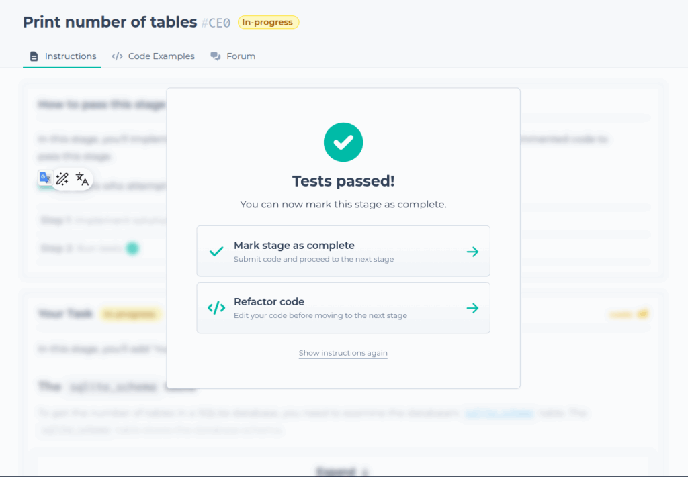

# はじめに

code craftersというサイトでミドルウェアや低レイヤーな技術についてコードを作成しながら学べるということで試しにやってみました。

今回はSQLiteをKotlinで実装するコースをやってみようかなと思います。

# Repository Setup



まずはリポジトリのセットアップからやっていきます

```
 git clone https://git.codecrafters.io/hoge codecrafters-sqlite-kotlin

cd codecrafters-sqlite-kotlin
Cloning into 'codecrafters-sqlite-kotlin'...
remote: Enumerating objects: 17, done.
remote: Counting objects: 100% (17/17), done.
remote: Compressing objects: 100% (13/13), done.
remote: Total 17 (delta 1), reused 0 (delta 0)
Unpacking objects: 100% (17/17), 5.07 KiB | 865.00 KiB/s, done.

 pwd
/home/user/Workspace/codecrafters-sqlite-kotlin
```

git commit & push するとリモートサーバでテストが動きます

```
 git commit --allow-empty -m 'test'
git push origin master
[master c019913] test
...

remote: [compile] [INFO] ------------------------------------------------------------------------
remote: [compile] [INFO] BUILD SUCCESS
remote: [compile] [INFO] ------------------------------------------------------------------------
remote: [compile] [INFO] Total time:  8.271 s
remote: [compile] [INFO] Finished at: 2025-08-23T02:10:28Z
remote: [compile] [INFO] ------------------------------------------------------------------------
remote: [compile] Moved ./.codecrafters/run.sh → ./your_program.sh
remote: [compile] Compilation successful.
remote:
remote: [tester::#DR6] Running tests for Stage #DR6 (Print page size)
remote: [tester::#DR6] $ ./your_program.sh test.db .dbinfo
remote: [your_program] Logs from your program will appear here!
remote: [tester::#DR6] Expected stdout to contain "database page size: 4096", got: ""
remote: [tester::#DR6] Test failed (try setting 'debug: true' in your codecrafters.yml to see more details)
remote:
remote: NOTE: This failure is expected! Uncomment code in src/main/kotlin/Main.kt.
remote:
remote: View instructions: https://app.codecrafters.io/courses/sqlite/stages/dr6
remote:
To https://git.codecrafters.io/fd9fb4509285e75e
   357d5bf..c019913  master -> master
```



# Print page size



## Step 1: Navigate to src/main/kotlin/Main.kt

vscodeでMain.ktを開きます



## Step 2: Uncomment code

画面に従ってコードのコメントを外します



Gemini Code Assistantに解説させてみましょう

> # Kotlin製SQLiteデータベース情報表示ツールの解説
> 
> このKotlinプログラムは、コマンドラインから指定されたSQLiteデータベースファイルの基本的な情報を読み取り、表示するためのシンプルなツールです。
> 
> ## 主な機能
> 
> 指定されたSQLiteデータベースファイルのヘッダーから**ページサイズ**を読み取り、標準出力に表示します。
> 
> ## コードの処理フロー
> 
> プログラムは以下のステップで実行されます。
> 
> 1. **コマンドライン引数の検証**
>     - プログラムは起動時に2つの引数を期待します。
>         1. データベースファイルのパス (`<database path>`)
>         
>         3. 実行するコマンド (`<command>`)
>     
>     - `if (args.size != 2)`: 引数の数が2つでない場合、正しい使い方をメッセージで表示し、`exitProcess(1)`でプログラムを異常終了させます。
> 
> 3. **引数の解析**
>     - `val databaseFilePath = args[0]`: 1つ目の引数をデータベースファイルのパスとして変数に格納します。
>     
>     - `val command = args[1]`: 2つ目の引数を実行コマンドとして変数に格納します。
> 
> 5. **コマンドの実行**
>     - `if (command == ".dbinfo")`: コマンドが`.dbinfo`であるかを判定します。
> 
> 7. **`.dbinfo` コマンドの処理**
>     - `val databaseFile = java.io.File(databaseFilePath).inputStream()`: 指定されたパスのファイルを開き、読み込み用の入力ストリームを作成します。
>     
>     - `databaseFile.skip(16)`: ファイルの先頭から16バイト分を読み飛ばします。SQLiteのファイルフォーマット仕様によると、ページサイズの情報はファイルの先頭から16バイト目に記録されているためです。
>     
>     - `val pageSizeBytes = ByteArray(2)`: ページサイズを格納するために、2バイトの長さを持つバイト配列を準備します。ページサイズは2バイトの数値で表現されます。
>     
>     - `databaseFile.read(pageSizeBytes)`: ファイルの現在位置（16バイト読み飛ばした後）から2バイトを読み込み、`pageSizeBytes`配列に格納します。
>     
>     - `val pageSize = ByteBuffer.wrap(pageSizeBytes).short.toUShort()`: 読み取ったバイト列を数値に変換します。
>         - `ByteBuffer.wrap(pageSizeBytes)`: バイト配列を`ByteBuffer`オブジェクトに変換します。これにより、バイト列を特定のデータ型として扱いやすくなります。
>         
>         - `.short`: バッファから2バイトを読み込み、`Short`型（16ビット整数）として解釈します。SQLiteのヘッダーはビッグエンディアン形式で保存されており、Java/Kotlinの`ByteBuffer`はデフォルトでビッグエンディアンとしてデータを扱うため、正しく解釈できます。
>         
>         - `.toUShort()`: `Short`型を符号なしの`UShort`型に変換します。ページサイズは負の値を取らないため、符号なし整数として扱うのがより適切です。
>     
>     - `println("database page size: $pageSize")`: 最終的に得られたページサイズをコンソールに出力します。
>     
>     - `databaseFile.close()`: 開いていたファイルストリームを閉じ、リソースを解放します。
> 
> 9. **無効なコマンドの処理**
>     - `else`: コマンドが`.dbinfo`でない場合、`"Invalid command: <command>"`というメッセージを表示してプログラムを終了します。
> 
> ## まとめ
> 
> このコードは、ファイルI/Oとバイトレベルの操作を使い、SQLiteデータベースファイルのバイナリ構造を直接解析して特定の情報（ページサイズ）を抽出する、低レベルな処理を行っています。

## Step 3: Submit changes

git commitしてpushすると自動で採点されます。

```
 git commit -am "[any message]"
[master e365998] [any message]
 1 file changed, 5 insertions(+), 5 deletions(-)

 git push origin master
Enumerating objects: 11, done.
Counting objects: 100% (11/11), done.
Delta compression using up to 16 threads
Compressing objects: 100% (3/3), done.
Writing objects: 100% (6/6), 437 bytes | 437.00 KiB/s, done.
Total 6 (delta 2), reused 0 (delta 0), pack-reused 0
remote: ------------------------------------------------------------------------
remote:
remote:
remote:      ___            _          ___              __  _
remote:     / __\ ___    __| |  ___   / __\_ __  __ _  / _|| |_  ___  _ __  ___
remote:    / /   / _ \  / _` | / _ \ / /  | '__|/ _` || |_ | __|/ _ \| '__|/ __|
remote:   / /___| (_) || (_| ||  __// /___| |  | (_| ||  _|| |_|  __/| |   \__
remote:   \____/ \___/  \__,_| \___|\____/|_|   \__,_||_|   \__|\___||_|   |___/
remote:
remote:
remote:    Welcome to CodeCrafters! Your commit was received successfully.
remote:
remote: ------------------------------------------------------------------------

...

------------------------------------------------------------------
remote: [compile] Moved ./.codecrafters/run.sh → ./your_program.sh
remote: [compile] Compilation successful.
remote:
remote: [tester::#DR6] Running tests for Stage #DR6 (Print page size)
remote: [tester::#DR6] $ ./your_program.sh test.db .dbinfo
remote: [your_program] Logs from your program will appear here!
remote: [your_program] database page size: 2048
remote: [tester::#DR6] Test passed.
remote:
remote: Test passed. Congrats!
remote:
remote: Mark step as complete: https://app.codecrafters.io/courses/sqlite
remote:
To https://git.codecrafters.io/fd9fb4509285e75e
   c019913..e365998  master -> master
```

Testもパスしました



# Print number of tables

## Instruction



次のステージはテーブルの数を表示するというものです。

> How to pass this stage  
> In this stage, you'll implement your own solution. Unlike stage 1, your repository doesn't contain commented code to pass this stage.
> 
> 98% of users who attempt this stage complete it.
> 
> Step 1: Implement solution
> 
> Head over to your editor / IDE and implement your solution.
> 
> If you want a quick look at what functions to use or how to structure your code, we recommend looking at Code Examples.

ステージをパスするには自分でサンプルを見ながら実装してくださいとのことですね。

## Your Task

タスクの内容を確認しましょう

> ### sqlite\_schema テーブル
> 
> このステージでは、.dbinfoコマンドの出力に「テーブルの数」を追加します。  
>   
> データベースのsqlite\_schemaテーブルを調べると、SQLiteデータベース内のテーブルの数を取得できます。sqlite\_schemaテーブルはデータベーススキーマを格納しています。
> 
> データベース内の各テーブル、インデックス、ビュー、またはトリガーごとに、sqlite\_schemaに対応する行があります。唯一の例外は、sqlite\_schemaテーブル自体には行がないことです。
> 
> sqlite\_schemaがどのように見えるかを確認するには、次のコマンドを実行します。
> 
> $ sqlite3 sample.db "SELECT \* FROM sqlite\_schema;"  
> この課題では、データベースにテーブルのみが含まれており、インデックス、ビュー、またはトリガーは含まれていないと想定できます。したがって、sqlite\_schemaの各行はデータベース内のテーブルを表します。その結果、sqlite\_schemaの行数を取得することで、データベース内のテーブルの総数を取得できます。
> 
> ### ページ
> 
> SQLiteデータベースファイルは1つ以上のページで構成されています。`sqlite_schema`を含むすべてのテーブルは、1つ以上のテーブルb-treeページに格納されます。
> 
> この課題では、`sqlite_schema`テーブルは1つのページに完全に収まるほど小さいと仮定できます（実際には、複数のページにまたがることがあります）。`sqlite_schema`の行数を取得するには、`sqlite_schema`ページを読み取る必要があります。
> 
> ### sqlite\_schemaページ
> 
> b-treeページの詳細については、後の段階で学びます。今のところ、知っておくべきことは次のとおりです。
> 
> - `sqlite_schema`ページは常にページ1であり、常にオフセット0から始まります。ファイルヘッダーはページの一部です。
> 
> - `sqlite_schema`ページは、行を「セル」と呼ばれるデータの塊として格納します。各セルは1つの行を格納します。
> 
> したがって、データベース内のテーブルの数は、`sqlite_schema`ページのセルの数と等しくなります。
> 
> * * *
> 
> ### セル数
> 
> `sqlite_schema`ページのセル数は、`sqlite_schema`ページヘッダーを見ることで取得できます。b-treeページヘッダーには、ページ上のセルの数を指定する2バイトのビッグエンディアン値が含まれています。詳細については、公式ドキュメントを参照してください。
> 
> ページヘッダーはファイルヘッダーとは別です。ページヘッダーはファイルヘッダーの直後に現れます。
> 
> ### テスト
> 
> テスターは次のようにあなたのプログラムを実行します。
> 
> `$ ./your_program.sh sample.db .dbinfo`
> 
> あなたのプログラムは以下の値を出力する必要があります。
> 
> - Database page size
> 
> - Number of tables
> 
> database page size: 4096
> 
> number of tables: 3
> 
> ### 注
> 
> 解決策に取り組む前に、`sample.db`を読んでファイル形式を理解しておくと役立つかもしれません。これを行うには、`hexdump -C sample.db`を実行するか、`HexEd.it`のような16進エディターを使用できます。

ポイントは以下のあたりでしょうか

- sqlite\_schemaページのセル数は、sqlite\_schemaページヘッダーを見ることで取得できます。

- b-treeページヘッダーには、ページ上のセルの数を指定する2バイトのビッグエンディアン値が含まれています。

- データベース内のテーブルの数は、sqlite\_schemaページのセルの数と等しい

- ページヘッダーはファイルヘッダーの直後に現れる

## Kotlin 2系のインストール

そのまえにローカルで実行できるようにkotlinを入れていきましょう

README.mdを見るとversion2以上をいれてくださいとのことでした。

ただGemini曰くaptだと2系を入れることが一般的ではないとのことなのでSDKMANというやつで入れていきます。

```
$ curl -s "https://get.sdkman.io" | bash
$ source "/home/user/.sdkman/bin/sdkman-init.sh"
$ sdk list kotlin

================================================================================
Available Kotlin Versions
================================================================================
     2.2.10              1.6.21              1.3.31              1.1.51
     2.2.0               1.6.20              1.3.30              1.1.50
     2.1.21              1.6.10              1.3.21              1.1.4-3
     2.1.20              1.6.0               1.3.20              1.1.4-2
     2.1.10              1.5.31              1.3.11              1.1.4
     2.1.0               1.5.30              1.3.10              1.1.3-2
     2.0.21              1.5.21              1.3.0               1.1.3
     2.0.20              1.5.10              1.2.71              1.1.2-5
     2.0.10              1.5.0               1.2.70              1.1.2-2
     2.0.0               1.4.31              1.2.61              1.1.2
     1.9.24              1.4.30              1.2.60              1.1.1
     1.9.23              1.4.21              1.2.51              1.1
     1.9.22              1.4.20              1.2.50              1.0.7
     1.9.21              1.4.10              1.2.41              1.0.6
     1.9.20              1.4.0               1.2.40              1.0.5-2
     1.9.10              1.3.72              1.2.31              1.0.5
     1.9.0               1.3.71              1.2.30              1.0.4
     1.8.20              1.3.70              1.2.21              1.0.3
     1.8.0               1.3.61              1.2.20              1.0.2
     1.7.21              1.3.60              1.2.10              1.0.1-2
     1.7.20              1.3.50              1.2.0               1.0.1-1
     1.7.10              1.3.41              1.1.61              1.0.1
     1.7.0               1.3.40              1.1.60              1.0.0

================================================================================
+ - local version
* - installed
> - currently in use
================================================================================

$ sdk install kotlin 2.0.0

$ kotlin -version

Kotlin version 2.0.0-release-341 (JRE 24+36-3646)
```

それでは動作確認してみましょう

```
 ./your_program.sh sample.db .dbinfo
./your_program.sh: 17: mvn: not found
```

mvnがないとでますね

aptでmavenをインストールしましょう

```
$ sudo apt install maven

$ mvn -version
Apache Maven 3.8.7
Maven home: /usr/share/maven
Java version: 24, vendor: Oracle Corporation, runtime: /home/york/.local/share/mise/installs/java/24.0.0
Default locale: en_US, platform encoding: UTF-8
OS name: "linux", version: "6.14.0-27-generic", arch: "amd64", family: "unix"
```

それでは再度./your\_program.shを実行してみましょう

```
$ ./your_program.sh sample.db .dbinfo

...

[INFO] ------------------------------------------------------------------------
[INFO] BUILD SUCCESS
[INFO] ------------------------------------------------------------------------
[INFO] Total time:  22.389 s
[INFO] Finished at: 2025-08-23T12:17:49+09:00
[INFO] ------------------------------------------------------------------------
Logs from your program will appear here!
database page size: 4096
```

動くようになりました

### 他の人のサンプルプログラムを眺める



他の方のサンプルコードを見ると、以下の流れで実装されていそうです

1. ファイルヘッダーの残り(82バイト)を読み飛ばす

3. b-treeのpage typeとfree block count(3バイト)を読み飛ばす

5. 次の2バイトを読み取って表示する

### 実装

それでは以下のコードをコピペしてコードを実行してみましょう

```
// テーブルサイズの表示
databaseFile.skip(82) // Skip the rest of the file header
databaseFile.skip(3) // Skip the b-tree page type & free block count
val cellAmountBytes = ByteArray(2) // The next 2 bytes are the number of cells
databaseFile.read(cellAmountBytes)
val cellAmount = ByteBuffer.wrap(cellAmountBytes).short.toUShort()
println("number of tables: $cellAmount")
```

```
 ./your_program.sh sample.db .dbinfo
database page size: 4096
number of tables: 3
```

答えと一致していそうです。

### テストの実行

それではgit push してテストを実行してみましょう

```
git add .
git commit --allow-empty -m "[any message]"
git push origin master
```



パスしてそうですね

# まとめ

今回はCode CrafterというサイトでSQLiteについて学んでみました。

無料で学べるのはここまでらしいのですが、120$ / 3 monthするので課金するかどうか迷いますね、、、

絶妙に高い、、、

定期的にプロモーションを配っているそうなので、そこまで待とうかな、、

またsqliteのリファレンスとして以下のリンクも紹介されていました。

こちらも読むとsqliteのページについて、より理解が深まるかもしれません。

[https://www.sqlite.org/schematab.html](https://www.sqlite.org/schematab.html)

[https://www.sqlite.org/fileformat.html#b\_tree\_pages](https://www.sqlite.org/fileformat.html#b_tree_pages)

[https://www.sqlite.org/fileformat.html#pages](https://www.sqlite.org/fileformat.html#pages)
