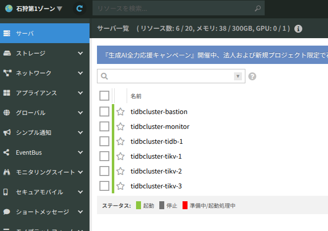
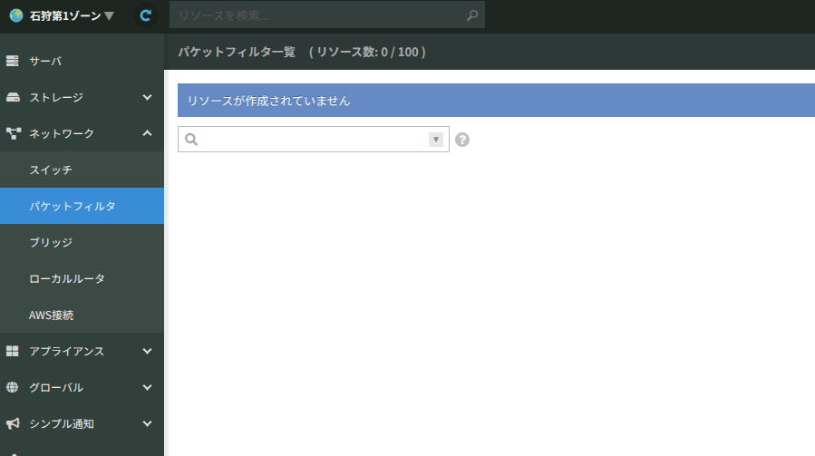
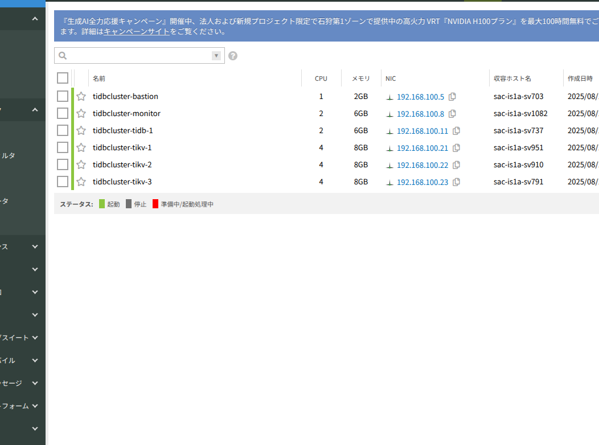
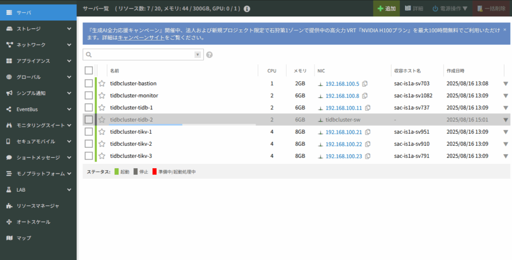
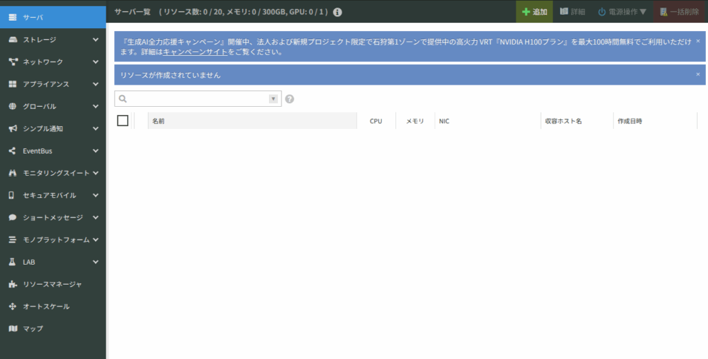

# はじめに

「作って壊して直して学ぶNewSQL入門」というTiDBの書籍が出ており、その中で様々なハンズオンがあったので実際にやってみました。

[https://amzn.to/3HB8dtm](https://amzn.to/3HB8dtm)

Localで実施できるものは皆やってそうだなーと思ったのでさくらのクラウドにTiDBをデプロイするというカロリー高めなセクションにトライしてみました。

# 実施環境

書籍ではMac OSでの利用を想定されていましたが、私はUbuntuユーザなので、書籍と一部手順がかわることがあるかもしれないです。

- ubuntu 22.04

# 1\. Terraformを使ったサーバーのセットアップ

## さくらのクラウドの準備

さくらインターネットの会員ではあったもののさくらのクラウドは初めて使うのでプロジェクトを作成していきます。

次にAPIキーを発行しようとしましたが「このアクションを実行する権限がありません。」というエラーがでました。

ルートユーザだと権限がないんですかね、小ユーザを作ってそこに権限を割り当てられないか試していきます。

[https://manual.sakura.ad.jp/cloud/controlpanel/access-level.html?\_gl=11jn0wlt\_gcl\_awR0NMLjE3NTUzMTI3NjYuQ2p3S0NBand0ZnZFQmhBbUVpd0EtRHNLanM0ODdraU1XSHBzc1lBbnhJamo5Smt3eUxOcUlaWVFfUDZGTkJ2UDdFWnJaZzVyXzFvX19Sb0N5S1VRQXZEX0J3RQ..\_gcl\_au\*MTgwNzk2ODgxNC4xNzU1MzEyNzY2](https://manual.sakura.ad.jp/cloud/controlpanel/access-level.html?_gl=11jn0wlt_gcl_awR0NMLjE3NTUzMTI3NjYuQ2p3S0NBand0ZnZFQmhBbUVpd0EtRHNLanM0ODdraU1XSHBzc1lBbnhJamo5Smt3eUxOcUlaWVFfUDZGTkJ2UDdFWnJaZzVyXzFvX19Sb0N5S1VRQXZEX0J3RQ.._gcl_au*MTgwNzk2ODgxNC4xNzU1MzEyNzY2)

1. 新規Userを追加作成

3. 以下のIAMポリシーをUserに適応
    - リソース閲覧
    
    - 作成・削除
    
    - 設定編集

5. ログアウト

7. さくらのクラウドホームに１のユーザで再ログイン

電話での認証も済んでいなかったので、やっていきます

APIキーの発行ができました!

## sshキーペアの生成

以下のコマンドを実行して、ひたすらエンター

```
$ ssh-keygen -f ~/.ssh/sakura_cloud -t ed25519
```

## Terraformを準備しよう

以下を見ながらUbuntuにterraformをインストールしていきます

[https://developer.hashicorp.com/terraform/tutorials/aws-get-started/install-cli](https://developer.hashicorp.com/terraform/tutorials/aws-get-started/install-cli)

```
$ sudo apt-get update && sudo apt-get install -y gnupg software-properties-common

$ wget -O- https://apt.releases.hashicorp.com/gpg | \
gpg --dearmor | \
sudo tee /usr/share/keyrings/hashicorp-archive-keyring.gpg > /dev/null

$ gpg --no-default-keyring \
--keyring /usr/share/keyrings/hashicorp-archive-keyring.gpg \
--fingerprint

$ echo "deb [arch=$(dpkg --print-architecture) signed-by=/usr/share/keyrings/hashicorp-archive-keyring.gpg] https://apt.releases.hashicorp.com $(grep -oP '(?<=UBUNTU_CODENAME=).*' /etc/os-release || lsb_release -cs) main" | sudo tee /etc/apt/sources.list.d/hashicorp.list

$ sudo apt update

$ sudo apt-get install terraform
```

ついでにコマンド補完が効くようにもしていきます。

```
$ terraform -install-autocomplete
```

正しくインストールされていそうですね。

```
$ terraform --version
Terraform v1.12.2
on linux_amd64
```

次にスクリプトをDLしていきます。

[https://github.com/bohnen/bbf-newsql](https://github.com/bohnen/bbf-newsql) をCloneします。

```
$ git clone path/to/bbf-newsql

$ cd bbf-newsql/tidb-cluster

$ tree
.
├── ansible
│   ├── bastion_playbook.yml
│   ├── cluster_playbook.yml
│   └── inventory.ini
├── README.md
├── terraform
│   ├── main.tf
│   ├── monitor.tf
│   ├── provider.tf
│   ├── terraform.tfvars.template
│   ├── tidb.tf
│   ├── tikv.tf
│   └── variables.tf
└── tiup
    ├── scale-out.yml
    └── topology.yml
```

つぎにプロバイダーをインストール

```
$ cd terraform
$ terraform init

Initializing the backend...
Initializing provider plugins...
- Finding sacloud/sakuracloud versions matching "2.26.0"...
- Installing sacloud/sakuracloud v2.26.0...
- Installed sacloud/sakuracloud v2.26.0 (self-signed, key ID 96CEB4B93D86849D)
Partner and community providers are signed by their developers.
If you'd like to know more about provider signing, you can read about it here:

...

Terraform has been successfully initialized!

You may now begin working with Terraform. Try running "terraform plan" to see
any changes that are required for your infrastructure. All Terraform commands
should now work.

If you ever set or change modules or backend configuration for Terraform,
rerun this command to reinitialize your working directory. If you forget, other
commands will detect it and remind you to do so if necessary.
```

ちゃんと動いてそうですかね

つぎにterraform.tfvarsを設定して, terraform validateします。

```
$ terraform validate
Success! The configuration is valid.
```

そして実際にterraformを実行してサーバを立ち上げていきます。

まずはplanを実行、16個のリソースを作成すると出ていれば良いとのこと

```
$ terraform plan

data.sakuracloud_archive.ubuntu: Reading...
data.sakuracloud_archive.ubuntu: Read complete after 2s [id=113701786671]

Terraform used the selected providers to generate the following execution plan. Resource actions are indicated
with the following symbols:
  + create

Terraform will perform the following actions:

  # sakuracloud_disk.monitor_server will be created
  + resource "sakuracloud_disk" "monitor_server" {
      + connector            = "virtio"
      + encryption_algorithm = "none"
      + id                   = (known after apply)
      + name                 = "tidbcluster-monitor-disk"
      + plan                 = "ssd"
      + server_id            = (known after apply)
      + size                 = 40
      + source_archive_id    = "113701786671"
      + zone                 = (known after apply)
    }

...

  # sakuracloud_switch.private_sw will be created
  + resource "sakuracloud_switch" "private_sw" {
      + description = "Private network switch"
      + id          = (known after apply)
      + name        = "tidbcluster-sw"
      + server_ids  = (known after apply)
      + zone        = (known after apply)
    }

Plan: 14 to add, 0 to change, 0 to destroy.

Changes to Outputs:
  + vpcrouter_public_ip = (known after apply)

─────────────────────────────────────────────────────────────────────────────────────────────────────────────────

Note: You didn't use the -out option to save this plan, so Terraform can't guarantee to take exactly these
actions if you run "terraform apply" now.
```

では実際にリソースを作成していきます

```
$ terraform apply
...
Apply complete! Resources: 14 added, 0 changed, 0 destroyed.
```

はじめてterraformを使いましたが、サーバが次々と立ち上がっていくのは気持ちいいですね！

ただ14addedとなっているのはあっているのだろうか、、、

listしてみるとこんなかんじで15個表示されている

```
$ terraform state list
data.sakuracloud_archive.ubuntu
sakuracloud_disk.monitor_server
sakuracloud_disk.tidb_bastion
sakuracloud_disk.tidb_server[0]
sakuracloud_disk.tikv_server[0]
sakuracloud_disk.tikv_server[1]
sakuracloud_disk.tikv_server[2]
sakuracloud_server.monitor_server
sakuracloud_server.tidb_bastion
sakuracloud_server.tidb_server[0]
sakuracloud_server.tikv_server[0]
sakuracloud_server.tikv_server[1]
sakuracloud_server.tikv_server[2]
sakuracloud_switch.private_sw
sakuracloud_vpc_router.vpcrouter
```

planで差分を比較しておく

```
$ terraform plan
data.sakuracloud_archive.ubuntu: Reading...
sakuracloud_switch.private_sw: Refreshing state... [id=113702095119]
data.sakuracloud_archive.ubuntu: Read complete after 1s [id=113701786671]
sakuracloud_disk.tidb_bastion: Refreshing state... [id=113702095122]
sakuracloud_disk.monitor_server: Refreshing state... [id=113702095124]
sakuracloud_disk.tidb_server[0]: Refreshing state... [id=113702095125]
sakuracloud_disk.tikv_server[2]: Refreshing state... [id=113702095120]
sakuracloud_disk.tikv_server[0]: Refreshing state... [id=113702095123]
sakuracloud_disk.tikv_server[1]: Refreshing state... [id=113702095121]
sakuracloud_vpc_router.vpcrouter: Refreshing state... [id=113702095126]
sakuracloud_server.tidb_bastion: Refreshing state... [id=113702095138]
sakuracloud_server.tidb_server[0]: Refreshing state... [id=113702095145]
sakuracloud_server.monitor_server: Refreshing state... [id=113702095140]
sakuracloud_server.tikv_server[0]: Refreshing state... [id=113702095143]
sakuracloud_server.tikv_server[2]: Refreshing state... [id=113702095144]
sakuracloud_server.tikv_server[1]: Refreshing state... [id=113702095142]

No changes. Your infrastructure matches the configuration.

Terraform has compared your real infrastructure against your configuration and found no differences, so no
changes are needed.
```

うーむ、差分はなさそうに見えるしこれでいいのかな、、

logに出てきたIPで作成されたサーバにsshログインします。

```
$ ssh -i ~/.ssh/sakura_cloud ubuntu@133.242.68.108

Welcome to Ubuntu 24.04.2 LTS (GNU/Linux 6.8.0-62-generic x86_64)
...

To run a command as administrator (user "root"), use "sudo <command>".
See "man sudo_root" for details.

ubuntu@tidbcluster-bastion:~$
```

つながっていそう。

# 2\. Ansibleを用いたサーバーの初期設定

sshキーを踏み台サーバに転送

```
$ scp -i ~/.ssh/sakura_cloud ~/.ssh/sakura_cloud ubuntu@133.242.68.108:~/.ssh/sakura_cloud

sakura_cloud                                                                    100%  419     4.1KB/s   00:00
```

sshを使って踏み台サーバに接続。

```
$ ssh -i ~/.ssh/sakura_cloud -p 2222 ubuntu@133.242.68.108
```

接続されないですね、、

ログを出しながらコマンドを再実行してみます

```
age$ ssh -vvv -i ~/.ssh/sakura_cloud -p 2222 ubuntu@133.242.68.108
OpenSSH_9.6p1 Ubuntu-3ubuntu13.12, OpenSSL 3.0.13 30 Jan 2024
debug1: Reading configuration data /etc/ssh/ssh_config
debug1: /etc/ssh/ssh_config line 19: include /etc/ssh/ssh_config.d/*.conf matched no files
debug1: /etc/ssh/ssh_config line 21: Applying options for *
debug2: resolve_canonicalize: hostname 133.242.68.108 is address
debug3: expanded UserKnownHostsFile '~/.ssh/known_hosts' -> '/home/york/.ssh/known_hosts'
debug3: expanded UserKnownHostsFile '~/.ssh/known_hosts2' -> '/home/york/.ssh/known_hosts2'
debug3: channel_clear_timeouts: clearing
debug3: ssh_connect_direct: entering
debug1: Connecting to 133.242.68.108 [133.242.68.108] port 2222.
debug3: set_sock_tos: set socket 3 IP_TOS 0x10
```

さくらのクラウドの「パケットフィルタ」が原因かもとGeminiさんが言っているので調べてみます。

```
1. さくらのクラウドのコントロールパネルにログインします。
2. サーバーが接続されているスイッチの**「パケットフィルタ」設定**を開きます。
3. TCPポート2222番への受信（Inbound）を許可するルールを追加してください。
```

さくらのクラウドのリージョンを石狩第一ゾーンに変えます。



パケットフィルタの画面をみると何もないですね



うーん、22番ポート用の設定があったので、コマンドを修正したら接続できました。

```
$ ssh -i ~/.ssh/sakura_cloud -p 22 ubuntu@133.242.68.108
Welcome to Ubuntu 24.04.2 LTS (GNU/Linux 6.8.0-62-generic x86_64)

 ...

ubuntu@tidbcluster-bastion:~$
```

まぁ一旦進みます

次にpythonを入れます

```
$ sudo apt update
[sudo] password for ubuntu: ここでterraform.varsで設定したパスワードをいれます

$ sudo apt install -y python3-pip python3-venv
```

venvコマンドでpythonの仮想環境を作成します

```
$ mkdir ~/ansible
$ cd ~/ansible
$ python3 -m venv venv
$ ls 
venv

$ source venv/bin/activate
(venv) $ pip install ansible

$ ansible --version

ansible [core 2.18.8]
  config file = None
  configured module search path = ['/home/ubuntu/.ansible/plugins/modules', '/usr/share/ansible/plugins/modules']
  ansible python module location = /home/ubuntu/ansible/venv/lib/python3.12/site-packages/ansible
  ansible collection location = /home/ubuntu/.ansible/collections:/usr/share/ansible/collections
  executable location = /home/ubuntu/ansible/venv/bin/ansible
  python version = 3.12.3 (main, Jun 18 2025, 17:59:45) [GCC 13.3.0] (/home/ubuntu/ansible/venv/bin/python3)
  jinja version = 3.1.6
  libyaml = True
```

次にAnsibleでサーバーのセットアップをするための設定ファイルを書きます

vim で ~/ansible/inventory.iniファイルを作成して以下をコピペします

```
[all:vars]
ansible_ssh_user=ubuntu
ansible_ssh_private_key_file=~/.ssh/sakura_cloud
ansible_ssh_common_args='-o StrictHostKeyChecking=no'

[bastion]
localhost

[tidb]
192.168.100.11
192.168.100.12

[tikv]
192.168.100.2[1:3]

[monitor]
192.168.100.8

[cluster:children]
tidb
tikv
monitor
```

```
$ ansible cluster -i inventory.ini -m ping

[WARNING]: Platform linux on host 192.168.100.22 is using the discovered Python interpreter at
/usr/bin/python3.12, but future installation of another Python interpreter could change the meaning of that path.
See https://docs.ansible.com/ansible-core/2.18/reference_appendices/interpreter_discovery.html for more
information.
192.168.100.22 | SUCCESS => {
    "ansible_facts": {
        "discovered_interpreter_python": "/usr/bin/python3.12"
    },
    "changed": false,
    "ping": "pong"
}
[WARNING]: Platform linux on host 192.168.100.11 is using the discovered Python interpreter at
/usr/bin/python3.12, but future installation of another Python interpreter could change the meaning of that path.
See https://docs.ansible.com/ansible-core/2.18/reference_appendices/interpreter_discovery.html for more
information.
192.168.100.11 | SUCCESS => {
    "ansible_facts": {
        "discovered_interpreter_python": "/usr/bin/python3.12"
    },
    "changed": false,
    "ping": "pong"
}
[WARNING]: Platform linux on host 192.168.100.21 is using the discovered Python interpreter at
/usr/bin/python3.12, but future installation of another Python interpreter could change the meaning of that path.
See https://docs.ansible.com/ansible-core/2.18/reference_appendices/interpreter_discovery.html for more
information.
192.168.100.21 | SUCCESS => {
    "ansible_facts": {
        "discovered_interpreter_python": "/usr/bin/python3.12"
    },
    "changed": false,
    "ping": "pong"
}
[WARNING]: Platform linux on host 192.168.100.23 is using the discovered Python interpreter at
/usr/bin/python3.12, but future installation of another Python interpreter could change the meaning of that path.
See https://docs.ansible.com/ansible-core/2.18/reference_appendices/interpreter_discovery.html for more
information.
192.168.100.23 | SUCCESS => {
    "ansible_facts": {
        "discovered_interpreter_python": "/usr/bin/python3.12"
    },
    "changed": false,
    "ping": "pong"
}
[WARNING]: Platform linux on host 192.168.100.8 is using the discovered Python interpreter at
/usr/bin/python3.12, but future installation of another Python interpreter could change the meaning of that path.
See https://docs.ansible.com/ansible-core/2.18/reference_appendices/interpreter_discovery.html for more
information.
192.168.100.8 | SUCCESS => {
    "ansible_facts": {
        "discovered_interpreter_python": "/usr/bin/python3.12"
    },
    "changed": false,
    "ping": "pong"
}
192.168.100.12 | UNREACHABLE! => {
    "changed": false,
    "msg": "Failed to connect to the host via ssh: ssh: connect to host 192.168.100.12 port 22: No route to host",
    "unreachable": true
}
```

192.168.100.12のTiDBだけ失敗してそう

さくらのクラウドを見るとTiDBが一つないですね。

先程、15個しかリソースが作成されていないがいいんだろうか、、と懸念していた部分でしょうか



terraform.tfvarsを見るとTiDBのデフォルトの数は1になってますね

2にあげましょう

```
...
# TiDBサーバの個数
-- num_tidb_servers = 1
++ num_tidb_servers = 2
...
```

terraform planしてみると「2 to add」とあるので書籍と同様に合計16のリソースが作成されそう。

```
$ terraform plan
data.sakuracloud_archive.ubuntu: Reading...
sakuracloud_switch.private_sw: Refreshing state... [id=113702095119]
data.sakuracloud_archive.ubuntu: Read complete after 1s [id=113701786671]
sakuracloud_disk.tidb_bastion: Refreshing state... [id=113702095122]
sakuracloud_disk.monitor_server: Refreshing state... [id=113702095124]
sakuracloud_disk.tikv_server[2]: Refreshing state... [id=113702095120]
sakuracloud_disk.tidb_server[0]: Refreshing state... [id=113702095125]
sakuracloud_disk.tikv_server[1]: Refreshing state... [id=113702095121]
sakuracloud_disk.tikv_server[0]: Refreshing state... [id=113702095123]
sakuracloud_server.monitor_server: Refreshing state... [id=113702095140]
sakuracloud_vpc_router.vpcrouter: Refreshing state... [id=113702095126]
sakuracloud_server.tidb_bastion: Refreshing state... [id=113702095138]
sakuracloud_server.tidb_server[0]: Refreshing state... [id=113702095145]
sakuracloud_server.tikv_server[1]: Refreshing state... [id=113702095142]
sakuracloud_server.tikv_server[2]: Refreshing state... [id=113702095144]
sakuracloud_server.tikv_server[0]: Refreshing state... [id=113702095143]

Terraform used the selected providers to generate the following execution plan. Resource actions are indicated
with the following symbols:
  + create

Terraform will perform the following actions:

  # sakuracloud_disk.tidb_server[1] will be created
  + resource "sakuracloud_disk" "tidb_server" {
      + connector            = "virtio"
      + encryption_algorithm = "none"
      + id                   = (known after apply)
      + name                 = "tidbcluster-tidb-disk-2"
      + plan                 = "ssd"
      + server_id            = (known after apply)
      + size                 = 40
      + source_archive_id    = "113701786671"
      + zone                 = (known after apply)
    }

  # sakuracloud_server.tidb_server[1] will be created
  + resource "sakuracloud_server" "tidb_server" {
      + commitment        = "standard"
      + core              = 2
      + cpu_model         = (known after apply)
      + disks             = (known after apply)
      + dns_servers       = (known after apply)
      + gateway           = (known after apply)
      + hostname          = (known after apply)
      + id                = (known after apply)
      + interface_driver  = "virtio"
      + ip_address        = (known after apply)
      + memory            = 6
      + name              = "tidbcluster-tidb-2"
      + netmask           = (known after apply)
      + network_address   = (known after apply)
      + private_host_name = (known after apply)
      + zone              = (known after apply)

      + disk_edit_parameter {
          + disable_pw_auth = false
          + gateway         = "192.168.100.1"
          + hostname        = "tidbcluster-tidb-2"
          + ip_address      = "192.168.100.12"
          + netmask         = 24
          + password        = (sensitive value)
          + ssh_keys        = [
              + <<-EOT
                    ssh-ed25519 AAAAC3NzaC1lZDI1NTE5AAAAIBdtu2CgonVhOeMPTb1FTsKMXbh3yldVRiJeQ52B9+tm york@york-ThinkPad-E14-Gen-6
                EOT,
            ]
        }

      + network_interface {
          + mac_address     = (known after apply)
          + upstream        = "113702095119"
          + user_ip_address = "192.168.100.12"
        }
    }

Plan: 2 to add, 0 to change, 0 to destroy.

─────────────────────────────────────────────────────────────────────────────────────────────────────────────────

Note: You didn't use the -out option to save this plan, so Terraform can't guarantee to take exactly these
actions if you run "terraform apply" now.
```

そしてアプライしましょう

```
$ terraform apply
...
Apply complete! Resources: 2 added, 0 changed, 0 destroyed.
```

立ち上げってそうですね



もう一度pingを送ってみましょう

```
(venv) ubuntu@tidbcluster-bastion:~/ansible$ ansible cluster -i inventory.ini -m ping

...

192.168.100.12 | SUCCESS => {
    "ansible_facts": {
        "discovered_interpreter_python": "/usr/bin/python3.12"
    },
    "changed": false,
    "ping": "pong"
}
```

先程届いていなかった192.168.100.12にも届いていそうですね！

次は以下のplaybookを作っていきます

[https://github.com/bohnen/bbf-newsql/blob/main/tidb-cluster/ansible/bastion\_playbook.yml](https://github.com/bohnen/bbf-newsql/blob/main/tidb-cluster/ansible/bastion_playbook.yml)

[https://github.com/bohnen/bbf-newsql/blob/main/tidb-cluster/ansible/cluster\_playbook.yml](https://github.com/bohnen/bbf-newsql/blob/main/tidb-cluster/ansible/cluster_playbook.yml)

```
(venv) ubuntu@tidbcluster-bastion:~/ansible$ cat bastion_playbook.yml
---
- name: Install necessary packages on bastion host
  hosts: bastion
  become: true
  tasks:
    - name: Download and install TiUP
      shell: curl --proto '=https' --tlsv1.2 -sSf https://tiup-mirrors.pingcap.com/install.sh | sh
      args:
        executable: /bin/bash
        creates: ~/.tiup/bin/tiup
      become: false

    - name: Install MySQL client
      package:
        name: mysql-client
        state: present

(venv) ubuntu@tidbcluster-bastion:~/ansible$ cat cluster_playbook.yml
---
- name: Install necessary packages on bastion host
  hosts: bastion
  become: true
  tasks:
    - name: Download and install TiUP
      shell: curl --proto '=https' --tlsv1.2 -sSf https://tiup-mirrors.pingcap.com/install.sh | sh
      args:
        executable: /bin/bash
        creates: ~/.tiup/bin/tiup
      become: false

    - name: Install MySQL client
      package:
        name: mysql-client
        state: present
```

それではplaybookを実行してtiupをinstallしつつ各ノードでubuntuユーザにパスワード無しでsudoを実行できるように設定します。

```
$ ansible-playbook -i inventory.ini bastion_playbook.yml --ask-become-pass

BECOME password:

PLAY [Install necessary packages on bastion host] ****************************************************************

TASK [Gathering Facts] *******************************************************************************************
[WARNING]: Platform linux on host localhost is using the discovered Python interpreter at /usr/bin/python3.12,
but future installation of another Python interpreter could change the meaning of that path. See
https://docs.ansible.com/ansible-core/2.18/reference_appendices/interpreter_discovery.html for more information.
ok: [localhost]

TASK [Download and install TiUP] *********************************************************************************
changed: [localhost]

TASK [Install MySQL client] **************************************************************************************
changed: [localhost]

PLAY RECAP *******************************************************************************************************
localhost                  : ok=3    changed=2    unreachable=0    failed=0    skipped=0    rescued=0    ignored=0

```

failedが0なのでうまく行ってそうですね

venvから出ちゃいましたが、tiupはインストールされてそうです

```
(venv) ubuntu@tidbcluster-bastion:~/ansible$ source ~/.bashrc

ubuntu@tidbcluster-bastion:~/ansible$ tiup --version
1.16.2 v1.16.2-nightly-36
Go Version: go1.24.1
Git Ref: master
GitHash: 8db1656e1355c44a746b6642cea7b65e780dfa1b
```

クラスターのプレイブックも実行していきます

```
$ ansible-playbook -i inventory.ini cluster_playbook.yml --ask-become-pass

ubuntu@tidbcluster-bastion:~/ansible$ ansible-playbook -i inventory.ini cluster_playbook.yml --ask-become-pass
BECOME password:

PLAY [Install necessary packages on bastion host] ****************************************************************

TASK [Gathering Facts] *******************************************************************************************
[WARNING]: Platform linux on host localhost is using the discovered Python interpreter at /usr/bin/python3.12,
but future installation of another Python interpreter could change the meaning of that path. See
https://docs.ansible.com/ansible-core/2.18/reference_appendices/interpreter_discovery.html for more information.
ok: [localhost]

TASK [Download and install TiUP] *********************************************************************************
ok: [localhost]

TASK [Install MySQL client] **************************************************************************************
ok: [localhost]

PLAY RECAP *******************************************************************************************************
localhost                  : ok=3    changed=0    unreachable=0    failed=0    skipped=0    rescued=0    ignored=0
```

# 3\. TiUPを用いたTiDBクラスターのセットアップ

つぎにtiupでTiDBを立ち上げるために構成ファイルtopology.yamlを作成します

[https://github.com/bohnen/bbf-newsql/blob/main/tidb-cluster/tiup/topology.yml](https://github.com/bohnen/bbf-newsql/blob/main/tidb-cluster/tiup/topology.yml)

```
global:
  user: "tidb"
  ssh_port: 22
  deploy_dir: "/tidb-deploy"
  data_dir: "/tidb-data"
server_configs:
  pd:
    replication.location-labels: ["zone","host"]
    replication.max-replicas: 3
pd_servers:
  - host: 192.168.100.11
tidb_servers:
  - host: 192.168.100.11
    config:
      server.labels:
        zone: is1a
        host: tidb1
tikv_servers:
  - host: 192.168.100.21
    config:
      server.labels:
        zone: is1a
        host: tikv1
  - host: 192.168.100.22
    config:
      server.labels:
        zone: is1a
        host: tikv2
  - host: 192.168.100.23
    config:
      server.labels:
        zone: is1a
        host: tikv3
monitoring_servers:
  - host: 192.168.100.8
grafana_servers:
  - host: 192.168.100.8
alertmanager_servers:
  - host: 192.168.100.8
```

以下のコマンドで状態確認します

```
$ tiup cluster check ./topology.yaml --user ubuntu -i ~/.ssh/sakura_cloud

+ Detect CPU Arch Name
  - Detecting node 192.168.100.11 Arch info ... Error
  - Detecting node 192.168.100.21 Arch info ... Error
  - Detecting node 192.168.100.22 Arch info ... Error
  - Detecting node 192.168.100.23 Arch info ... Error
  - Detecting node 192.168.100.8 Arch info ... Error

Error: failed to fetch cpu-arch or kernel-name: executor.ssh.execute_failed: Failed to execute command over SSH for 'ubuntu@192.168.100.23:22' {ssh_stderr: sudo: a terminal is required to read the password; either use the -S option to read from standard input or configure an askpass helper
sudo: a password is required
, ssh_stdout: , ssh_command: export LANG=C; PATH=$PATH:/bin:/sbin:/usr/bin:/usr/sbin; /usr/bin/sudo -H bash -c "uname -m"}, cause: Process exited with status 1

Verbose debug logs has been written to /home/ubuntu/.tiup/logs/tiup-cluster-debug-2025-08-16-15-27-50.log.
```

cluster\_playbookにbastion\_playbookのコードを入れて実行してました、、正しいコードを入れてもう一度設定し直します

```
ubuntu@tidbcluster-bastion:~/ansible$ ansible-playbook -i inventory.ini cluster_playbook.yml --ask-become-pass
BECOME password:

PLAY [Configure passwordless sudo for ubuntu user] ***************************************************************

TASK [Gathering Facts] *******************************************************************************************
[WARNING]: Platform linux on host 192.168.100.22 is using the discovered Python interpreter at
/usr/bin/python3.12, but future installation of another Python interpreter could change the meaning of that path.
See https://docs.ansible.com/ansible-core/2.18/reference_appendices/interpreter_discovery.html for more
information.
ok: [192.168.100.22]
[WARNING]: Platform linux on host 192.168.100.11 is using the discovered Python interpreter at
/usr/bin/python3.12, but future installation of another Python interpreter could change the meaning of that path.
See https://docs.ansible.com/ansible-core/2.18/reference_appendices/interpreter_discovery.html for more
information.
ok: [192.168.100.11]
[WARNING]: Platform linux on host 192.168.100.23 is using the discovered Python interpreter at
/usr/bin/python3.12, but future installation of another Python interpreter could change the meaning of that path.
See https://docs.ansible.com/ansible-core/2.18/reference_appendices/interpreter_discovery.html for more
information.
ok: [192.168.100.23]
[WARNING]: Platform linux on host 192.168.100.21 is using the discovered Python interpreter at
/usr/bin/python3.12, but future installation of another Python interpreter could change the meaning of that path.
See https://docs.ansible.com/ansible-core/2.18/reference_appendices/interpreter_discovery.html for more
information.
ok: [192.168.100.21]
[WARNING]: Platform linux on host 192.168.100.12 is using the discovered Python interpreter at
/usr/bin/python3.12, but future installation of another Python interpreter could change the meaning of that path.
See https://docs.ansible.com/ansible-core/2.18/reference_appendices/interpreter_discovery.html for more
information.
ok: [192.168.100.12]
[WARNING]: Platform linux on host 192.168.100.8 is using the discovered Python interpreter at
/usr/bin/python3.12, but future installation of another Python interpreter could change the meaning of that path.
See https://docs.ansible.com/ansible-core/2.18/reference_appendices/interpreter_discovery.html for more
information.
ok: [192.168.100.8]

TASK [Add ubuntu user to sudoers with NOPASSWD] ******************************************************************
changed: [192.168.100.11]
changed: [192.168.100.23]
changed: [192.168.100.22]
changed: [192.168.100.21]
changed: [192.168.100.12]
changed: [192.168.100.8]

PLAY RECAP *******************************************************************************************************
192.168.100.11             : ok=2    changed=1    unreachable=0    failed=0    skipped=0    rescued=0    ignored=0
192.168.100.12             : ok=2    changed=1    unreachable=0    failed=0    skipped=0    rescued=0    ignored=0
192.168.100.21             : ok=2    changed=1    unreachable=0    failed=0    skipped=0    rescued=0    ignored=0
192.168.100.22             : ok=2    changed=1    unreachable=0    failed=0    skipped=0    rescued=0    ignored=0
192.168.100.23             : ok=2    changed=1    unreachable=0    failed=0    skipped=0    rescued=0    ignored=0
192.168.100.8              : ok=2    changed=1    unreachable=0    failed=0    skipped=0    rescued=0    ignored=0

```

もう一度tiupを実行します.

なんだかfailとか色々出ていますがデプロイには支障がないそうなので、次へ進みます

```
ubuntu@tidbcluster-bastion:~$ tiup cluster check ./topology.yaml --user ubuntu -i ~/.ssh/sakura_cloud

+ Detect CPU Arch Name
  - Detecting node 192.168.100.11 Arch info ... Done
  - Detecting node 192.168.100.21 Arch info ... Done
  - Detecting node 192.168.100.22 Arch info ... Done
  - Detecting node 192.168.100.23 Arch info ... Done
  - Detecting node 192.168.100.8 Arch info ... Done

+ Detect CPU OS Name
  - Detecting node 192.168.100.11 OS info ... Done
  - Detecting node 192.168.100.21 OS info ... Done
  - Detecting node 192.168.100.22 OS info ... Done
  - Detecting node 192.168.100.23 OS info ... Done
  - Detecting node 192.168.100.8 OS info ... Done
+ Download necessary tools
  - Downloading check tools for linux/amd64 ... Done
+ Collect basic system information
+ Collect basic system information
  - Getting system info of 192.168.100.11:22 ... ⠧ CopyComponent: component=insight, version=, remote=192.168.1...
  - Getting system info of 192.168.100.21:22 ... ⠧ CopyComponent: component=insight, version=, remote=192.168.1...
+ Collect basic system information
+ Collect basic system information
  - Getting system info of 192.168.100.11:22 ... Done
  - Getting system info of 192.168.100.21:22 ... Done
  - Getting system info of 192.168.100.22:22 ... Done
  - Getting system info of 192.168.100.23:22 ... Done
  - Getting system info of 192.168.100.8:22 ... Done
+ Check time zone
  - Checking node 192.168.100.21 ... Done
  - Checking node 192.168.100.22 ... Done
  - Checking node 192.168.100.23 ... Done
  - Checking node 192.168.100.8 ... Done
  - Checking node 192.168.100.11 ... Done
+ Check system requirements
+ Check system requirements
+ Check system requirements
+ Check system requirements
+ Check system requirements
+ Check system requirements
  - Checking node 192.168.100.11 ... Done
  - Checking node 192.168.100.21 ... Done
+ Check system requirements
+ Check system requirements
+ Check system requirements
  - Checking node 192.168.100.11 ... Done
+ Check system requirements
+ Check system requirements
+ Check system requirements
+ Check system requirements
  - Checking node 192.168.100.11 ... Done
  - Checking node 192.168.100.21 ... Done
  - Checking node 192.168.100.22 ... Done
  - Checking node 192.168.100.23 ... Done
  - Checking node 192.168.100.11 ... Done
  - Checking node 192.168.100.8 ... Done
  - Checking node 192.168.100.8 ... Done
  - Checking node 192.168.100.8 ... Done
  - Checking node 192.168.100.21 ... Done
  - Checking node 192.168.100.22 ... Done
  - Checking node 192.168.100.23 ... Done
  - Checking node 192.168.100.8 ... Done
  - Checking node 192.168.100.11 ... Done
+ Cleanup check files
  - Cleanup check files on 192.168.100.11:22 ... Done
  - Cleanup check files on 192.168.100.21:22 ... Done
  - Cleanup check files on 192.168.100.22:22 ... Done
  - Cleanup check files on 192.168.100.23:22 ... Done
  - Cleanup check files on 192.168.100.8:22 ... Done
Node            Check         Result  Message
---- ----- ------ -------
192.168.100.11  thp           Fail    THP is enabled, please disable it for best performance
192.168.100.11  command       Pass    numactl: policy: default
192.168.100.11  cpu-cores     Pass    number of CPU cores / threads: 2
192.168.100.11  cpu-governor  Warn    Unable to determine current CPU frequency governor policy
192.168.100.11  disk          Warn    mount point / does not have 'noatime' option set
192.168.100.11  service       Pass    service firewalld not found, ignore
192.168.100.11  limits        Fail    soft limit of 'nofile' for user 'tidb' is not set or too low
192.168.100.11  limits        Fail    hard limit of 'nofile' for user 'tidb' is not set or too low
192.168.100.11  limits        Fail    soft limit of 'stack' for user 'tidb' is not set or too low
192.168.100.11  sysctl        Fail    vm.swappiness = 60, should be 0
192.168.100.11  sysctl        Fail    net.core.somaxconn = 4096, should 32768 or greater
192.168.100.11  sysctl        Fail    net.ipv4.tcp_syncookies = 1, should be 0
192.168.100.11  selinux       Pass    SELinux is disabled
192.168.100.11  service       Fail    service irqbalance not found, should be installed and started
192.168.100.11  os-version    Warn    OS is Ubuntu 24.04.2 LTS 24.04.2 (Ubuntu support is not fully tested, be careful)
192.168.100.11  memory        Pass    memory size is 6144MB
192.168.100.11  disk          Fail    mount point / does not have 'nodelalloc' option set
192.168.100.21  disk          Fail    mount point / does not have 'nodelalloc' option set
192.168.100.21  command       Pass    numactl: policy: default
192.168.100.21  limits        Fail    soft limit of 'nofile' for user 'tidb' is not set or too low
192.168.100.21  limits        Fail    hard limit of 'nofile' for user 'tidb' is not set or too low
192.168.100.21  limits        Fail    soft limit of 'stack' for user 'tidb' is not set or too low
192.168.100.21  sysctl        Fail    net.core.somaxconn = 4096, should 32768 or greater
192.168.100.21  sysctl        Fail    net.ipv4.tcp_syncookies = 1, should be 0
192.168.100.21  sysctl        Fail    vm.swappiness = 60, should be 0
192.168.100.21  service       Fail    service irqbalance not found, should be installed and started
192.168.100.21  os-version    Warn    OS is Ubuntu 24.04.2 LTS 24.04.2 (Ubuntu support is not fully tested, be careful)
192.168.100.21  cpu-cores     Pass    number of CPU cores / threads: 4
192.168.100.21  cpu-governor  Warn    Unable to determine current CPU frequency governor policy
192.168.100.21  memory        Pass    memory size is 8192MB
192.168.100.21  disk          Warn    mount point / does not have 'noatime' option set
192.168.100.21  selinux       Pass    SELinux is disabled
192.168.100.21  thp           Fail    THP is enabled, please disable it for best performance
192.168.100.21  service       Pass    service firewalld not found, ignore
192.168.100.21  timezone      Pass    time zone is the same as the first PD machine: Asia/Tokyo
192.168.100.22  service       Fail    service irqbalance not found, should be installed and started
192.168.100.22  thp           Fail    THP is enabled, please disable it for best performance
192.168.100.22  service       Pass    service firewalld not found, ignore
192.168.100.22  timezone      Pass    time zone is the same as the first PD machine: Asia/Tokyo
192.168.100.22  cpu-governor  Warn    Unable to determine current CPU frequency governor policy
192.168.100.22  memory        Pass    memory size is 8192MB
192.168.100.22  sysctl        Fail    net.core.somaxconn = 4096, should 32768 or greater
192.168.100.22  sysctl        Fail    net.ipv4.tcp_syncookies = 1, should be 0
192.168.100.22  sysctl        Fail    vm.swappiness = 60, should be 0
192.168.100.22  selinux       Pass    SELinux is disabled
192.168.100.22  cpu-cores     Pass    number of CPU cores / threads: 4
192.168.100.22  disk          Fail    mount point / does not have 'nodelalloc' option set
192.168.100.22  disk          Warn    mount point / does not have 'noatime' option set
192.168.100.22  limits        Fail    soft limit of 'nofile' for user 'tidb' is not set or too low
192.168.100.22  limits        Fail    hard limit of 'nofile' for user 'tidb' is not set or too low
192.168.100.22  limits        Fail    soft limit of 'stack' for user 'tidb' is not set or too low
192.168.100.22  command       Pass    numactl: policy: default
192.168.100.22  os-version    Warn    OS is Ubuntu 24.04.2 LTS 24.04.2 (Ubuntu support is not fully tested, be careful)
192.168.100.23  timezone      Pass    time zone is the same as the first PD machine: Asia/Tokyo
192.168.100.23  memory        Pass    memory size is 8192MB
192.168.100.23  disk          Warn    mount point / does not have 'noatime' option set
192.168.100.23  service       Fail    service irqbalance not found, should be installed and started
192.168.100.23  service       Pass    service firewalld not found, ignore
192.168.100.23  cpu-cores     Pass    number of CPU cores / threads: 4
192.168.100.23  cpu-governor  Warn    Unable to determine current CPU frequency governor policy
192.168.100.23  selinux       Pass    SELinux is disabled
192.168.100.23  os-version    Warn    OS is Ubuntu 24.04.2 LTS 24.04.2 (Ubuntu support is not fully tested, be careful)
192.168.100.23  thp           Fail    THP is enabled, please disable it for best performance
192.168.100.23  command       Pass    numactl: policy: default
192.168.100.23  disk          Fail    mount point / does not have 'nodelalloc' option set
192.168.100.23  limits        Fail    soft limit of 'nofile' for user 'tidb' is not set or too low
192.168.100.23  limits        Fail    hard limit of 'nofile' for user 'tidb' is not set or too low
192.168.100.23  limits        Fail    soft limit of 'stack' for user 'tidb' is not set or too low
192.168.100.23  sysctl        Fail    net.core.somaxconn = 4096, should 32768 or greater
192.168.100.23  sysctl        Fail    net.ipv4.tcp_syncookies = 1, should be 0
192.168.100.23  sysctl        Fail    vm.swappiness = 60, should be 0
192.168.100.8   memory        Pass    memory size is 6144MB
192.168.100.8   disk          Fail    mount point / does not have 'nodelalloc' option set
192.168.100.8   selinux       Pass    SELinux is disabled
192.168.100.8   timezone      Pass    time zone is the same as the first PD machine: Asia/Tokyo
192.168.100.8   cpu-governor  Warn    Unable to determine current CPU frequency governor policy
192.168.100.8   disk          Warn    mount point / does not have 'noatime' option set
192.168.100.8   limits        Fail    soft limit of 'stack' for user 'tidb' is not set or too low
192.168.100.8   limits        Fail    soft limit of 'nofile' for user 'tidb' is not set or too low
192.168.100.8   limits        Fail    hard limit of 'nofile' for user 'tidb' is not set or too low
192.168.100.8   thp           Fail    THP is enabled, please disable it for best performance
192.168.100.8   service       Fail    service irqbalance not found, should be installed and started
192.168.100.8   command       Pass    numactl: policy: default
192.168.100.8   cpu-cores     Pass    number of CPU cores / threads: 2
192.168.100.8   sysctl        Fail    net.core.somaxconn = 4096, should 32768 or greater
192.168.100.8   sysctl        Fail    net.ipv4.tcp_syncookies = 1, should be 0
192.168.100.8   sysctl        Fail    vm.swappiness = 60, should be 0
192.168.100.8   service       Pass    service firewalld not found, ignore
192.168.100.8   os-version    Warn    OS is Ubuntu 24.04.2 LTS 24.04.2 (Ubuntu support is not fully tested, be careful)
```

以下のコマンドで簡易な問題は修正できるらしいので実行

```
$ tiup cluster check --apply ./topology.yaml --user ubuntu -i ~/.ssh/sakura_cloud

...

192.168.100.11  sysctl        Fail    will try to set 'net.core.somaxconn = 32768'
192.168.100.11  sysctl        Fail    will try to set 'net.ipv4.tcp_syncookies = 0'
192.168.100.11  sysctl        Fail    will try to set 'vm.swappiness = 0'
192.168.100.11  thp           Fail    will try to disable THP, please check again after reboot
+ Try to apply changes to fix failed checks
  - Applying changes on 192.168.100.21 ... ⠼ Sysctl: host=192.168.100.21 vm.swappiness = 0
+ Try to apply changes to fix failed checks
  - Applying changes on 192.168.100.21 ... ⠴ Sysctl: host=192.168.100.21 vm.swappiness = 0
  - Applying changes on 192.168.100.22 ... ⠴ Sysctl: host=192.168.100.22 vm.swappiness = 0
  - Applying changes on 192.168.100.23 ... ⠴ Shell: host=192.168.100.23, sudo=true, command=`if [ -d /sys/kerne...
  - Applying changes on 192.168.100.8 ... ⠴ Sysctl: host=192.168.100.8 vm.swappiness = 0
  - Applying changes on 192.168.100.11 ... ⠴ Sysctl: host=192.168.100.11 vm.swappiness = 0
Run command on 192.168.100.22(sudo:true): if [ -d /sys/kernel/mm/transparent_hugepage ]; then echo never > /sys/kernel/mm/transparent_hugepage/enabled; fi
+ Try to apply changes to fix failed checks
  - Applying changes on 192.168.100.21 ... Done
  - Applying changes on 192.168.100.22 ... Done
  - Applying changes on 192.168.100.23 ... Done
  - Applying changes on 192.168.100.8 ... Done
  - Applying changes on 192.168.100.11 ... Done
```

それではデプロイしていきます

```
$ tiup cluster deploy tidb-test v8.1.1 ./topology.yaml --user ubuntu -i ~/.ssh/sakura_cloud

...

Cluster `tidb-test` deployed successfully, you can start it with command: `tiup cluster start tidb-test --init`
```

deploy成功していそうですね！

それではクラスターを起動していきましょう〜

```
$ tiup cluster start tidb-test --init
```

ちゃんとサーバーが立ち上がっていそうですね

```
$ tiup cluster display tidb-test
Cluster type:       tidb
Cluster name:       tidb-test
Cluster version:    v8.1.1
Deploy user:        tidb
SSH type:           builtin
Dashboard URL:      http://192.168.100.11:2379/dashboard
Dashboard URLs:     http://192.168.100.11:2379/dashboard
Grafana URL:        http://192.168.100.8:3000
ID                    Role          Host            Ports        OS/Arch       Status   Data Dir                      Deploy Dir
-- ---- ---- ----- ------- ------ -------- ----------
192.168.100.8:9093    alertmanager  192.168.100.8   9093/9094    linux/x86_64  Up       /tidb-data/alertmanager-9093  /tidb-deploy/alertmanager-9093
192.168.100.8:3000    grafana       192.168.100.8   3000         linux/x86_64  Up       - /tidb-deploy/grafana-3000
192.168.100.11:2379   pd            192.168.100.11  2379/2380    linux/x86_64  Up|L|UI  /tidb-data/pd-2379            /tidb-deploy/pd-2379
192.168.100.8:9090    prometheus    192.168.100.8   9090/12020   linux/x86_64  Up       /tidb-data/prometheus-9090    /tidb-deploy/prometheus-9090
192.168.100.11:4000   tidb          192.168.100.11  4000/10080   linux/x86_64  Up       - /tidb-deploy/tidb-4000
192.168.100.21:20160  tikv          192.168.100.21  20160/20180  linux/x86_64  Up       /tidb-data/tikv-20160         /tidb-deploy/tikv-20160
192.168.100.22:20160  tikv          192.168.100.22  20160/20180  linux/x86_64  Up       /tidb-data/tikv-20160         /tidb-deploy/tikv-20160
192.168.100.23:20160  tikv          192.168.100.23  20160/20180  linux/x86_64  Up       /tidb-data/tikv-20160         /tidb-deploy/tikv-20160
Total nodes: 8
```

mysqlクライアントで接続していきます

```
ubuntu@tidbcluster-bastion:~$ mysql -h  192.168.100.11 -P 4000 -u root -p
Enter password:
Welcome to the MySQL monitor.  Commands end with ; or \g.
Your MySQL connection id is 3384803334
Server version: 8.0.11-TiDB-v8.1.1 TiDB Server (Apache License 2.0) Community Edition, MySQL 8.0 compatible

Copyright (c) 2000, 2025, Oracle and/or its affiliates.

Oracle is a registered trademark of Oracle Corporation and/or its
affiliates. Other names may be trademarks of their respective
owners.

Type 'help;' or '\h' for help. Type '\c' to clear the current input statement.

mysql>
```

クエリも実行できますね

```
mysql> select version();
+--------------------+
| version()          |
+--------------------+
| 8.0.11-TiDB-v8.1.1 |
+--------------------+
1 row in set (0.00 sec)
```

# 4\. 運用中の操作

なんやかんや数時間程度でここまできました

次にスケールアウトしていきましょう

[https://github.com/bohnen/bbf-newsql/blob/main/tidb-cluster/tiup/scale-out.yml](https://github.com/bohnen/bbf-newsql/blob/main/tidb-cluster/tiup/scale-out.yml)

```
$ vim ~/scale-out.yml

tidb_servers:
  - host: 192.168.100.12
    config:
      server.labels:
        zone: is1a
        host: tidb2

$ tiup cluster check tidb-test --apply scale-out.yml --cluster --user ubuntu -i ~/.ssh/sakura_cloud

...

$ tiup cluster scale-out tidb-test scale-out.yml --user ubuntu -i ~/.ssh/sakura_cloud

...

Scaled cluster `tidb-test` out successfully

$ tiup cluster display tidb-test

Cluster type:       tidb
Cluster name:       tidb-test
Cluster version:    v8.1.1
Deploy user:        tidb
SSH type:           builtin
Dashboard URL:      http://192.168.100.11:2379/dashboard
Dashboard URLs:     http://192.168.100.11:2379/dashboard
Grafana URL:        http://192.168.100.8:3000
ID                    Role          Host            Ports        OS/Arch       Status   Data Dir                      Deploy Dir
-- ---- ---- ----- ------- ------ -------- ----------
192.168.100.8:9093    alertmanager  192.168.100.8   9093/9094    linux/x86_64  Up       /tidb-data/alertmanager-9093  /tidb-deploy/alertmanager-9093
192.168.100.8:3000    grafana       192.168.100.8   3000         linux/x86_64  Up       - /tidb-deploy/grafana-3000
192.168.100.11:2379   pd            192.168.100.11  2379/2380    linux/x86_64  Up|L|UI  /tidb-data/pd-2379            /tidb-deploy/pd-2379
192.168.100.8:9090    prometheus    192.168.100.8   9090/12020   linux/x86_64  Up       /tidb-data/prometheus-9090    /tidb-deploy/prometheus-9090
192.168.100.11:4000   tidb          192.168.100.11  4000/10080   linux/x86_64  Up       - /tidb-deploy/tidb-4000
192.168.100.12:4000   tidb          192.168.100.12  4000/10080   linux/x86_64  Up       - /tidb-deploy/tidb-4000
192.168.100.21:20160  tikv          192.168.100.21  20160/20180  linux/x86_64  Up       /tidb-data/tikv-20160         /tidb-deploy/tikv-20160
192.168.100.22:20160  tikv          192.168.100.22  20160/20180  linux/x86_64  Up       /tidb-data/tikv-20160         /tidb-deploy/tikv-20160
192.168.100.23:20160  tikv          192.168.100.23  20160/20180  linux/x86_64  Up       /tidb-data/tikv-20160         /tidb-deploy/tikv-20160
Total nodes: 9
```

tidbが一台増えてそうですね！

次はスケールインしてみます

```
$ tiup cluster scale-in tidb-test --node 192.168.100.12:4000

...

Scaled cluster `tidb-test` in successfully

$ tiup cluster display tidb-test
Cluster type:       tidb
Cluster name:       tidb-test
Cluster version:    v8.1.1
Deploy user:        tidb
SSH type:           builtin
Dashboard URL:      http://192.168.100.11:2379/dashboard
Dashboard URLs:     http://192.168.100.11:2379/dashboard
Grafana URL:        http://192.168.100.8:3000
ID                    Role          Host            Ports        OS/Arch       Status   Data Dir                      Deploy Dir
-- ---- ---- ----- ------- ------ -------- ----------
192.168.100.8:9093    alertmanager  192.168.100.8   9093/9094    linux/x86_64  Up       /tidb-data/alertmanager-9093  /tidb-deploy/alertmanager-9093
192.168.100.8:3000    grafana       192.168.100.8   3000         linux/x86_64  Up       - /tidb-deploy/grafana-3000
192.168.100.11:2379   pd            192.168.100.11  2379/2380    linux/x86_64  Up|L|UI  /tidb-data/pd-2379            /tidb-deploy/pd-2379
192.168.100.8:9090    prometheus    192.168.100.8   9090/12020   linux/x86_64  Up       /tidb-data/prometheus-9090    /tidb-deploy/prometheus-9090
192.168.100.11:4000   tidb          192.168.100.11  4000/10080   linux/x86_64  Up       - /tidb-deploy/tidb-4000
192.168.100.21:20160  tikv          192.168.100.21  20160/20180  linux/x86_64  Up       /tidb-data/tikv-20160         /tidb-deploy/tikv-20160
192.168.100.22:20160  tikv          192.168.100.22  20160/20180  linux/x86_64  Up       /tidb-data/tikv-20160         /tidb-deploy/tikv-20160
192.168.100.23:20160  tikv          192.168.100.23  20160/20180  linux/x86_64  Up       /tidb-data/tikv-20160         /tidb-deploy/tikv-20160
Total nodes: 8
```

TiDBが一台減ってるのでスケールインできていそうですね

次はクラスターを停止してみます

```
$ tiup cluster stop tidb-test
...
Stopped cluster `tidb-test` successfully
```

最後にサーバ自体を削除します

```
$ terraform destroy
...
Destroy complete! Resources: 16 destroyed.
```

さくらのクラウドコンソールからも綺麗サッパリ削除されてそうですね！



# おわりに

実際にクラウド環境にTiDPをデプロイして手を動かしていくとTiDB Cloudではこれらの作業が自動化されているんだろうなという気持ちになり、より理解が深まった感じがしました。

Localで実施できるハンズオンも色々やってみようかなと思いました〜
