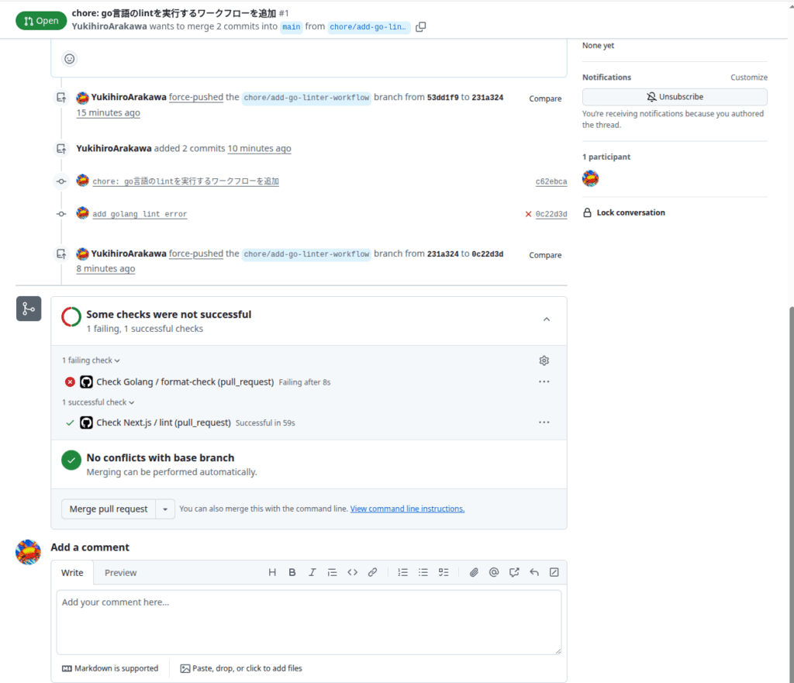
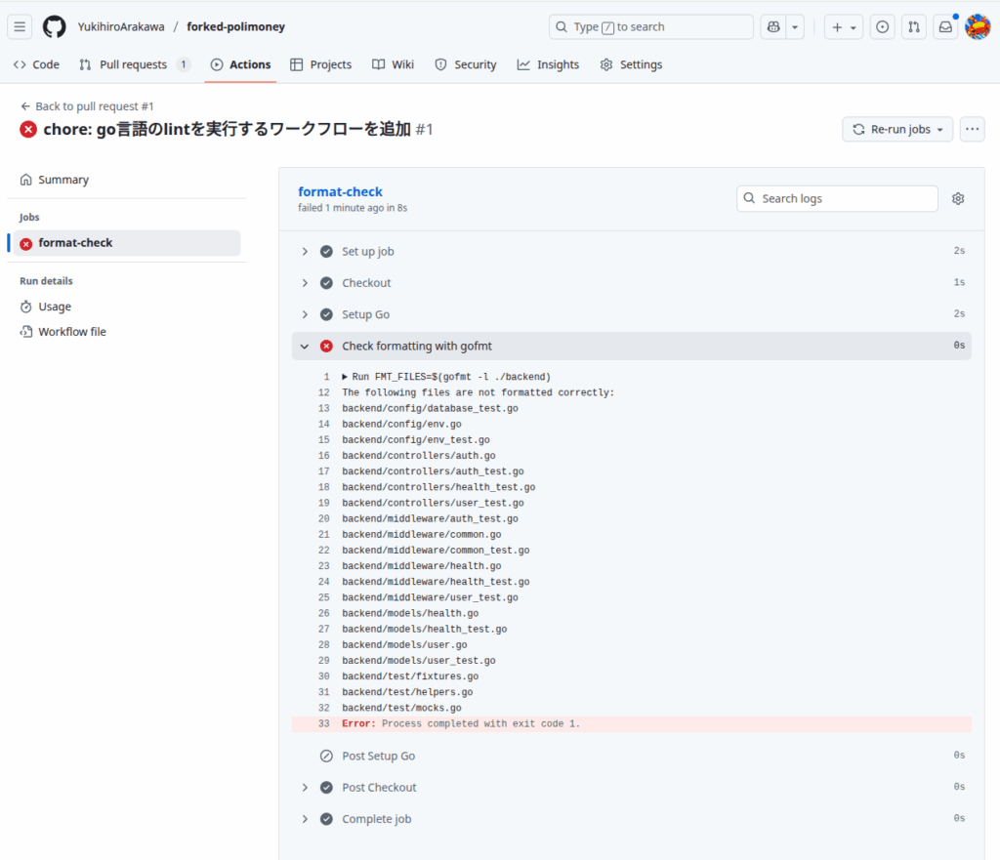

## はじめに

polimoneyという政治資金の見える化ツールがあります。

[https://github.com/digitaldemocracy2030/polimoney](https://github.com/digitaldemocracy2030/polimoney)

このツールはPythonとNext.jsとGo言語で書かれていますが、Go言語についてはPR作成時にLinterやFormatterが実行されるようになっていませんでした。

## lint-go.ymlの作成

そこで以下のlint-go.ymlを作成してみました。

polimoneyではbackendというディレクトリにGo言語のコードが格納されているため、こちらに修正が入った場合のみ実行されるようにしています。

```
name: Check Golang

# プルリクエストが作成・更新された時にこのワークフローを実行
on:
  pull_request:
    types: [opened, synchronize, reopened]
    # backendディレクトリ配下の.goファイルに変更があった場合のみ実行
    paths:
      - 'backend/**.go'

jobs:
  # フォーマットチェックを行うジョブ
  format-check:
    runs-on: ubuntu-latest

    steps:
      # 1. リポジトリのコードをチェックアウト
      - name: Checkout
        uses: actions/checkout@v4

      # 2. Go言語の環境をセットアップ
      - name: Setup Go
        uses: actions/setup-go@v5
        with:
          go-version: '1.22' # プロジェクトで使用しているGoのバージョンを指定

      # 3. gofmtでフォーマットをチェック
      # -l オプションはフォーマットが崩れているファイル名を出力する
      # 出力があった場合、ワークフローは失敗する
      - name: Check formatting with gofmt
        run: |
          FMT_FILES=$(gofmt -l ./backend)

          if [ -n "${FMT_FILES}" ]; then
            echo "The following files are not formatted correctly:"
            echo "${FMT_FILES}"
            exit 1
          fi

          echo "All Go files are correctly formatted."
```

## 動作確認

フォークした自分のリポジトリでPR作成してみて試したところ無事実行されました。



初回実行なのでフォーマッターが各ファイルに実行されておらずエラーが出まくります。

[https://github.com/YukihiroArakawa/forked-polimoney/actions/runs/17209158801/job/48816436244?pr=1](https://github.com/YukihiroArakawa/forked-polimoney/actions/runs/17209158801/job/48816436244?pr=1)



## PR提出

PR作成したら無事マージしてもらえました。

[https://github.com/digitaldemocracy2030/polimoney/pull/185](https://github.com/digitaldemocracy2030/polimoney/pull/185)
