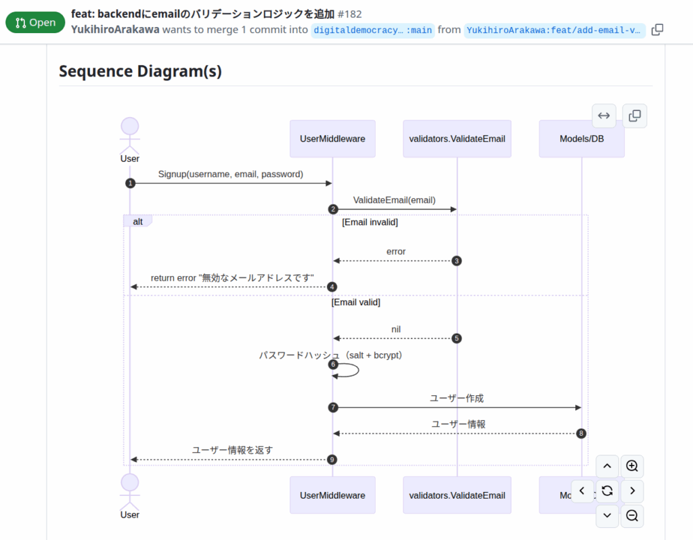

## はじめに

polimoneyというお金を見える化するためのOSSがあります。

[https://github.com/digitaldemocracy2030/polimoney](https://github.com/digitaldemocracy2030/polimoney)

そこでユーザ登録ロジックが実装されているのですが、メールのバリデーションが設定されていないので、誤ったメールアドレスが登録可能性がありました。

フロントエンド側ではメールバリデーションがされているのかもしれませんが、バックエンドでも実装されているべきだと思うので、今回はgemini cliを使ったvibe codingでPRを作っていきたいと思います。

※ Issueを作成したあとに気付いたのですが、まだバックエンドは開発中とのことでした。  

## 設計方針

基本方針としては以下の3点です。

- バリデーションはビジネスロジックとみなして、middleware層(service層)で行う

- バリデーションロジックはmiddleware層とは別クラスで実装することで、DBを使わずにテストできるようにする

- 既存データへの影響を抑えるため、DDLのCHECK制約ではバリデーションを実装しない

## プロンプト

```
backend/middleware/auth.goのSignupにUser.Emailのバリデーションを追加したいです。

別のクラスにバリデーションのメソッドを作成して、それを呼び出すようにしてください。

またkent beckのtddのスタイルでコーディングをしてください。
```

## 結果のコード

まずミドルウェア層からバリデーションをするようにしてくれています。

これはgeminiが書いたコードのまま

```
    feat: backendにemailのバリデーションを追加
---
 backend/middleware/auth.go                           |  6 ++++
 backend/middleware/validators/user_validator.go      | 20 +++++++++++++
 backend/middleware/validators/user_validator_test.go | 65 +++++++++++++++++++++++++++++++++++++++++++
 3 files changed, 91 insertions(+)

diff --git a/backend/middleware/auth.go b/backend/middleware/auth.go
index cb2450c..69d225f 100644
--- a/backend/middleware/auth.go
+++ b/backend/middleware/auth.go
@@ -7,12 +7,18 @@ import (
        "log"
        "os"

+       "github.com/digitaldemocracy2030/polimoney/middleware/validators"
        "github.com/digitaldemocracy2030/polimoney/models"
        "golang.org/x/crypto/bcrypt"
 )

 // Signup は新規ユーザー登録を行う
 func (um *UserMiddleware) Signup(username, email, password string) (*models.User, error) {
+       // Emailのバリデーション
+       if err := validators.ValidateEmail(email); err != nil {
+               return nil, fmt.Errorf("無効なメールアドレスです")
+       }
+
        // パスワードをsha256ハッシュ化
        // bcryptの72バイト制限回避のため
        salt := os.Getenv("PASSWORD_SALT")
```

こちらのコードについてもほぼそのままですね

```
diff --git a/backend/middleware/validators/user_validator.go b/backend/middleware/validators/user_valid
new file mode 100644
index 0000000..3223922
--- /dev/null
+++ b/backend/middleware/validators/user_validator.go
@@ -0,0 +1,20 @@
+package validators
+
+import (
+       "errors"
+       "fmt"
+       "net/mail"
+)
+
+// ValidateEmail checks if the email format is valid.
+func ValidateEmail(email string) error {
+       // 空の場合はエラー
+       if email == "" {
+               return errors.New("email is required")
+       }
+       _, err := mail.ParseAddress(email)
+       if err != nil {
+               return fmt.Errorf("invalid email format: %w", err)
+       }
+       return nil
+}
```

以下のテストコードについて、最初の出力では正常系も異常系ごちゃまぜになっており、やや見にくい状況でした。

そのため、Gemini2.5Proに相談して、正常系と異常系を分離する形にしてもらいました。

普段はjava/kotlinでしかテストコードを書かないのでGo言語におけるベストプラクティス的な書き方がわからないですが、一旦よさそう。

```
diff --git a/backend/middleware/validators/user_validator_test.go b/backend/middleware/validators/user_
new file mode 100644
index 0000000..55cffdb
--- /dev/null
+++ b/backend/middleware/validators/user_validator_test.go
@@ -0,0 +1,65 @@
+package validators
+
+import (
+       "testing"
+
+       "github.com/stretchr/testify/assert"
+)
+
+func TestValidateEmail(t *testing.T) {
+       // --- 正常系テストケース ---
+       validTestCases := []struct {
+               name  string
+               email string
+       }{
+               {
+                       name:  "valid email",
+                       email: "test@example.com",
+               },
+               {
+                       name:  "valid email with subdomain",
+                       email: "test@sub.example.com",
+               },
+       }
+
+       for _, tc := range validTestCases {
+               t.Run(tc.name, func(t *testing.T) {
+                       err := ValidateEmail(tc.email)
+                       assert.NoError(t, err)
+               })
+       }
+ 
+       // --- 異常系テストケース ---
+       invalidTestCases := []struct {
+               name  string
+               email string
+       }{
+               {
+                       name:  "invalid email - no at sign",
+                       email: "testexample.com",
+               },
+               {
+                       name:  "invalid email - no domain",
+                       email: "test@",
+               },
+               {
+                       name:  "invalid email - no local part",
+                       email: "@example.com",
+               },
+               {
+                       name:  "invalid email - multiple at signs",
+                       email: "test@@example.com",
+               },
+               {
+                       name:  "empty email",
+                       email: "",
+               },
+       }
+
+       for _, tc := range invalidTestCases {
+               t.Run(tc.name, func(t *testing.T) {
+                       err := ValidateEmail(tc.email)
+                       assert.Error(t, err)
+               })
+       }
```

## 作成したPR

まだバックエンドは開発途中ということなのでリジェクトされるかもしれませんが、ダメ元で一旦PR作成してみました

[https://github.com/digitaldemocracy2030/polimoney/pull/182](https://github.com/digitaldemocracy2030/polimoney/pull/182)

Code Rabbitくんがシーケンスとか自動で書いていてすごいですね


