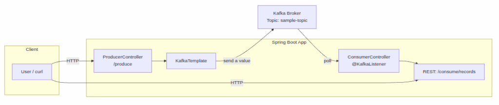
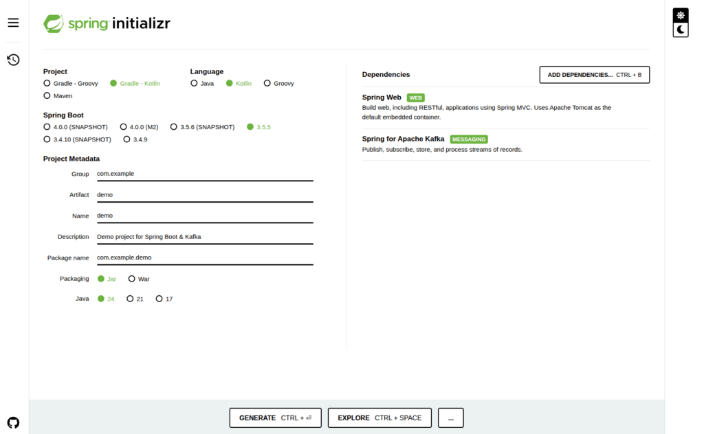
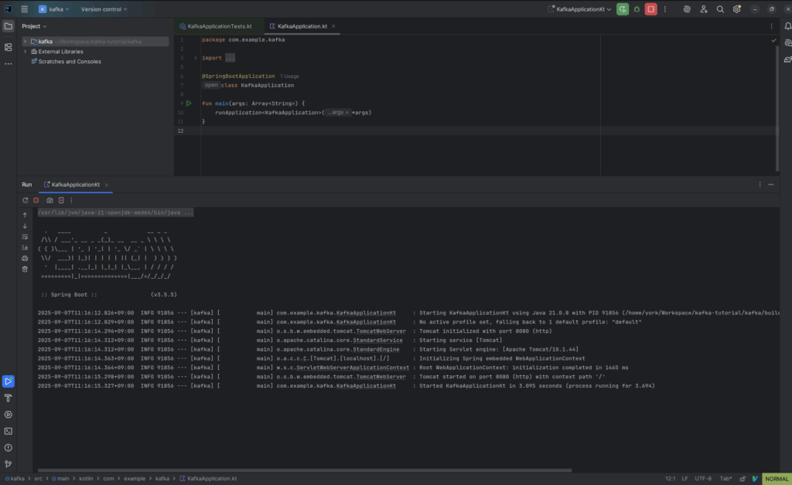
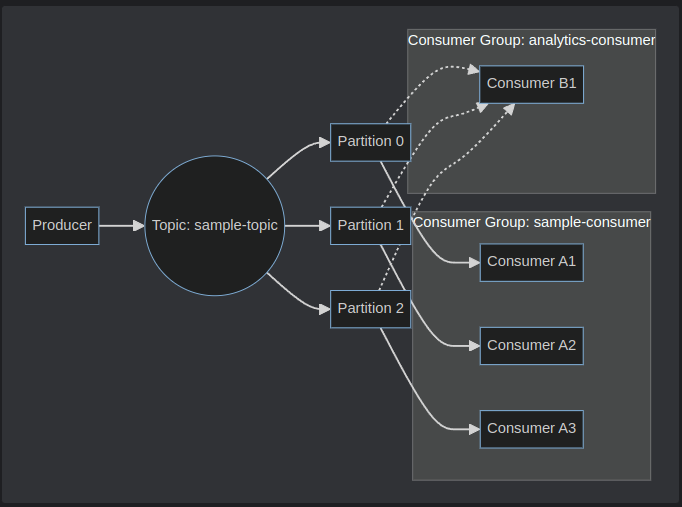
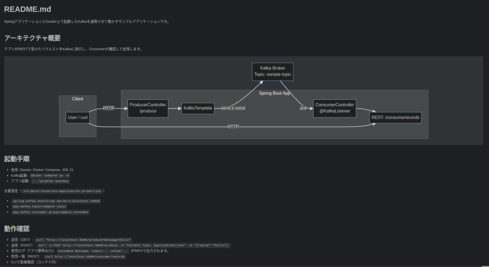

## はじめに

前回でKafkaのチュートリアルを一通りやることができたので次はSpringアプリケーションとKafkaをDocker上で動かして簡単なサンプルアプリを作成してみようかと思います。

https://yukiotechblog.com/learning-kafka-wirh-ai-2/

作成するアプリのイメージは以下のとおりです。



処理の流れとしては以下の通りですね

1. ClientからcurlでSpring Applicationにリクエストを送る

3. コントローラーは受け取ったリクエストを元にKafkaにイベント発行する

5. 別のコントローラーでKafkaのイベントをリッスンしておき、結果をログに出力

## Spring Initializerでプロジェクトを作成する

まず以下の設定でSpring Projectを作成していきます。

[https://start.spring.io](https://start.spring.io)



```
$ unzip kafka.zip
$ cd kafka
$ ls
Permissions Size User Date Modified Name
drwxr-xr-x     - york  7 Sep 11:04   gradle
drwxr-xr-x     - york  7 Sep 11:04   src
.rw-r--r-- 1.1k york  7 Sep 11:04   build.gradle.kts
.rwxr-xr-x  8.7k york  7 Sep 11:04   gradlew
.rw-r--r-- 2.9k york  7 Sep 11:04   gradlew.bat
.rw-r--r-- 1.2k york  7 Sep 11:04   HELP.md
.rw-r--r-- 27 york  7 Sep 11:04   settings.gradle.kts
```

IDEAで開いてSprigアプリが起動できるか確かめてみましょう

```
***************************
APPLICATION FAILED TO START
***************************

Description:

Web server failed to start. Port 8080 was already in use.

Action:

Identify and stop the process that's listening on port 8080 or configure this application to listen on another port.

Process finished with exit code 1
```

他のdockerコンテナがすでにポートを使用していたので、停止しておきましょう

それではもう一度起動



無事アプリが立ち上がってそうですね

## Kafkaをdocker composeで立ち上げる

次にKafkaの準備をしていきましょう

codexさんにkafkaをdocker composeで立ち上げるymlを作ってもらいました。

kafkaは分散ノードの整合性担保のためにzookeeperを使う方法とkraftを使う方法の2種類があるそうです。

kraftのほうが1ノードで済むしモダンとのことなのですが、簡単に立ち上がるのはzookeeperを使った方法らしいです。

```
version: '3.8'

services:
  zookeeper:
    image: confluentinc/cp-zookeeper:7.6.1
    container_name: zookeeper
    environment:
      ZOOKEEPER_CLIENT_PORT: 2181
      ZOOKEEPER_TICK_TIME: 2000
    ports:
      - "2181:2181"

  kafka:
    image: confluentinc/cp-kafka:7.6.1
    container_name: kafka
    depends_on:
      - zookeeper
    ports:
      - "29092:29092"
    environment:
      KAFKA_BROKER_ID: 1
      KAFKA_ZOOKEEPER_CONNECT: zookeeper:2181
      KAFKA_LISTENER_SECURITY_PROTOCOL_MAP: PLAINTEXT:PLAINTEXT,PLAINTEXT_HOST:PLAINTEXT
      KAFKA_ADVERTISED_LISTENERS: PLAINTEXT://kafka:9092,PLAINTEXT_HOST://localhost:29092
      KAFKA_LISTENERS: PLAINTEXT://0.0.0.0:9092,PLAINTEXT_HOST://0.0.0.0:29092
      KAFKA_INTER_BROKER_LISTENER_NAME: PLAINTEXT
      KAFKA_OFFSETS_TOPIC_REPLICATION_FACTOR: 1
      KAFKA_TRANSACTION_STATE_LOG_MIN_ISR: 1
      KAFKA_TRANSACTION_STATE_LOG_REPLICATION_FACTOR: 1
```

それではdocker composeで立ち上げていきましょう。

```
$ docker compose up -d
$ docker ps

CONTAINER ID   IMAGE                             COMMAND                  CREATED          STATUS          PORTS                                                             NAMES
d73bb44193b4   confluentinc/cp-kafka:7.6.1       "/etc/confluent/dock…"   31 seconds ago   Up 31 seconds   9092/tcp, 0.0.0.0:29092->29092/tcp, [::]:29092->29092/tcp         kafka
0e757595ccab   confluentinc/cp-zookeeper:7.6.1   "/etc/confluent/dock…"   32 seconds ago   Up 31 seconds   2888/tcp, 0.0.0.0:2181->2181/tcp, [::]:2181->2181/tcp, 3888/tcp   zookeeper
```

立ち上がってそうですね

立ち上げたコンテナに入って動作確認をしましょう

まずはプロデューサーのサーバーを立ち上げてイベントを発行してみます。

```
$ docker exec -it kafka bash
[appuser@d73bb44193b4 ~]$ kafka-topics --bootstrap-server localhost:9092 --list

[appuser@d73bb44193b4 ~]$ kafka-console-producer --bootstrap-server localhost:9092 --topic test
> This is first event.
```

別のターミナルセッションでコンシューマーを立ち上げてイベントが購読されている確認します。

```
$ docker exec -it kafka bash
[appuser@d73bb44193b4 ~]$ kafka-console-consumer --bootstrap-server localhost:9092 --topic test

[2025-09-07 03:01:43,802] WARN [Consumer clientId=console-consumer, groupId=console-consumer-4603] Error while fetching metadata with correlation id 2 : {test=LEADER_NOT_AVAILABLE} (org.apache.kafka.clients.NetworkClient)
[2025-09-07 03:01:43,918] WARN [Consumer clientId=console-consumer, groupId=console-consumer-4603] Error while fetching metadata with correlation id 4 : {test=LEADER_NOT_AVAILABLE} (org.apache.kafka.clients.NetworkClient)
[2025-09-07 03:01:44,024] WARN [Consumer clientId=console-consumer, groupId=console-consumer-4603] Error while fetching metadata with correlation id 6 : {test=LEADER_NOT_AVAILABLE} (org.apache.kafka.clients.NetworkClient)

This is first event.
```

無事「This is first event」が購読されていますね。

## Spring ApplicationからKafkaにイベント発行するコントローラーを作成する

次にSpringのApplicationに対してRESTでアクセスした際にイベントを発行するコントローラーを作成しましょう。

### ProducerControllerの作成

まずREST経由でSpringアプリケーションにアクセスするために、ProducerControllerを作成します。

ここで/produceというエンドポイントにポストされたら、sample-topicというトピックに対して、リクエストのkey/valueを載せたイベントを発行するようにします

```
package com.example.kafka.web

import org.springframework.beans.factory.annotation.Value
import org.springframework.http.ResponseEntity
import org.springframework.kafka.core.KafkaTemplate
import org.springframework.web.bind.annotation.*
import java.util.concurrent.TimeUnit

@RestController
@RequestMapping("/produce")
class ProducerController(
    private val kafkaTemplate: KafkaTemplate<String, String>,
    @Value("\${app.kafka.topic:sample-topic}") private val topic: String,
) {

    data class EventRequest(
        val key: String? = null,
        val value: String,
    )

    @PostMapping
    fun publish(@RequestBody req: EventRequest): ResponseEntity<Map<String, Any?>> {
        val future = if (req.key == null) {
            kafkaTemplate.send(topic, req.value)
        } else {
            kafkaTemplate.send(topic, req.key, req.value)
        }
        val result = future.get(5, TimeUnit.SECONDS)
        val metadata = result.recordMetadata
        val body = mapOf(
            "topic" to metadata.topic(),
            "partition" to metadata.partition(),
            "offset" to metadata.offset(),
            "timestamp" to metadata.timestamp(),
            "key" to req.key,
            "value" to req.value,
        )
        return ResponseEntity.ok(body)
    }

    @GetMapping
    fun publishQuick(@RequestParam("message") message: String): ResponseEntity<Map<String, Any?>> =
        publish(EventRequest(value = message))
}
```

ミソはKafkaTemplateというクラスで簡単にKafkaにリクエストを遅れるようになっている点ですかね

### application.propertiesにkafka serverの情報などを記載しておく

propertyにKafkaのサーバーの情報を記載しておきます。

ここでどのKafkaにアクセスするかを決めているっぽい。

```
spring.application.name=kafka
spring.kafka.bootstrap-servers=localhost:29092
app.kafka.topic=sample-topic
```

またデフォルトのトピックについてもここで定義しています。

モジュールの単位でトピックを作っていくならプロパティに定義する形になるのかな

トピックってDBでいうところのスキーマとかテーブルにあたると思うのでできればマイグレーションスクリプトみたいな感じで管理できるといいと思っていたんだけど、何がいいんだろうか

### KafkaProducerConfig.kt

次にKafkaのProducerを動かすためのコンフィグクラスを作ります。

```
package com.example.kafka.config

import org.apache.kafka.clients.producer.ProducerConfig
import org.apache.kafka.common.serialization.StringSerializer
import org.springframework.boot.autoconfigure.kafka.KafkaProperties
import org.springframework.context.annotation.Bean
import org.springframework.context.annotation.Configuration
import org.springframework.kafka.core.DefaultKafkaProducerFactory
import org.springframework.kafka.core.KafkaTemplate
import org.springframework.kafka.core.ProducerFactory
import org.springframework.kafka.config.TopicBuilder
import org.apache.kafka.clients.admin.NewTopic
import org.springframework.beans.factory.annotation.Value

@Configuration
class KafkaProducerConfig(
    private val kafkaProperties: KafkaProperties,
) {

    @Bean
    fun producerFactory(): ProducerFactory<String, String> {
        val props = kafkaProperties.buildProducerProperties().toMutableMap()
        props.putIfAbsent(ProducerConfig.KEY_SERIALIZER_CLASS_CONFIG, StringSerializer::class.java)
        props.putIfAbsent(ProducerConfig.VALUE_SERIALIZER_CLASS_CONFIG, StringSerializer::class.java)
        return DefaultKafkaProducerFactory(props)
    }

    @Bean
    fun kafkaTemplate(): KafkaTemplate<String, String> = KafkaTemplate(producerFactory())

    @Bean
    fun eventsTopic(
        @Value("\${app.kafka.topic:sample-topic}") topic: String,
    ): NewTopic = TopicBuilder.name(topic).partitions(1).replicas(1).build()
}
```

イマイチ何をやっているのかという感じなのでcodexに説明してもらいましょう

> ▌kafkaProducerConfig.ktはなんのためのクラス？何をやってるの？
> 
> > 以下は本プロジェクトの KafkaProducerConfig.kt の役割と中身の説明です。
> 
> - 目的
>     - Kafkaへの「送信（produce）」を行うためのSpring構成クラス。プロデューサ関連の  
>         BeanをDIコンテナに登録します。
>     
>     - Kafkaへの「送信（produce）」を行うためのSpring構成クラス。プロデューサ関連の  
>         BeanをDIコンテナに登録します。  
>         \- 
>         定義している主なBean
>     
>     - ProducerFactory: 送信時のクライアント生成元。spring.kafka.\*  
>         の設定を取り込みつつ、キー/値のシリアライザを StringSerializer に設定。
>     
>     - KafkaTemplate: アプリからメッセージ送信に使う高レベルAPI。  
>         ProducerController がこれを注入され、send() でKafkaに発行します。
>     
>     - NewTopic: 起動時に存在しない場合はトピックを作成するための定義（Spring Kafka  
>         のAdmin機能が有効な場合）。名前は app.kafka.topic（デフォルト sample-topic）、パー  
>         ティション1・レプリカ1。  
>         \- 
>         どこから設定を読むか
>     
>     - KafkaProperties 経由で application.properties の spring.kafka.\* を読み込み  
>         ます。
>     
>     - 例: spring.kafka.bootstrap-servers=localhost:29092 が ProducerFactory に反映  
>         されます。  
>         \- 
>         起動時のトピック作成について
>     
>     - spring-kafka は spring.kafka.bootstrap-servers が設定されていると自動で  
>         KafkaAdmin を用意し、NewTopic Bean 定義に基づいてトピックを作成します（既存ならスキップ）。
>     
>     - ブローカー側で権限/設定が不足していると作成に失敗するため、その場合はCLIで作  
>         成してください。  
>         \- 
>         カスタマイズの例
>     
>     - トピック名変更: application.properties の app.kafka.topic を編集。
>     
>     - 送信のシリアライザ変更: ProducerConfig.VALUE\_SERIALIZER\_CLASS\_CONFIG を別のシ  
>         リアライザに差し替え。
>     
>     - パフォーマンス調整: acks、batch.size、linger.ms、compression.type などを  
>         spring.kafka.producer.\* で設定。  
>         \- 
>         関連
>     
>     - ProducerController は KafkaTemplate を用いて /produce リクエストを受けると  
>         sample-topic にメッセージを送信します。

### 動作確認

それでは動作確認のためにE2Eテストを作成していきます

```
package com.example.kafka

import org.apache.kafka.clients.consumer.ConsumerConfig
import org.apache.kafka.common.serialization.StringDeserializer
import org.junit.jupiter.api.Assertions.assertTrue
import org.junit.jupiter.api.Test
import org.springframework.beans.factory.annotation.Autowired
import org.springframework.boot.test.context.SpringBootTest
import org.springframework.boot.test.web.client.TestRestTemplate
import org.springframework.boot.test.web.server.LocalServerPort
import org.springframework.http.HttpEntity
import org.springframework.http.HttpHeaders
import org.springframework.http.MediaType
import org.springframework.kafka.core.DefaultKafkaConsumerFactory
import org.springframework.kafka.support.serializer.ErrorHandlingDeserializer
import org.springframework.kafka.test.EmbeddedKafkaBroker
import org.springframework.kafka.test.context.EmbeddedKafka
import org.springframework.kafka.test.utils.KafkaTestUtils
import org.springframework.test.context.TestPropertySource
import java.time.Duration

@SpringBootTest(webEnvironment = SpringBootTest.WebEnvironment.RANDOM_PORT)
@EmbeddedKafka(partitions = 1, topics = ["sample-topic"])
@TestPropertySource(properties = [
    "spring.kafka.bootstrap-servers=\${spring.embedded.kafka.brokers}"
])
class ProducerE2ETest {

    @Autowired
    lateinit var rest: TestRestTemplate

    @Autowired
    lateinit var embeddedKafka: EmbeddedKafkaBroker

    @LocalServerPort
    var port: Int = 0

    @Test
    fun `POST to produce publishes to Kafka`() {
        val message = "hello-e2e"

        val headers = HttpHeaders()
        headers.contentType = MediaType.APPLICATION_JSON
        val body = mapOf("value" to message)
        val entity = HttpEntity(body, headers)

        val response = rest.postForEntity("http://localhost:$port/produce", entity, Map::class.java)
        assertTrue(response.statusCode.is2xxSuccessful, "Request to /produce should succeed")

        val consumerProps = KafkaTestUtils.consumerProps("e2e-consumer", "true", embeddedKafka).toMutableMap()
        consumerProps[ConsumerConfig.KEY_DESERIALIZER_CLASS_CONFIG] = ErrorHandlingDeserializer::class.java
        consumerProps[ConsumerConfig.VALUE_DESERIALIZER_CLASS_CONFIG] = ErrorHandlingDeserializer::class.java
        consumerProps[ErrorHandlingDeserializer.KEY_DESERIALIZER_CLASS] = StringDeserializer::class.java
        consumerProps[ErrorHandlingDeserializer.VALUE_DESERIALIZER_CLASS] = StringDeserializer::class.java
        consumerProps[ConsumerConfig.AUTO_OFFSET_RESET_CONFIG] = "earliest"

        val consumerFactory = DefaultKafkaConsumerFactory<String, String>(consumerProps)
        val consumer = consumerFactory.createConsumer()
        consumer.subscribe(listOf("sample-topic"))

        val records = KafkaTestUtils.getRecords(consumer, Duration.ofSeconds(5))
        val values = records.records("sample-topic").map { it.value() }

        assertTrue(values.contains(message), "Kafka should contain the produced message")

        consumer.close()
    }
}
```

ここではイベント発行時にConsumer側でイベントを受け取れているか確認しています。

## Kafkaのイベントを購読するコントローラーを作成する

イベント発行をするコントローラを作成したので、次はトピックを購読してそのイベントに応じて処理をするConsumerControllerを作成していきましょう。

### ConsumerController.kt

まずはコントローラーから作成します。

```
package com.example.kafka.web

import org.apache.kafka.clients.consumer.ConsumerRecord
import org.springframework.beans.factory.annotation.Value
import org.springframework.http.ResponseEntity
import org.springframework.kafka.annotation.KafkaListener
import org.springframework.web.bind.annotation.DeleteMapping
import org.springframework.web.bind.annotation.GetMapping
import org.springframework.web.bind.annotation.RequestMapping
import org.springframework.web.bind.annotation.RestController
import java.time.Instant
import java.util.concurrent.ConcurrentLinkedDeque
import org.slf4j.LoggerFactory

@RestController
@RequestMapping("/consume")
class ConsumerController(
    @Value("\${app.kafka.consumer-group:sample-consumer}") private val groupId: String,
) {
    companion object {
        private val log = LoggerFactory.getLogger(ConsumerController::class.java)
    }
    data class ConsumedEvent(
        val topic: String,
        val partition: Int,
        val offset: Long,
        val timestamp: Long,
        val key: String?,
        val value: String,
        val receivedAt: Long = Instant.now().toEpochMilli(),
    )

    private val recent = ConcurrentLinkedDeque<ConsumedEvent>()
    private val maxKeep = 100

    @KafkaListener(
        topics = ["\${app.kafka.topic:sample-topic}"],
        groupId = "\${app.kafka.consumer-group:sample-consumer}"
    )
    fun listen(record: ConsumerRecord<String, String>) {
        log.info(
            "Consumed message: topic={}, partition={}, offset={}, key={}, value={}, timestamp={}, groupId={}",
            record.topic(), record.partition(), record.offset(), record.key(), record.value(), record.timestamp(), groupId
        )
        val event = ConsumedEvent(
            topic = record.topic(),
            partition = record.partition(),
            offset = record.offset(),
            timestamp = record.timestamp(),
            key = record.key(),
            value = record.value(),
        )
        recent.addFirst(event)
        while (recent.size > maxKeep) recent.removeLast()
    }

    @GetMapping("/records")
    fun records(): ResponseEntity<List<ConsumedEvent>> = ResponseEntity.ok(recent.toList())

    @DeleteMapping("/records")
    fun clear(): ResponseEntity<Void> {
        recent.clear()
        return ResponseEntity.noContent().build()
    }
}
```

ミソは@KafkaListenerをつければ指定したTopicを購読できるという点ですかね

これだけでイベント駆動できるの便利ですね

### KafkaConfig.kt

次にConfigクラスも同様に作っていきます。

```
package com.example.kafka.config

import org.apache.kafka.clients.consumer.ConsumerConfig
import org.apache.kafka.common.serialization.StringDeserializer
import org.springframework.boot.autoconfigure.kafka.KafkaProperties
import org.springframework.context.annotation.Bean
import org.springframework.context.annotation.Configuration
import org.springframework.kafka.config.ConcurrentKafkaListenerContainerFactory
import org.springframework.kafka.core.ConsumerFactory
import org.springframework.kafka.core.DefaultKafkaConsumerFactory

@Configuration
class KafkaConsumerConfig(
    private val kafkaProperties: KafkaProperties,
) {
    @Bean
    fun consumerFactory(): ConsumerFactory<String, String> {
        val props = kafkaProperties.buildConsumerProperties().toMutableMap()
        props.putIfAbsent(ConsumerConfig.KEY_DESERIALIZER_CLASS_CONFIG, StringDeserializer::class.java)
        props.putIfAbsent(ConsumerConfig.VALUE_DESERIALIZER_CLASS_CONFIG, StringDeserializer::class.java)
        props.putIfAbsent(ConsumerConfig.AUTO_OFFSET_RESET_CONFIG, "earliest")
        return DefaultKafkaConsumerFactory(props)
    }

    @Bean
    fun kafkaListenerContainerFactory(): ConcurrentKafkaListenerContainerFactory<String, String> {
        val factory = ConcurrentKafkaListenerContainerFactory<String, String>()
        factory.consumerFactory = consumerFactory()
        return factory
    }
}
```

### application.propertiesにconsumer-groupを追加

最後にプロパティファイルにconsuemr groupを追加します

```
spring.application.name=kafka
spring.kafka.bootstrap-servers=localhost:29092
app.kafka.topic=sample-topic
++ app.kafka.consumer-group=sample-consumer
```

イマイチ必要性がよくわからなかったのでcodexに説明させます

> ▌consumer groupのidって何？なんで必要？
> 
> 概要
> 
> - consumer group ID は「どのコンシューマ群が同じ処理グループとして動くか」を識別す  
>     る名前。
> 
> - 同じ group ID に属するコンシューマは、同じトピック内のパーティションを分担して処  
>     理します。
> 
> - 必要な理由
>     - スケールアウト: 同一グループ内のインスタンス数に応じてパーティションが自動で割り当てられ、負荷分散される。
>     
>     - フォールトトレランス: インスタンス停止時は残りのメンバーに再割り当て（リバラン  
>         ス）される。
>     
>     - オフセット管理: 各グループ単位で「どこまで読んだか」を\_\_consumer\_offsetsに保存。  
>         別グループは独立して読み位置を持つ。
>     
>     - 配信モード制御: 同一グループは「キュー」的に分担消費、異なるグループは「ブロード  
>         キャスト」的に全グループへ配信。
> 
> - 挙動の要点
>     - 同じgroup IDのコンシューマが複数起動すると、パーティションが分配されて重複処理しない。
>     
>     - 異なるgroup IDなら、それぞれがトピックの全メッセージを独立に消費できる。
>     
>     - グループ変更＝別の読み取り履歴になるため、既読メッセージを再読することがある  
>         （auto.offset.resetに依存）。

イメージ図も作ってもらいました。



分析用のグループと更新系のグループみたいな感じでグループ分けしておくことで論理的にどのような処理として使われるか区別したりできるわけですかね

### 動作確認

それでは動作確認としてClient -> Producer -> Kafka -> Consumerという流れがうまく実装されているかチェックするテストを作成します。

```
package com.example.kafka

import org.junit.jupiter.api.Assertions.assertTrue
import org.junit.jupiter.api.Test
import org.springframework.beans.factory.annotation.Autowired
import org.springframework.boot.test.context.SpringBootTest
import org.springframework.boot.test.web.client.TestRestTemplate
import org.springframework.boot.test.web.server.LocalServerPort
import org.springframework.core.ParameterizedTypeReference
import org.springframework.http.HttpEntity
import org.springframework.http.HttpHeaders
import org.springframework.http.HttpMethod
import org.springframework.http.MediaType
import org.springframework.kafka.test.context.EmbeddedKafka
import org.springframework.test.context.TestPropertySource
import java.util.UUID

@SpringBootTest(webEnvironment = SpringBootTest.WebEnvironment.RANDOM_PORT)
@EmbeddedKafka(partitions = 1, topics = ["sample-topic"])
@TestPropertySource(properties = [
    "spring.kafka.bootstrap-servers=\${spring.embedded.kafka.brokers}",
    "app.kafka.consumer-group=e2e-consumer-group"
])
class ProduceConsumeE2ETest {

    @Autowired
    lateinit var rest: TestRestTemplate

    @LocalServerPort
    var port: Int = 0

    private fun url(path: String) = "http://localhost:$port$path"

    @Test
    fun `produce then consume via REST reflects message`() {
        // Clear previous in-memory records on the consumer side
        rest.delete(url("/consume/records"))

        val message = "e2e-" + UUID.randomUUID()

        val headers = HttpHeaders()
        headers.contentType = MediaType.APPLICATION_JSON
        val entity = HttpEntity(mapOf("value" to message), headers)

        val produceResp = rest.postForEntity(url("/produce"), entity, Map::class.java)
        assertTrue(produceResp.statusCode.is2xxSuccessful, "produce endpoint should succeed")

        // Poll the consumer records REST endpoint until the message appears
        val typeRef = object : ParameterizedTypeReference<List<Map<String, Any>>>() {}
        var found = false
        val deadline = System.currentTimeMillis() + 10_000 // up to 10 seconds
        while (System.currentTimeMillis() < deadline && !found) {
            val resp = rest.exchange(url("/consume/records"), HttpMethod.GET, null, typeRef)
            if (resp.statusCode.is2xxSuccessful) {
                val list = resp.body ?: emptyList()
                found = list.any { (it["value"] as? String) == message }
            }
            if (!found) Thread.sleep(250)
        }

        assertTrue(found, "Consumer should have received the produced message via Kafka")
    }
}
```

無事テストコードも通ってそうですね。

## リポジトリをまとめたREADME.mdの作成

最後にここまでで作成したリポジトリを説明したREADME.mdをcodexに作ってもらいました。

client -> producer controller -> kafka broker -> consumer controllerという流れをまとめた図と動作確認手順などをまとめてくれました。



## おわりに

今回はSpringアプリケーションからKafkaを経由して処理をするサンプルアプリケーションを作成してみました。

KotlinでKafkaを扱う際のイメージが湧いてより実践的な知識がついたのではないかと思います。

みなさんもぜひサンプルアプリを動かしてみてください〜

[https://github.com/YukihiroArakawa/kafka-tutorial/tree/main/kafka](https://github.com/YukihiroArakawa/kafka-tutorial/tree/main/kafka)
