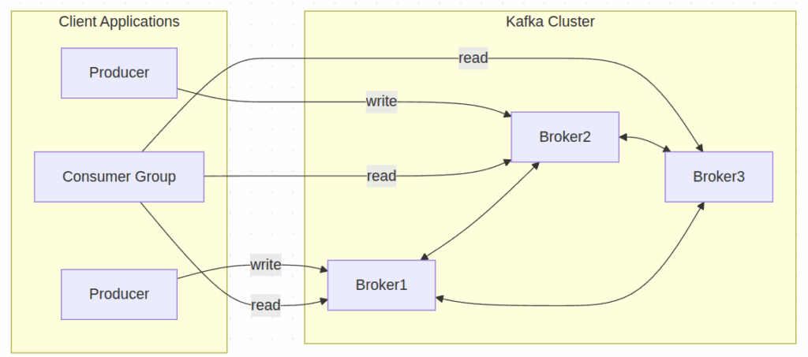
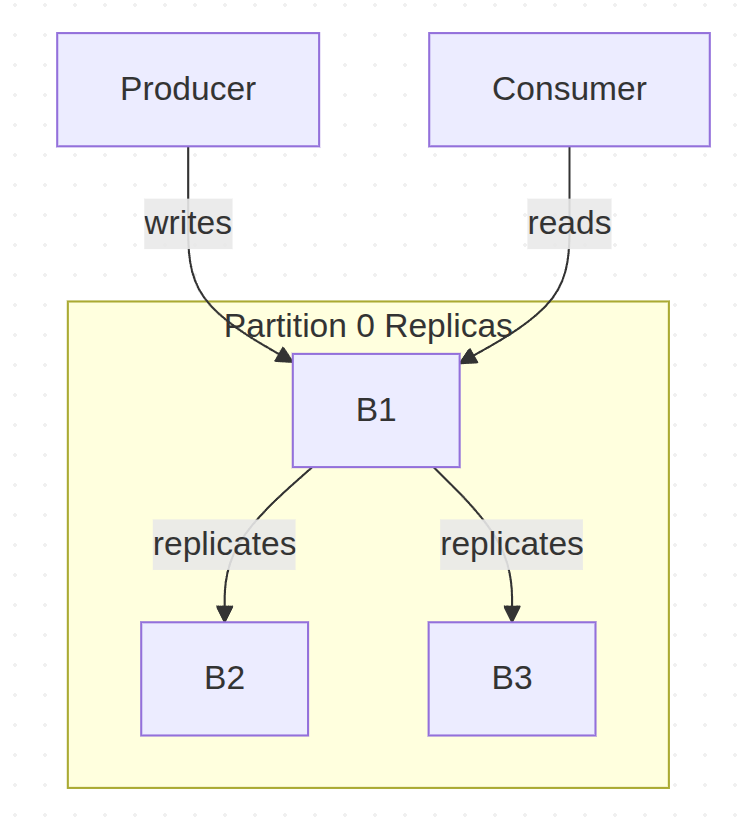
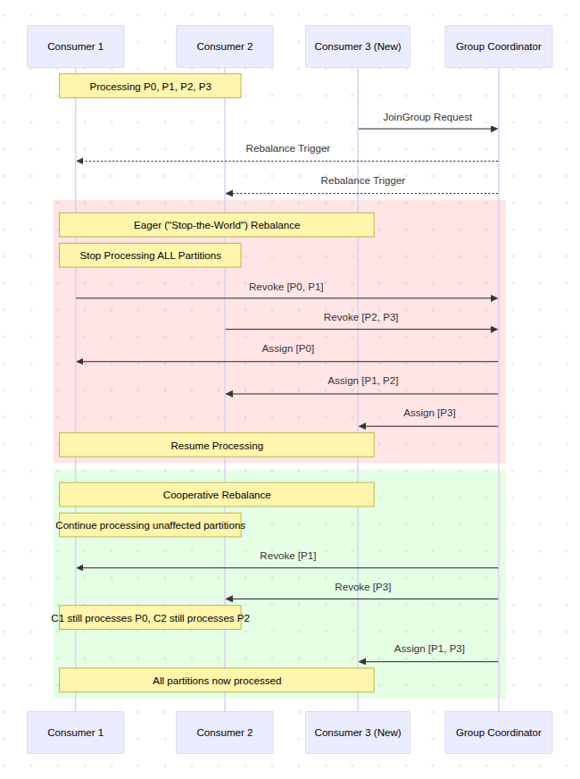

それではgemini2.5ProのDeep Research機能で概要を調べてみましょう

以下Research結果

# Apache Kafkaのアーキテクチャ詳説：コアコンセプトとメカニズム

## 第1章 Apache Kafka：イベントストリーミングプラットフォームとしての概論

Apache Kafkaは、現代のデータインフラストラクチャにおいて中心的な役割を果たす技術として広く認識されています。しかし、その真価を理解するためには、単なるメッセージングシステムという枠を超え、「イベントストリーミングプラットフォーム」というパラダイムの転換を捉える必要があります。本章では、Kafkaの根幹をなすこのパラダイムを定義し、その核となる3つの能力、そしてそのすべてを支える基盤原理である「分散コミットログ」について詳述します。

### 1.1 「イベントストリーミング」パラダイムの定義

Apache Kafkaは公式に「イベントストリーミングプラットフォーム」として定義されています 1。この文脈における「イベント」とは、ビジネスやシステム内で「何かが起こった」という事実を記録したデータであり、ドキュメントでは「レコード」や「メッセージ」とも呼ばれます 1。イベントストリーミングとは、これらのイベントを発生源からリアルタイムで継続的に捕捉し、連続したデータの流れ（ストリーム）として扱う考え方です 6。

このパラダイムは、従来の「静的なデータ（data at rest）」を中心としたデータベースとは対照的に、「動的なデータ（data in motion）」を第一級の市民として扱います。Kafkaは、リアルタイムで発生する大量のデータフィードを処理するために設計されており、そのアーキテクチャ全体がこの目的に最適化されています 8。例えば、決済取引、モバイルデバイスからの位置情報更新、IoTデバイスからのセンサー測定値など、絶え間なく生成されるデータストリームを効率的に処理する能力が求められます 1。このパラダイムシフトは、企業がデータを事後的に分析するだけでなく、発生した瞬間に価値を引き出し、即座に行動を起こすことを可能にする点で、極めて重要です。

### 1.2 3つのコア能力：Publish/Subscribe、Store、Process

Kafkaのプラットフォームとしての能力は、相互に連携する3つの主要な機能に集約されます 4。

1. **Publish/Subscribe（発行/購読）**: イベントストリームを発行（書き込み）し、購読（読み取り）する能力。これには、他のシステムからの継続的なデータのインポート/エクスポートも含まれます。

3. **Store（保存）**: イベントストリームを、必要とされる期間、永続的かつ信頼性の高い方法で保存する能力。

5. **Process（処理）**: イベントストリームを、発生したその場でリアルタイムに、あるいは過去に遡って処理する能力。

これらの機能は、分散型でスケーラブル、耐障害性を持ち、かつセキュアな方法で提供されます 2。特筆すべきは、これらの能力が独立しているのではなく、相乗効果を生み出す点です。特に「永続的な保存」能力は、KafkaをRabbitMQやActiveMQのような従来のメッセージブローカーと一線を画す、真のストリーミングプラットフォームたらしめる要素です 10。従来のメッセージングシステムでは、メッセージは消費されると削除されるのが一般的でした 5。しかしKafkaでは、データは設定された保存期間（数秒から数年、あるいは無期限まで）に基づいてディスクに永続化されます 3。

memo: ここ面白いポイントですね、他のメッセージブローカーだと永続性はあまり重視されていないんですね。単なるキューとして役割が強いんでしょうか。

この永続性により、コンシューマ（消費者）は自身のペースでデータを処理でき、システム障害からの復旧や、過去のデータに対する再分析（レトロスペクティブ分析）が可能になります 3。この設計は、プロデューサー（生産者）とコンシューマの間に存在する時間的な制約を完全に取り払います。データはもはや一度きりの配信物ではなく、繰り返しアクセス可能な「真実の源（source of truth）」へと昇華します。その結果、複数の独立したアプリケーションが、異なる目的で、異なるタイミングで同じデータストリームにアクセスできるようになり、組織内でのデータ共有を促進し、データサイロの解消に貢献します 1。これは、新しいアプリケーションを既存のデータストリーム上に構築する際に、ソースシステムを再設計する必要がなくなることを意味し、組織の俊敏性と革新性を飛躍的に向上させるアーキテクチャ上の大きな利点となります。

ここがポイントっぽいですね。データを永続化することで耐障害性や分析性を高めている。

### 1.3 分散コミットログ：基盤となる設計原理

Kafkaのアーキテクチャを理解する上で最も根源的な概念は、それが「分散コミットログ」の抽象化に基づいているという点です 3。コミットログとは、追記専用（append-only）で、順序が保証された不変のデータ構造です。Kafkaは、この単純ながらも強力な概念を分散環境で実現しています。

イベントがKafkaに書き込まれると、それはログの末尾に追記されます 2。一度書き込まれたデータは変更不可能です。この設計は、ディスクへの高速なシーケンシャルI/Oを可能にし、Kafkaの驚異的なスループット性能の源泉となっています 11。また、データはディスクに永続化されるため、高い耐久性が保証されます 3。

TiDBのストレージエンジンであるTitanでもLSM Treeという追記専用のデータ構造が使われており、B+ツリーと比べて挿入がとても高速だそうです。ランダムアクセスが発生しないから高速というのがポイントですね。

さらに、Kafkaは分散システムの外部コミットログとしても機能します 1。これは、システム内のノード間でデータを複製する際の信頼性の高いメカニズムとして、また、障害が発生したノードが自身の状態を復元するための再同期メカニズムとして利用できることを意味します。この原理は、イベントソーシングのような、状態変更をイベントのシーケンスとして記録するアプリケーション設計パターンを実装する上で、Kafkaを理想的なバックエンドたらしめています 10。Kafkaのアーキテクチャのほぼすべての側面（パーティション内の順序保証、レプリケーション、耐障害性）は、この分散コミットログという基本原理から導き出されています。

一般的なRDBにもトランザクションログとかWrite Ahead Logなどのログがありますが、それと似た感じがしますね。事実を記録してからコミットするという流れを取ることでリトライや整合性の担保が取れるようになっている。

## 第2章 Kafkaアーキテクチャのコアコンポーネント

Apache Kafkaの強力な機能は、いくつかの基本的な構成要素が精巧に連携することによって実現されています。本章では、Kafkaクラスタを構成するこれらのコアコンポーネント、すなわちイベント、トピック、パーティション、プロデューサー、コンシューマ、そしてブローカーについて詳説し、それらの役割と相互作用をMermaid形式の図を用いて視覚的に解説します。

### 2.1 イベント：データの原子単位

Kafkaにおけるデータの基本単位は「イベント」です 5。前述の通り、これはシステム内で発生した事象を記録したものであり、その構造は単純かつ強力です。イベントは主に以下の要素で構成されます 1。

- **キー (Key)**: イベントの識別子。同じキーを持つイベントは、同じパーティションに送られることが保証されます。

- **バリュー (Value)**: イベントの本体となるデータ。通常、JSON、Avro、Protobufなどの形式でシリアライズされたバイトシーケンスです 3。

- **タイムスタンプ (Timestamp)**: イベントが発生した時刻、またはKafkaによって受信された時刻。

- **ヘッダー (Headers)**: オプションのメタデータを格納するためのキーバリューペア。

ここで特に重要なのが「キー」の役割です。キーは単なるメタデータではなく、Kafkaの順序保証と並列処理を実現するための機能的な要素です。例えば、特定の顧客IDをキーとして設定することで、その顧客に関連するすべてのイベント（注文、支払い、問い合わせなど）が同じパーティションに一貫してルーティングされ、処理順序が保証されます 5。

ここは一つ注意点かもしれないですね。同じパーティションにデータや処理が偏るとスケールしにくくなりそう。

### 2.2 トピックとパーティション：スケーラビリティと並列処理の基盤

イベントは、「トピック」と呼ばれる論理的なカテゴリに分類・整理されます 3。トピックは、ファイルシステムにおけるフォルダのようなものだと考えることができます 5。例えば、「payments」トピックには決済関連のイベントが、「user\_clicks」トピックにはユーザーのクリックイベントが格納されます。

Kafkaのスケーラビリティを支える核心的な仕組みが「パーティション」です。各トピックは、1つ以上のパーティションに分割されます 3。パーティションは、それぞれが順序付けされた不変のコミットログであり、これが並列処理の基本単位となります 11。

なるほど、トピック ＞ パーティションという構造を取ることで偏りもコントロールできそうなのかな。

Code snippet

```
graph TD
    subgraph Topic: payments
        P1[Partition 0]
        P2[Partition 1]
        P3[Partition 2]
    end
```


パーティションはクラスタ内の異なるブローカー（サーバー）に分散して配置されます。この分散配置により、単一のトピックが単一マシンのスループットに制約されることなく、クラスタ全体のリソースを活用して水平にスケールすることが可能になります 3。クライアントアプリケーションは、複数のブローカーに対して同時に読み書きを行うことで、極めて高いスループットを実現できるのです 5。

このアーキテクチャは、論理的なビュー（トピック）と物理的な実装（ブローカー間に分散されたパーティション）を意図的に分離しています。開発者は主に「トピック」という単純な論理チャネルを意識してアプリケーションを構築します 3。一方で、データが物理的にどのように保存され、分散され、並列化されるかという運用上の複雑さは、パーティションのメカニズムによって抽象化されています 5。この関心の分離により、運用チームはアプリケーションコードを変更することなく、ブローカーの追加やパーティションの再配置によってクラスタをスケールさせることができます。これは、開発者の生産性とシステムの運用スケーラビリティを両立させる、優れた分散システムの設計思想の現れです。

パーティション再配置できるんだ。DBで言うところのシャードの再配置に近い気がするけど気軽にやれるもんなんだろうか。メッセージキューみたく永続化されているデータが限定的だとできるのかな。  
  
あとブローカー、ブローカーといっているのはノードのことを指しているのかな。

### 2.3 プロデューサーとコンシューマ：疎結合なデータフロー

Kafkaクラスタと対話するクライアントアプリケーションは、主に2つの役割に分類されます。

- **プロデューサー (Producers)**: イベントを生成し、Kafkaのトピックに書き込む（発行する）クライアントアプリケーション 3。

- **コンシューマ (Consumers)**: トピックを購読し、イベントを読み取って処理するクライアントアプリケーション 3。

Kafkaの設計における最も重要な特徴の一つが、プロデューサーとコンシューマが完全に「疎結合（decoupled）」である点です 1。プロデューサーは、自身の発行したイベントを誰が、いつ、どのように消費するかを意識する必要がありません。同様に、コンシューマもイベントがどのプロデューサーから来たのかを知る必要はありません。プロデューサーはコンシューマの処理速度を待つことなく、データをKafkaクラスタに書き込み続けることができます 1。

この疎結合性こそが、Kafkaの柔軟性とスケーラビリティの源泉です。プロデューサーとコンシューマのアプリケーションは、それぞれ独立して開発、デプロイ、スケールすることが可能です。例えば、コンシューマの処理が遅い場合でも、プロデューサーは影響を受けずに高いレートでデータを送信し続けることができます。データはKafkaクラスタ内に永続的にバッファリングされるため、コンシューマは後から追いつくことができるのです 10。

「データ指向アプリケーションデザイン」という本でもDBという文脈でバッファリングというワードが出てきたけど、一時的な受け皿的な意味で使われているのかな。

### 2.4 ブローカーとクラスタ：分散システムの心臓部

Kafkaは、「ブローカー」と呼ばれる1台以上のサーバーで構成されるクラスタとして実行されます 3。各ブローカーは、Kafkaサーバープロセスが動作する物理的または仮想的なマシンです。ブローカーの主な役割は以下の通りです。

- パーティションのセットをホストし、データをディスクに保存する。

- プロデューサーからの書き込みリクエストと、コンシューマからの読み取りリクエストを処理する 3。

- 他のブローカーとの間でパーティションのレプリケーションを管理する。

Kafkaクラスタは、高いスケーラビリティ、伸縮性、耐障害性を実現するように設計されています。クラスタ内の一つのブローカーに障害が発生した場合でも、他のブローカーがその役割を引き継ぎ、データ損失なく継続的な運用を保証します 2。この堅牢なクラスタアーキテクチャが、Kafkaをミッションクリティカルなシステムで利用可能にしているのです。

ここらへんデプロイするの大変そうだな、、、マネージドサービスとかあるのだろうか。TiDBを学んだときにも思ったけど分散システムはマネージドサービス使わないと運用が大変そう、、



Code snippet

```
graph LR
    subgraph Client Applications
        Producer1[Producer]
        Producer2[Producer]
        ConsumerGroup[Consumer Group]
    end

    subgraph Kafka Cluster
        Broker1
        Broker2
        Broker3
    end
    
    Producer1 -- write --> Broker1
    Producer2 -- write --> Broker2
    ConsumerGroup -- read --> Broker1
    ConsumerGroup -- read --> Broker2
    ConsumerGroup -- read --> Broker3

    Broker1 <--> Broker2
    Broker2 <--> Broker3
    Broker1 <--> Broker3
```

この図は、プロデューサーがクラスタ内の特定のブローカーにデータを書き込み、コンシューマグループが複数のブローカーからデータを読み取る様子、そしてブローカー同士が内部で通信しクラスタを形成している全体像を示しています。

プロデューサーはまぁ任意のタイミングで書き込むわけだけど、コンシューマーはどのタイミングで読み取っているんだろう？コンシューマー側からポーリングして読み取っているのか、Kafka側からプッシュされるのかどっちなんだろうか。後者の場合コンシューマー側が捌ききれなくなりそうだし、前者の場合はどの頻度でポーリングするべきなのかという判断が難しそう。

## 第3章 データ信頼性と耐障害性のメカニズム

Apache Kafkaがミッションクリティカルなアプリケーションで広く採用されている理由は、その高いデータ信頼性と耐障害性にあります。これらの特性は、単一の機能ではなく、巧妙に設計されたプロトコルと設定の組み合わせによって実現されています。本章では、Kafkaの堅牢性を支えるレプリケーションメカニズム、パフォーマンスと耐久性のトレードオフを調整するプロデューサー設定、そして障害発生時の自動復旧プロセスについて深く掘り下げます。

### 3.1 レプリケーションプロトコル：リーダー、フォロワー、In-Sync Replica (ISR)

Kafkaの耐障害性の根幹をなすのが、パーティション単位のレプリケーションです。各パーティションは、耐障害性を確保するために、クラスタ内の複数のブローカーに複製（レプリケート）されます 2。このレプリケーションは、リーダー・フォロワーモデルに基づいています。

- **リーダー (Leader)**: 各パーティションには、レプリカの中から1つだけが「リーダー」として指定されます。そのパーティションに対するすべての読み書きリクエストは、このリーダーレプリカが処理します 11。この設計により、書き込み順序が厳密に保証されます。

- **フォロワー (Follower)**: リーダー以外のレプリカは「フォロワー」と呼ばれます。フォロワーの役割は、リーダーのログをパッシブに複製し、リーダーと常に同期を保つことです 11。

- **In-Sync Replica (ISR)**: リーダーのログに完全に追いついているレプリカ（リーダー自身を含む）のセットを「In-Sync Replica (ISR)」セットと呼びます 11。メッセージが「コミット済み」と見なされるのは、そのメッセージがISR内のすべてのレプリカに書き込まれた時点です 18。ISRの概念は、書き込みのレイテンシが遅いレプリカによってボトルネックになるのを防ぐための重要な最適化です。

ISR内のすべてのレプリカに複製されないといけないんだ。TiKVのRaftだと過半数に複製されればOKだったわけだけど、すこし方針が違うのかな。それともISR自体が過半数みたいに構成されているのかな。



Code snippet

```
graph TD
    subgraph Partition 0 Replicas
        B1
        B2
        B3
    end
    Producer[Producer] -- writes --> B1
    B1 -- replicates --> B2
    B1 -- replicates --> B3
    Consumer[Consumer] -- reads --> B1
```

このモデルにより、Kafkaは一貫性と可用性を両立させています。書き込みを単一のリーダーに限定することで順序を保証し、フォロワーへのレプリケーションによってリーダーに障害が発生してもデータが失われないことを保証します。

書き込みをリーダーに限定しているのはRaftみがあるな。というかRaftなのかな。

### 3.2 プロデューサーの確認応答 (`acks`)：耐久性とパフォーマンスのトレードオフ調整

プロデューサーが送信したメッセージがいつ「成功」と見なされるかは、`acks`（acknowledgements）設定によって制御されます。この設定は、アプリケーションの要件に応じて、データの耐久性とパフォーマンスのバランスを調整するための強力な手段です 13。

- `acks=0`: プロデューサーはメッセージを送信後、ブローカーからの応答を一切待ちません（「fire and forget」）。これにより、ネットワークの往復時間がなくなり、最高のスループットと最低のレイテンシが実現されます。しかし、ブローカーがメッセージを受信する前に障害が発生した場合など、メッセージが失われる可能性があります 20。

- `acks=1`: プロデューサーは、パーティションのリーダーレプリカがメッセージを受信したという応答を待ちます。これはパフォーマンスと耐久性の良好なバランスを提供しますが、リーダーがメッセージを受信した直後、フォロワーがそれを複製する前に障害が発生した場合、データが失われるリスクが残ります 13。

- `acks=all` (または `-1`): プロデューサーは、リーダーがISR内のすべてのレプリカからメッセージ受信の確認を受け取った後に、リーダーからの応答を待ちます。これにより、最も強力なデータ耐久性が保証されますが、すべてのレプリカへの伝播を待つため、レイテンシは最も高くなります 13。

この設定は、Kafkaがユーザーに明確なトレードオフの選択肢を提供するという設計思想を象徴しています。重要度の低いログ収集（`acks=0`）から、金融取引のような絶対に失われてはならないデータ（`acks=all`）まで、ユースケースごとに最適な保証レベルを選択することが可能です。

それこそここで過半数を設定することはできないんだろうか、Raftみたく。

| `acks` 設定 | 説明 | パフォーマンス（レイテンシ/スループット） | 耐久性保証 | 代表的なユースケース |
| --- | --- | --- | --- | --- |
| `acks=0` | プロデューサーはブローカーの応答を待たずに送信する。 | 最低レイテンシ / 最高スループット | 最大1回（At-most-once）。保証なし、メッセージ損失の可能性あり。 | メトリクス収集、重要度の低いロギング。 |
| `acks=1` | プロデューサーはリーダーレプリカからの応答を待つ。 | 中程度のレイテンシ / 中程度のスループット | 少なくとも1回（At-least-once）。リーダー障害時に損失の可能性あり。 | 時折の損失が許容される一般的なメッセージング。 |
| `acks=all` | プロデューサーはISR内の全レプリカからの応答を待つ。 | 最高レイテンシ / 最低スループット | 少なくとも1回（冪等性と組み合わせることで厳密に1回）。メッセージ損失に対する最も強力な保証。 | 金融取引、ミッションクリティカルなイベント処理。 |

### 3.3 ブローカー設定 (`min.insync.replicas`)：最低限の耐久性保証の強制

`min.insync.replicas`はブローカー側の設定で、`acks=all`と連携して機能します。この設定は、`acks=all`での書き込みリクエストを受け付けるために、ISR内に存在しなければならないレプリカの最小数を指定します 20。

もし、ISR内のレプリカ数がこの設定値を下回った場合、`acks=all`を指定したプロデューサーからの書き込みリクエストはエラーとなり、拒否されます。これは、`acks=all`が誤った安心感を与えることを防ぐための、サーバー側の安全装置として機能します。例えば、`replication.factor=3`で設定されているパーティションで2つのフォロワーがダウンし、ISRがリーダーのみになったとします。この時、`min.insync.replicas`が1（デフォルト）のままだと、`acks=all`の書き込みはリーダー1台に書き込まれただけで成功してしまい、実質的に`acks=1`と同じ挙動になります。しかし、`min.insync.replicas=2`と設定しておけば、この状況での書き込みは失敗し、システムが必要な冗長性を確保できていないことをプロデューサーに正しく通知します。

このクライアント側の`acks`設定とサーバー側の`min.insync.replicas`設定の相互作用は、Kafkaのデータ安全性に対する洗練された多層的なアプローチを示しています。耐久性は単一の機能ではなく、クライアントアプリケーションとクラスタ間の「契約」によって動的に保証されるのです。アプリケーションは必要な耐久性を要求し（`acks`）、クラスタはその要求を満たす能力があるか（ISRのサイズが`min.insync.replicas`以上か）を検証します。この設計により、システムの現在の健全性に基づいた明示的で検証可能な保証が提供されます。

### 3.4 リーダー選出：フェイルオーバープロセス

パーティションのリーダーブローカーに障害が発生した場合、Kafkaクラスタは自動的にフェイルオーバープロセスを開始します。クラスタコントローラーは、ISR内に残っているフォロワーの中から新しいリーダーを選出します 11。

ISR内のレプリカは、定義上、コミット済みのメッセージに関してはリーダーと完全に同期が取れているため、このリーダー選出はデータ損失なしに行うことができます 18。新しいリーダーが選出されると、プロデューサーとコンシューマは自動的に新しいリーダーとの通信に切り替え、処理は中断することなく継続されます。この迅速かつ自動的なフェイルオーバープロセスこそが、Kafkaの高い可用性を実現する鍵となっています。

## 第4章 コンシューマの動態と状態管理

Kafkaアーキテクチャのもう一方の主役は、データを消費し、価値を創造するコンシューマです。Kafkaは、コンシューマ側にもスケーラブルで耐障害性の高い処理を実現するための洗練されたメカニズムを提供しています。本章では、並列処理を可能にするコンシューマグループ、ワークロードを動的に再分配するリバランスプロトコル、そしてコンシューマの進捗を管理するオフセット管理について詳説します。

### 4.1 コンシューマグループ：並列処理とスケーラビリティの実現

Kafkaにおけるスケーラブルなデータ消費の鍵は、「コンシューマグループ」という概念にあります。コンシューマグループとは、同じトピック（群）を購読し、協調してデータを処理する複数のコンシューマインスタンスの集合です 11。

このモデルの核心的なルールは、「**あるコンシューマグループ内において、1つのパーティションは常に1つのコンシューマインスタンスによってのみ消費される**」という点です 11。これにより、トピックのパーティション全体にわたる処理負荷が、グループ内の全コンシューマに分散されます。例えば、12個のパーティションを持つトピックを3つのコンシューマインスタンスからなるグループで購読した場合、各コンシューマは4つのパーティションを担当することになります。

ここ面白いな。ただコンシューマーインスタンスが倒れた場合、処理されないパーティションができるのかな。コンシューマーインスタンスが復活したら割当られるパーティションも自動で決まるのかな。

この仕組みにより、コンシューマの処理能力を水平にスケールさせることが極めて容易になります。もしデータ生成の速度にコンシューマの処理が追いつかなくなった場合、同じ`group.id`を持つ新しいコンシューマインスタンスを起動するだけで、Kafkaは自動的にパーティションの割り当てを再調整し、新しいインスタンスにも作業を分担させます 21。

さらに、複数のコンシューマグループが同じトピックを独立して購読することも可能です 11。これにより、同じデータストリームを、一方はリアルタイム分析のために、もう一方はデータウェアハウスへのロードのために、といった異なる目的で、互いに影響を与えることなく並行して処理できます。

これ便利そうだな。更新用データと参照用データ作成で用途を分けられそうでCQRSみたいなことも簡単に実現できそう。

### 4.2 リバランスプロトコル：ワークロードの再分配

コンシューマグループの伸縮性と耐障害性を支える動的なプロセスが「リバランス」です。リバランスとは、グループ内のコンシューマ間でパーティションの割り当てを再分配するプロセスを指します 11。リバランスは主に以下の状況でトリガーされます。

- 新しいコンシューマインスタンスがグループに参加した時。

- コンシューマインスタンスが正常にシャットダウンするか、障害によってグループから離脱した時。

- 購読しているトピックのパーティション数に変更があった時 24。

リバランスのプロトコルには、大きく分けて2つの世代が存在します。

#### Eager ("Stop-the-World") Rebalancing

これは従来のリバランスプロトコルです。リバランスがトリガーされると、グループ内の**すべての**コンシューマが処理を停止し、現在割り当てられているすべてのパーティションを一旦手放します。その後、グループコーディネーター（クラスタ内のブローカーが担う役割）が新しい割り当てを決定し、各コンシューマに通知します。この間、グループ全体のデータ処理が完全に停止するため、「Stop-the-World」と呼ばれます。この方法は、特にコンシューマが状態を持つ（ステートフルな）処理を行っている場合、処理の中断や不要な状態の再構築を引き起こす可能性があり、運用上の大きな課題となることがありました 22。

#### Incremental Cooperative Rebalancing

Eagerリバランスの課題を解決するために導入された、より洗練された新しいプロトコルです（Kafka 4.0で一般利用可能 1）。このプロトコルでは、パーティションの移動が段階的（インクリメンタル）に行われます。リバランスの際、移動対象とならないパーティションを担当しているコンシューマは、そのまま処理を継続できます。これにより、「Stop-the-World」の影響が最小限に抑えられ、処理の中断時間が大幅に短縮されます 22。この進化は、Kafkaがミッションクリティカルな大規模システムでの安定性とパフォーマンスを重視し、成熟を遂げていることを示しています。

ここらへんがメッセージキューによって個性がある部分なんだろうか。Kafkaだとうまいことやってくれるぽいけど。



Code snippet

```
sequenceDiagram
    participant C1 as Consumer 1
    participant C2 as Consumer 2
    participant C3 as Consumer 3 (New)
    participant GC as Group Coordinator

    Note over C1, C2: Processing P0, P1, P2, P3
    C3->>GC: JoinGroup Request
    GC-->>C1: Rebalance Trigger
    GC-->>C2: Rebalance Trigger

    rect rgba(255, 0, 0, 0.1)
        Note over C1, C3: Eager ("Stop-the-World") Rebalance
        Note over C1, C2: Stop Processing ALL Partitions
        C1->>GC: Revoke [P0, P1]
        C2->>GC: Revoke [P2, P3]
        GC->>C1: Assign [P0]
        GC->>C2: Assign [P1, P2]
        GC->>C3: Assign [P3]
        Note over C1, C3: Resume Processing
    end

    rect rgba(0, 255, 0, 0.1)
        Note over C1, C3: Cooperative Rebalance
        Note over C1, C2: Continue processing unaffected partitions
        GC->>C1: Revoke [P1]
        GC->>C2: Revoke [P3]
        Note over C1, C2: C1 still processes P0, C2 still processes P2
        GC->>C3: Assign [P1, P3]
        Note over C1, C3: All partitions now processed
    end
```

### 4.3 オフセット管理：コンシューマの進捗追跡

コンシューマがパーティション内のどこまでデータを読み取ったかを追跡するための仕組みが「オフセット管理」です。

- **オフセット (Offset)**: パーティション内の各メッセージに割り当てられる、一意で単調増加するシーケンシャルなIDです 28。コンシューマは、このオフセットを使って各パーティションでの読み取り位置を記録します。

- **オフセットのコミット**: コンシューマは、正常に処理したメッセージのオフセットを「コミット」することで、進捗をKafkaに報告します 30。障害発生後にコンシューマが再起動した場合、最後にコミットされたオフセットから処理を再開するため、データの見逃しや重複を最小限に抑えることができます。

- **`__consumer_offsets` トピック**: コミットされたオフセット情報は、Kafkaクラスタ内の `__consumer_offsets` という名前の特別な内部トピックに保存されます 29。この設計は非常に巧妙で、コンシューマの状態（オフセット）自体を、アプリケーションデータと同じくKafkaの堅牢なレプリケーションと永続性のメカニズムで管理することを意味します。これにより、オフセット管理のために外部の状態ストア（Zookeeperやデータベースなど）を必要とせず、システム全体のアーキテクチャが簡素化されます。

オフセットのコミット方法には、主に2つの戦略があります。

- **自動コミット**: コンシューマクライアントがバックグラウンドで定期的にオフセットをコミットする方法です（`enable.auto.commit=true`）。実装は簡単ですが、メッセージを処理した後、次の自動コミットが行われる前にコンシューマがクラッシュすると、その間の処理が失われ、再起動後に同じメッセージを再度処理してしまう（データ重複）可能性があります 17。

- **手動コミット**: アプリケーションコード内で、明示的にオフセットをコミットする方法です（`commitSync` または `commitAsync`）。これにより、処理の完了を保証した上でコミットを行うなど、より厳密な制御が可能になります。特に「厳密に1回（exactly-once）」の処理セマンティクスを実現するためには、手動コミットが不可欠ですが、実装の複雑さは増します 17。

ここむずいな、、、自動コミットは参照用のデータ作成をする場合は問題なさそうだけど、決済取引時は手動コミットが求められそうだな、、

コンシューマが自身のオフセットを管理できるという点は、Kafkaの強力な特徴です。これにより、コンシューマは自身のペースで処理を進めるだけでなく、必要に応じてオフセットを過去の位置にリセットしてメッセージを再処理（リプレイ）することも可能です 2。Kafkaは単なるデータパイプではなく、その上に構築されたコンシューマグループという動的な負荷分散と耐障害性のフレームワークを通じて、単純なストレージ層をアクティブで伸縮性のある処理基盤へと昇華させているのです。

このリプレイ機能便利だなー、イベント駆動実装する上で必須なんじゃないか。

## 第5章 メタデータ管理の進化：ZooKeeperからKRaftへ

Apache Kafkaの歴史において最も重要なアーキテクチャ上の変更の一つが、外部依存であったApache ZooKeeperの排除です。この進化は、Kafkaの運用性、スケーラビリティ、およびパフォーマンスを根本的に向上させるものでした。本章では、ZooKeeperが果たしてきた歴史的な役割を振り返り、それに代わる新しいメタデータ管理モード「KRaft」のアーキテクチャと、その移行がもたらす多大なメリットについて詳説します。

### 5.1 ZooKeeperの歴史的役割

Kafkaは、その誕生以来、分散システムとしての協調動作を実現するためにApache ZooKeeperを利用してきました 33。ZooKeeperは、Kafkaクラスタのメタデータを管理するための信頼性の高い外部ストアとして機能し、主に以下の重要な役割を担っていました。

- **クラスタメンバーシップの管理**: アクティブなブローカーのリストを保持し、ブローカーの参加や離脱を検知する。

- **コントローラーの選出**: クラスタ全体で1台だけ存在する「コントローラー」ブローカー（パーティションのリーダー選出などの管理タスクを担当）を選出する。

- **トピック設定の保存**: トピックの作成、削除、パーティション数、レプリケーションファクタなどの設定情報を格納する。

- **アクセスコントロールリスト (ACLs) の管理**: どのユーザーがどのトピックにアクセスできるかといった権限情報を管理する 33。

ZooKeeperは、Kafkaが分散システムとして機能するためのコンセンサスサービスを提供しましたが、これは同時に大きな運用上の負担も意味していました。Kafkaクラスタを運用するためには、ZooKeeperというもう一つの複雑な分散システムを別途構築、管理、監視、保護する必要があったのです 35。

### 5.2 KRaftアーキテクチャ：自己完結型のメタデータ管理

この課題を解決するために開発されたのが、\*\*KRaft（Kafka Raft）\*\*モードです。KRaftは、ZooKeeperへの依存を完全に取り除き、Kafka自身がメタデータを管理する仕組みです。

KRaftモードでは、ZooKeeperの代わりに、**コントローラーノード**から成る内部的なクォーラムが形成されます。これらのコントローラーは、Raftコンセンサスプロトコルを用いてメタデータの合意形成とレプリケーションを行います 19。すべてのメタデータは、

`__cluster_metadata`という名前の内部的なKafkaトピックに、イベントログとして永続化されます 33。

このアーキテクチャ変更は、Kafkaを自己完結型のシステムへと進化させました。そして、Kafkaバージョン4.0をもってZooKeeperモードは完全に削除され、KRaftが唯一の公式なメタデータ管理モードとなりました 1。

ん、ここらへん難しいな。KafkaクラスターのノードでRaftを使って合意形成するようにしているということなのかな。

### 5.3 KRaftのメリット：運用簡素化、スケーラビリティ向上、高速フェイルオーバー

KRaftへの移行は、Kafkaに以下のような多岐にわたるメリットをもたらしました。

- **アーキテクチャと運用の簡素化**: ZooKeeperアンサンブルを別途デプロイ、管理、監視する必要がなくなり、運用上のオーバーヘッドが劇的に削減されました。これにより、Kafkaの導入と維持がはるかに容易になりました 35。

- **スケーラビリティの向上**: ZooKeeperベースの設計では、トピックやパーティションの数が増えるにつれてZooKeeperへの負荷がボトルネックとなることがありました。KRaftは、数百万のパーティションまでスケールできるように設計されており、このスケーラビリティの制約を克服しました 35。

- **高速なコントローラーフェイルオーバー**: ZooKeeperモードでは、コントローラーに障害が発生すると、新しいコントローラーはZooKeeperからすべての状態を読み込む必要があり、フェイルオーバーに時間がかかりました。KRaftモードでは、スタンバイ中のコントローラーもメタデータログを常に複製しているため、リーダーシップの交代がほぼ瞬時に行われ、クラスタの可用性が向上します 35。

- **セキュリティと管理の統合**: KafkaとZooKeeperで別々のセキュリティモデルを管理する必要がなくなり、システム全体で統一されたセキュリティポリシーと設定管理が可能になりました 35。

このKRaftへの移行は、単なる技術的な改善にとどまりません。それは、Kafkaがより成熟し、自己完結型で、クラウドネイティブな環境での運用を前提としたプラットフォームへと戦略的に再配置されたことを意味します。初期の分散システムがZooKeeperのような汎用的な協調サービスに依存するのは実用的な選択でしたが、Kafkaが大規模かつミッションクリティカルなシステムへと成長するにつれて、その依存関係は運用上の負担とアーキテクチャ上の制約となりました。コミュニティがKRaftという専用のコンセンサスプロトコルを開発・統合したという事実は、Kafkaが自らのコア機能を完全に制御する段階に達したことを示しています。自己完結型のシステムは、コンテナ化やKubernetesのようなオーケストレーションツールとの親和性が非常に高く、現代のインフラストラクチャパラダイムにおいて極めて有利です。

| 特徴 | ZooKeeperモード（レガシー） | KRaftモード（モダン） |
| --- | --- | --- |
| **メタデータストレージ** | 外部のApache ZooKeeperアンサンブル | 内部のKafkaコントローラーによるRaftクォーラム |
| **運用上の複雑さ** | 高い（2つの分散システムを管理） | 低い（単一の自己完結型システム） |
| **スケーラビリティ** | ZooKeeperの性能に制約される（特にパーティション数） | 数百万のパーティションまでスケール可能 |
| **コントローラーフェイルオーバー** | 遅い（ZooKeeperから全状態をロード） | ほぼ瞬時（状態はメモリ内に保持） |
| **セキュリティモデル** | 2つの分離したセキュリティモデル（KafkaとZooKeeper） | システム全体で統一されたセキュリティモデル |
| **デプロイメント** | Kafkaブローカー + ZooKeeperノードが必要 | Kafkaブローカー + Kafkaコントローラーノードが必要（兼用可） |
| **Kafkaバージョン** | 非推奨、Kafka 4.0で削除 | Kafka 4.0以降で唯一サポートされるモード |

この比較表は、KRaftアーキテクチャの優位性を明確に示しており、この進化がKafkaの長期的なビジョン、すなわち、単なるコンポーネントではなく、運用の容易なエンタープライズグレードの完全なデータストリーミングプラットフォームとなるための戦略的な一歩であったことを物語っています。

## 第6章 広範なKafkaエコシステムと主要なユースケース

Apache Kafkaの真の力は、コアとなるブローカーの堅牢なアーキテクチャだけでなく、それを補完し、拡張する強力なエコシステムにもあります。本章では、Kafkaプラットフォームを構成する主要なツールであるKafka ConnectとKafka Streamsに焦点を当て、それらがどのようにして現実世界のビジネス課題を解決するために利用されているかを、具体的なユースケースと共に解説します。

### 6.1 Kafka Connect：外部システムとの統合

Kafka Connectは、Apache Kafkaと他のデータシステムとの間で、データを確実かつスケーラブルにストリーミングするためのフレームワークです 5。データパイプラインにおける「最初の一マイル（データの取り込み）」と「最後の一マイル（データの書き出し）」の問題を解決します。

Kafka Connectは「コネクタ」と呼ばれるプラグイン可能なコンポーネントを使用します 4。

- **ソースコネクタ (Source Connectors)**: リレーショナルデータベース、メッセージキュー、ログファイルなどの外部ソースシステムからデータを読み取り、Kafkaトピックに発行します。

- **シンクコネクタ (Sink Connectors)**: Kafkaトピックからデータを読み取り、Elasticsearch、データウェアハウス、AWS S3などの外部ターゲットシステムに書き出します。

コミュニティやベンダーによって、リレーショナルデータベース、NoSQLストア、クラウドストレージ、SaaSアプリケーションなど、数百もの既製のコネクタが提供されています 4。これにより、開発者はカスタムの統合コードを書く手間を省き、設定ファイルを書くだけで迅速にデータパイプラインを構築できます。Kafka Connectは、既存のシステムとKafkaをシームレスに連携させ、データ統合のプロセスを劇的に加速させるための不可欠なツールです 39。

### 6.2 Kafka Streams：ネイティブなストリーム処理

Kafka Streamsは、入力データと出力データの両方がKafkaに保存されているリアルタイムアプリケーションやマイクロサービスを構築するためのクライアントライブラリです 1。これは、SparkやFlinkのような別の処理クラスタを必要としない、軽量なライブラリとして提供されます 8。

Kafka Streamsは、高レベルなDSL（ドメイン固有言語）を提供し、以下のような複雑なストリーム処理を容易に実装できます。

- **フィルタリング、マッピング、変換**: イベントストリームに対する基本的な操作。

- **ステートフルな操作**: 集計（`count`, `sum`）、結合（`join`）、ウィンドウ処理（`windowing`）など、状態を保持しながらの処理 1。

- **イベント時間ベースの処理**: イベントが発生した時刻に基づいて処理を行う能力。

Kafka Streamsで構築されたアプリケーションは、通常のJavaやScalaのアプリケーションとしてデプロイできます。スケーラビリティと耐障害性は、Kafkaのコンシューマグループのメカニズムを内部で利用することで実現されます 2。これにより、Kafkaは単なるデータパイプラインから、完全なストリーム処理プラットフォームへとその役割を拡大します。開発者は使い慣れた環境で、Kafkaクラスタの能力を最大限に活用した高度なリアルタイム処理ロジックを実装できるのです。

Kafkaのエコシステム（ConnectとStreams）の成功は、強力なプラットフォーム戦略を物語っています。まず、堅牢でスケーラブルなコア（ブローカー）を提供し、次にそのコアを一般的な高価値タスク（統合と処理）に容易に活用できるようにするための公式ツールを構築する。このアプローチにより、Kafkaは単体で強力なだけでなく、包括的で使いやすいエコシステムを形成し、その採用をさらに加速させています。

### 6.3 一般的なユースケース

Kafkaの柔軟性とスケーラビリティは、業界を問わず多岐にわたるアプリケーションで活用されています 40。Fortune 100企業の80%以上がKafkaを信頼し、利用しているという事実は、その汎用性の高さを証明しています 40。

- **メッセージング**: 従来のメッセージブローカー（RabbitMQ, ActiveMQなど）の代替として、より高いスループット、耐久性、スケーラビリティを提供します 4。

- **Webサイトアクティビティ追跡とメトリクス収集**: ユーザーのクリックストリーム、ページビュー、検索などの行動をリアルタイムで追跡し、分析に活用します。また、分散システムから運用メトリクスを集約するためにも使用されます 10。

- **ログ集約**: Flumeのような従来のログ収集システムに代わり、より低レイテンシで信頼性の高いログデータストリームを構築します 10。

- **リアルタイム分析とデータパイプライン**: データレイクやデータウェアハウス、リアルタイム分析エンジンへのデータ供給パイプラインの中核として機能します 12。

- **イベント駆動アーキテクチャとマイクロサービス**: 疎結合なマイクロサービス間の通信ハブ、すなわち「中枢神経系」として機能し、システムの俊敏性と回復力を高めます 7。

- **金融サービス**: 不正検知、リアルタイムの取引処理、市場データの分析など、ミリ秒単位の応答が求められる金融アプリケーションで広く採用されています 7。

- **IoT (Internet of Things)**: 何百万ものデバイスから送られてくるセンサーデータをリアルタイムで収集、処理、分析するためのバックボーンとして利用されます 7。

これらのユースケースの多様性は、Kafkaが特定のニッチな問題を解決するツールではなく、現代のデータ駆動型社会における基盤的なインフラストラクチャであることを示しています。

## 第7章 結論：Apache Kafkaの力の統合

本レポートでは、Apache Kafkaのアーキテクチャをその基本原理から深く掘り下げ、イベントストリーミングプラットフォームとしてのアイデンティティ、コアコンポーネントの相互作用、データ信頼性を保証するメカニズム、そして運用性を飛躍的に向上させたメタデータ管理の進化について詳述してきました。最終章として、Kafkaをリアルタイムデータ処理における変革的技術たらしめている核心的な設計思想を統合し、その将来的な役割を展望します。

### 7.1 コア設計原理の再確認

Kafkaの卓越性は、以下の4つの基本設計原理の巧妙な組み合わせに起因します。

- **疎結合とスケーラビリティ**: プロデューサーとコンシューマを完全に分離したモデルは、パーティション分割というメカニズムと組み合わさることで、Kafkaの驚異的な水平スケーラビリティの基盤を形成しています。これにより、システムの各コンポーネントは独立して進化し、スケールすることが可能になります。

- **耐久性とパフォーマンスのスペクトラム**: Kafkaは、`acks`設定やオフセットコミット戦略といった明示的かつ設定可能なトレードオフを提供します。これにより、アーキテクトは画一的な保証レベルに縛られることなく、アプリケーションの特定の要件（例えば、金融取引の厳格な一貫性や、メトリクス収集の最高のスループット）に合わせてシステムの挙動を精密に調整できます。

- **抽象化による単純さ**: 分散コミットログという強力だが複雑な概念を、「トピック」という単純な論理的抽象化の背後に隠蔽しています。これにより、開発者は分散システムの複雑さを意識することなく、強力なプラットフォームの恩恵を受けることができます。

- **運用卓越性への進化**: ZooKeeperへの依存を排除し、KRaftモードへ移行したことは、Kafkaが単なる高性能なツールから、堅牢で自己完結し、運用が容易なエンタープライズグレードのプラットフォームへと成熟を遂げたことの最も明確な証左です。この進化は、Kafkaをクラウドネイティブ時代におけるデータインフラストラクチャの標準としての地位を確固たるものにしました。

### 7.2 リアルタイムデータの未来

今日、データは生成された瞬間にその価値が最大となります。Apache Kafkaは、このリアルタイムデータの価値を最大限に引き出すためのデファクトスタンダードとしての地位を確立しました。イベント駆動アーキテクチャの中核として、また、AI/MLパイプラインへのリアルタイムデータ供給 41、IoTデバイスからの膨大なストリームの処理 7、そして次世代の顧客体験の創出に至るまで、その重要性は増すばかりです。

Kafkaが提供するのは、単なるデータの輸送手段ではありません。それは、データを組織全体の共有資産として位置づけ、リアルタイムで流れる「真実の源」を創出するための思想とアーキテクチャです。この基盤の上に、企業はより迅速に、よりインテリジェントに、そしてより俊敏に、未来の課題に対応していくことができるでしょう。Apache Kafkaは、これからもリアルタイムデータが織りなす世界の中心で、その進化を続けていくに違いありません。
