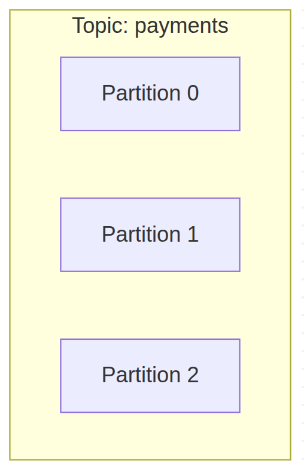

## はじめに

https://yukiotechblog.com/learning-kafka-wirh-ai-1/

それでは前回で基礎概念をざっくり理解できたので、Docker上でKafkaを動かしてみましょう

まずは公式チュートリアルからやっていきたいと思います。

[https://kafka.apache.org/quickstart](https://kafka.apache.org/quickstart)

## 環境構築

まずはtutorialで使うKafkaをDLしていきます。

[https://www.apache.org/dyn/closer.cgi?path=/kafka/4.1.0/kafka\_2.13-4.1.0.tgz](https://www.apache.org/dyn/closer.cgi?path=/kafka/4.1.0/kafka_2.13-4.1.0.tgz)

```
$ tar -xzf kafka_2.13-4.1.0.tgz
$ cd kafka_2.13-4.1.0
```

次にJVMベースのKafkaのDocker Imageをプルしていきましょう

```
$ docker pull apache/kafka:4.1.0

4.1.0: Pulling from apache/kafka
9824c27679d3: Already exists
6a46580b9894: Pull complete
57f9d6575194: Pull complete
cf466e9ba1cf: Pull complete
fb760d495f93: Pull complete
f5746fcc910a: Pull complete
60930a4e944b: Pull complete
56f63c25ccc7: Pull complete
5acb7b35446c: Pull complete
5621607a4a73: Pull complete
1e7ff3c422db: Pull complete
Digest: sha256:bff074a5d0051dbc0bbbcd25b045bb1fe84833ec0d3c7c965d1797dd289ec88f
Status: Downloaded newer image for apache/kafka:4.1.0
docker.io/apache/kafka:4.1.0
```

pullできたらdocker runしてKafkaを立ち上げます。

```
$ docker run -p 9092:9092 apache/kafka:4.1.0

===> User
uid=1000(appuser) gid=1000(appuser) groups=1000(appuser)
===> Setting default values of environment variables if not already set.
CLUSTER_ID not set. Setting it to default value: "5L6g3nShT-eMCtK--X86sw"
===> Configuring ...
===> Launching ...
===> Using provided cluster id 5L6g3nShT-eMCtK--X86sw ...

...

[2025-09-06 08:00:32,313] INFO Kafka version: 4.1.0 (org.apache.kafka.common.utils.AppInfoParser)
[2025-09-06 08:00:32,314] INFO Kafka commitId: 13f70256db3c994c (org.apache.kafka.common.utils.AppInfoParser)
[2025-09-06 08:00:32,314] INFO Kafka startTimeMs: 1757145632313 (org.apache.kafka.common.utils.AppInfoParser)
[2025-09-06 08:00:32,315] INFO [KafkaRaftServer nodeId=1] Kafka Server started (kafka.server.KafkaRaftServer)
```

## イベントを保存するためにトピックを作成する Create a topic to store your events

つぎにDBでいうところのレコードに相当するイベントを保存するために、トピックと呼ばれるスキーマ・テーブルのようなものを作成していきます。



docker runしたKafkaとは別セッションを開いてトピックを作成するshを実行していきます。

```
$ pwd
/home/user/kafka_2.13-4.1.0

$ java --version
openjdk 24 2025-03-18
OpenJDK Runtime Environment (build 24+36-3646)
OpenJDK 64-Bit Server VM (build 24+36-3646, mixed mode, sharing)

$ bin/kafka-topics.sh --create --topic quickstart-events --bootstrap-server localhost:9092

Created topic quickstart-events.
```

Kafkaのセッションの方にもログが追加で表示されました。

```
[2025-09-06 08:11:39,806] INFO [ReplicaFetcherManager on broker 1] Removed fetcher for partitions Set(quickstart-events-0) (kafka.server.ReplicaFetcherManager)

[2025-09-06 08:11:39,821] INFO [LogLoader partition=quickstart-events-0, dir=/tmp/kraft-combined-logs] Loading producer state till offset 0 (org.apache.kafka.storage.internals.log.UnifiedLog)

[2025-09-06 08:11:39,826] INFO Created log for partition quickstart-events-0 in /tmp/kraft-combined-logs/quickstart-events-0 with properties {} (kafka.log.LogManager)

[2025-09-06 08:11:39,828] INFO [Partition quickstart-events-0 broker=1] No checkpointed highwatermark is found for partition quickstart-events-0 (kafka.cluster.Partition)

[2025-09-06 08:11:39,830] INFO [Partition quickstart-events-0 broker=1] Log loaded for partition quickstart-events-0 with initial high watermark 0 (kafka.cluster.Partition)
```

kafkaのcliツールの方で作成したトピックに関する情報を表示していきます。

```
$ bin/kafka-topics.sh --describe --topic quickstart-events --bootstrap-server localhost:9092
Topic: quickstart-events        TopicId: GOoyuFQnQdiuThTSdYHPIQ PartitionCount: 1       ReplicationFactor: 1    Configs: min.insync.replicas=1,segment.bytes=1073741824
        Topic: quickstart-events        Partition: 0    Leader: 1       Replicas: 1     Isr: 1  Elr:    LastKnownElr:
```

ここから以下のような情報がわかりました。

- 作成されたトピック: quickstart-events

- パーティションの数: 1

- Leaderの数: 1

- レプリカの数: 1

まだイベントを挿入していないのでパーティションは最小の1になっているんですかね。

## トピックにイベントを書き込む Write some events into the topic

それでは作成したトピックにイベントを書き込んでいきましょう

> A Kafka client communicates with the Kafka brokers via the network for writing (or reading) events. Once received, the brokers will store the events in a durable and fault-tolerant manner for as long as you need—even forever.
> 
> Run the console producer client to write a few events into your topic. By default, each line you enter will result in a separate event being written to the topic.
> 
>   
> Kafkaクライアントは、Kafkaブローカーとネットワークを介して通信し、イベントを書き込む（または読み込む）。イベントを受信すると、ブローカーは耐久性と耐障害性に優れた方法で、必要な期間（永久でも）イベントを保存します。
> 
> コンソールのプロデューサークライアントを実行して、いくつかのイベントをトピックに書き込みます。デフォルトでは、入力した行ごとに個別のイベントがトピックに書き込まれます。

```
$ bin/kafka-console-producer.sh --topic quickstart-events --bootstrap-server localhost:9092
>This is my first event
>This is my second event
```

## イベントを読み込む

次に別セッションでコンシューマクライアントを起動してイベントを読み込んでみましょう

> Open another terminal session and run the console consumer client to read the events you just created:
> 
> ```
> $ bin/kafka-console-consumer.sh --topic quickstart-events --from-beginning --bootstrap-server localhost:9092
> This is my first event
> This is my second event
> ```
> 
> You can stop the consumer client with `Ctrl-C` at any time.
> 
> Feel free to experiment: for example, switch back to your producer terminal (previous step) to write additional events, and see how the events immediately show up in your consumer terminal.
> 
> Because events are durably stored in Kafka, they can be read as many times and by as many consumers as you want. You can easily verify this by opening yet another terminal session and re-running the previous command again.
> 
> 別のターミナルセッションを開き、コンソールコンシューマークライアントを実行して、作成したイベントを読み込む：
> 
> $ bin/kafka-console-consumer.sh --topic quickstart-events --from-beginning --bootstrap-server localhost:9092  
> これが最初のイベント  
> これが2つ目のイベント  
> コンシューマークライアントはいつでも Ctrl-C で停止できる。
> 
> 自由に実験してください：例えば、プロデューサー・ターミナル（前のステップ）に戻って追加のイベントを書き、そのイベントがすぐにコンシューマー・ターミナルにどのように表示されるかを見てください。
> 
> イベントはKafkaに永続的に保存されるため、何度でも、何人のコンシューマーでも読み込むことができる。別のターミナル・セッションを開き、前のコマンドをもう一度実行すれば、簡単に確認できる。

consumerのクライアントを立ち上げると先程作成したイベントが順番に読み込まれました。

```
# consumer session

$ bin/kafka-console-consumer.sh --topic quickstart-events --from-beginning --bootstrap-server localhost:9092

This is my first event
This is my second event
```

せっかくなので別のイベントも作成してみましょう

```
# producer session

$ bin/kafka-console-producer.sh --topic quickstart-events --bootstrap-server localhost:9092
> This is my third event
> This is my forth event
```

そうすると直ちにconsumer sessionでイベントが表示されました。

```
# consumer session

This is my third event
```

さらに別のconsumer sessionを開いてみましょう。

```
# consumer session 2

$ bin/kafka-console-consumer.sh --topic quickstart-events --from-beginning --bootstrap-server localhost:9092
This is my first event
This is my second event

This is my third event
This is my forth event
```

今まで発行されたイベントがすべて表示されました。

ブローカー側でイベントが保存されていることで、Consumerが追加された場合でもイベントを再連携できるようになっているという感じですね

## Kafka Connectを使ってデータをイベントストリームとしてインポート・エクスポートする Import/export your data as streams of events with Kafka Connect

tutorialを読みながら先に進みます。

> You probably have lots of data in existing systems like relational databases or traditional messaging systems, along with many applications that already use these systems. Kafka Connect allows you to continuously ingest data from external systems into Kafka, and vice versa. It is an extensible tool that runs connectors, which implement the custom logic for interacting with an external system. It is thus very easy to integrate existing systems with Kafka. To make this process even easier, there are hundreds of such connectors readily available.  
>   
> リレーショナル・データベースや従来のメッセージング・システムのような既存のシステムには、おそらく多くのデータがあり、これらのシステムをすでに使用しているアプリケーションも多くあります。Kafka Connectを使えば、外部システムからKafkaに継続的にデータを取り込んだり、逆に取り込んだりすることができます。Kafka Connectはコネクタを実行する拡張可能なツールで、外部システムとやり取りするためのカスタムロジックを実装します。そのため、既存のシステムをKafkaと統合するのは非常に簡単だ。このプロセスをさらに簡単にするために、このようなコネクタは何百も用意されている。

外部システムと連携するためのライブラリがあるんですね

> In this quickstart we'll see how to run Kafka Connect with simple connectors that import data from a file to a Kafka topic and export data from a Kafka topic to a file.
> 
> First, make sure to add connect-file-4.1.0.jar to the plugin.path property in the Connect worker's configuration. For the purpose of this quickstart we'll use a relative path and consider the connectors' package as an uber jar, which works when the quickstart commands are run from the installation directory. However, it's worth noting that for production deployments using absolute paths is always preferable. See plugin.path for a detailed description of how to set this config.
> 
> Edit the config/connect-standalone.properties file, add or change the plugin.path configuration property match the following, and save the file:
> 
> このクイックスタートでは、ファイルからKafkaトピックにデータをインポートし、KafkaトピックからファイルにデータをエクスポートするシンプルなコネクタでKafka Connectを実行する方法を説明します。
> 
> まず、Connect ワーカーの設定の plugin.path プロパティに connect-file-4.1.0.jar を追加してください。このクイックスタートでは相対パスを使用し、コネクタのパッケージをuber jar と見なします。しかし、本番環境では絶対パスを使用することが常に望ましいことに注意してください。この設定の詳細については plugin.path を参照してください。
> 
> config/connect-standalone.properties ファイルを編集し、plugin.path 設定プロパティを以下のように追加または変更し、ファイルを保存します：

まぁ進めましょう

コネクターを追加して、ファイルにシード値を入れていきます。

```
$ echo "plugin.path=libs/connect-file-4.1.0.jar" >> config/connect-standalone.properties

$ echo -e "foo\nbar" > test.txt
```

> 次に、スタンドアロン・モードで動作する2つのコネクタを起動します。これは、単一のローカルな専用プロセスで動作することを意味します。パラメータとして3つの設定ファイルを用意する。最初のファイルは常に Kafka Connect プロセスの設定であり、接続する Kafka ブローカーやデータのシリアライズ形式などの一般的な設定が含まれています。残りの設定ファイルは、それぞれ作成するコネクタを指定します。これらのファイルには、一意のコネクタ名、インスタンス化するコネクタクラス、およびコネクタが必要とするその他の設定が含まれます。次に、スタンドアロン・モードで動作する2つのコネクタを起動します。これは、単一のローカルな専用プロセスで動作することを意味します。パラメータとして3つの設定ファイルを用意する。最初のファイルは常に Kafka Connect プロセスの設定であり、接続する Kafka ブローカーやデータのシリアライズ形式などの一般的な設定が含まれています。残りの設定ファイルは、それぞれ作成するコネクタを指定します。これらのファイルには、一意のコネクタ名、インスタンス化するコネクタクラス、およびコネクタが必要とするその他の設定が含まれます。

ということでコネクタを起動したらログが出てきました。

```
$ bin/connect-standalone.sh config/connect-standalone.properties config/connect-file-source.properties config/connect-file-sink.pbin/connect-standalone.sh 

...

[2025-09-06 17:44:13,306] INFO [local-file-sink|task-0] [Consumer clientId=connector-consumer-local-file-sink-0, groupId=connect-local-file-sink] Resetting offset for partition connect-test-0 to position FetchPosition{offset=0, offsetEpoch=Optional.empty, currentLeader=LeaderAndEpoch{leader=Optional[localhost:9092 (id: 1 rack: null isFenced: false)], epoch=0}}. (org.apache.kafka.clients.consumer.internals.SubscriptionState:457)
[2025-09-06 17:44:20,123] INFO [local-file-source|task-0|offsets] WorkerSourceTask{id=local-file-source-0} Committing offsets for 2 acknowledged messages (org.apache.kafka.connect.runtime.WorkerSourceTask:241)
```

> These sample configuration files, included with Kafka, use the default local cluster configuration you started earlier and create two connectors: the first is a source connector that reads lines from an input file and produces each to a Kafka topic and the second is a sink connector that reads messages from a Kafka topic and produces each as a line in an output file.
> 
> During startup you'll see a number of log messages, including some indicating that the connectors are being instantiated. Once the Kafka Connect process has started, the source connector should start reading lines from test.txt and producing them to the topic connect-test, and the sink connector should start reading messages from the topic connect-test and write them to the file test.sink.txt. We can verify the data has been delivered through the entire pipeline by examining the contents of the output file:
> 
> 1つ目は入力ファイルから行を読み取り、それぞれをKafkaトピックに出力するソースコネクタで、2つ目はKafkaトピックからメッセージを読み取り、それぞれを出力ファイルの行として出力するシンクコネクタです。
> 
> 起動時には、コネクタがインスタンス化されていることを示すいくつかのログメッセージが表示されます。Kafka Connectのプロセスが開始されると、ソースコネクタはtest.txtから行を読み込んでconnect-testというトピックに出力し、シンクコネクタはconnect-testというトピックからメッセージを読み込んでtest.sink.txtというファイルに書き込む。出力ファイルの内容を調べることで、パイプライン全体を通してデータが配信されたことを確認できます：

```
$ more test.sink.txt
foo
bar
```

> Note that the data is being stored in the Kafka topic connect-test, so we can also run a console consumer to see the data in the topic (or use custom consumer code to process it):
> 
> データはKafkaトピックのconnect-testに保存されているので、コンソール・コンシューマーを実行してトピック内のデータを見ることもできる（あるいは、カスタム・コンシューマー・コードを使って処理することもできる）：

```
$ bin/kafka-console-consumer.sh --bootstrap-server localhost:9092 --topic connect-test --from-beginning

{"schema":{"type":"string","optional":false},"payload":"foo"}
{"schema":{"type":"string","optional":false},"payload":"bar"}
```

お、コンシューマープロセスでconnect-testというトピックを読み込むようにしたら、コネクター経由で連携されたんですかね

>   
> The connectors continue to process data, so we can add data to the file and see it move through the pipeline:
> 
> $ echo "Another line" >> test.txt  
> You should see the line appear in the console consumer output and in the sink file.
> 
> コネクターはデータ処理を続けるので、ファイルにデータを追加し、パイプラインを通過するのを確認できる：
> 
> echo "Another line" >> test.txt  
> コンソールのコンシューマー出力とシンクファイルに行が表示されるはずだ。

ファイルにデータ追加したら自動で連携してくれるよということですかね

```
# terminal session
$ echo "Another line" >> test.txt

# consumer session
{"schema":{"type":"string","optional":false},"payload":"Another line"}an
```

確かにConsumerセッションに連携されました。

今回の例ではファイルに追記されたらそれを連携するという形でしたが、DBとかでもできるんでしょうね

## Kafka Streamsでイベントを処理する Process your events with Kafka Streams

> Once your data is stored in Kafka as events, you can process the data with the Kafka Streams client library for Java/Scala. It allows you to implement mission-critical real-time applications and microservices, where the input and/or output data is stored in Kafka topics. Kafka Streams combines the simplicity of writing and deploying standard Java and Scala applications on the client side with the benefits of Kafka's server-side cluster technology to make these applications highly scalable, elastic, fault-tolerant, and distributed. The library supports exactly-once processing, stateful operations and aggregations, windowing, joins, processing based on event-time, and much more.
> 
> To give you a first taste, here's how one would implement the popular WordCount algorithm:
> 
> KStream textLines = builder.stream("quickstart-events");
> 
> KTable wordCounts = textLines  
> .flatMapValues(line -> Arrays.asList(line.toLowerCase().split(" ")))  
> .groupBy((keyIgnored, word) -> word)  
> .count();
> 
> wordCounts.toStream().to("output-topic", Produced.with(Serdes.String(), Serdes.Long()));  
> The Kafka Streams demo and the app development tutorial demonstrate how to code and run such a streaming application from start to finish.
> 
> * * *
> 
> 一度データがイベントとして Kafka に保存されると、Java/Scala 用の **Kafka Streams クライアントライブラリ** を使ってそのデータを処理することができます。これにより、入力データや出力データが Kafka のトピックに保存されるような、ミッションクリティカルなリアルタイムアプリケーションやマイクロサービスを実装できます。
> 
> Kafka Streams は、クライアント側で標準的な Java/Scala アプリケーションを記述・デプロイするシンプルさと、Kafka のサーバーサイドのクラスター技術のメリットを組み合わせることで、アプリケーションを **高いスケーラビリティ・弾力性・フォールトトレランス・分散性** を持ったものにします。
> 
> このライブラリは、**Exactly-Once 処理、ステートフルな操作や集計、ウィンドウ処理、結合、イベント時刻に基づく処理** など、さまざまな機能をサポートしています。
> 
> まずは雰囲気をつかむために、有名な **WordCount アルゴリズム** を実装する例を見てみましょう。
> 
> ```
> KStream textLines = builder.stream("quickstart-events");
> 
> KTable wordCounts = textLines
>     .flatMapValues(line -> Arrays.asList(line.toLowerCase().split(" ")))
>     .groupBy((keyIgnored, word) -> word)
>     .count();
> 
> wordCounts.toStream().to("output-topic", Produced.with(Serdes.String(), Serdes.Long()));
> ```
> 
> Kafka Streams のデモやアプリ開発チュートリアルでは、このようなストリーミングアプリケーションを **最初から最後までコーディングして実行する方法** を紹介しています。

ほーJava用のライブラリあるよって感じの紹介ですかね

## 次の教材

次に学ぶと良い教材についても紹介されていました。

> - Read through the brief [Introduction](https://kafka.apache.org/intro) to learn how Kafka works at a high level, its main concepts, and how it compares to other technologies. To understand Kafka in more detail, head over to the [Documentation](https://kafka.apache.org/documentation/).
> 
> - Browse through the [Use Cases](https://kafka.apache.org/powered-by) to learn how other users in our world-wide community are getting value out of Kafka.
> 
> - Join a [local Kafka meetup group](https://kafka.apache.org/events) and [watch talks from Kafka Summit](https://kafka-summit.org/past-events/), the main conference of the Kafka community.
> 
> 簡単なイントロダクションを読んで、Kafka の高レベルでの仕組み、主要な概念、そして他の技術との比較について学びましょう。Kafka をより詳しく理解するには、ドキュメントをご覧ください。  
> ユースケースを参照して、世界中のコミュニティのユーザーがどのように Kafka を活用しているかを学びましょう。  
> 地域の Kafka ミートアップグループに参加したり、Kafka コミュニティの主要なカンファレンスである Kafka Summit の講演を視聴してみましょう。

## おわりに

今回はKafkaのチュートリアルをやってみました。

手を動かしてみることで以下のことを学ぶことができました。

- トピックで論理的にイベントを分類分けできる
    - DBのスキーマやテーブルに近い概念
    
    - ファイルでいうとフォルダ的な概念

- イベントはブローカー側で永続化されるため、コンシューマーが再起動した場合は永続化されたイベントをもう一度読み込むことができる
    - 耐障害性につながる特性だなと思いました。

- Kafka以外のデータソースへの入力をKafka Connectを通して、Kafkaのブローカーに対してイベントを発行することができる

さわりのさわりという感じでしたので、次にSpringアプリケーションとしてKafkaを使うにはどうするのかを学んで、より実践的な知識を得たいと思います。
