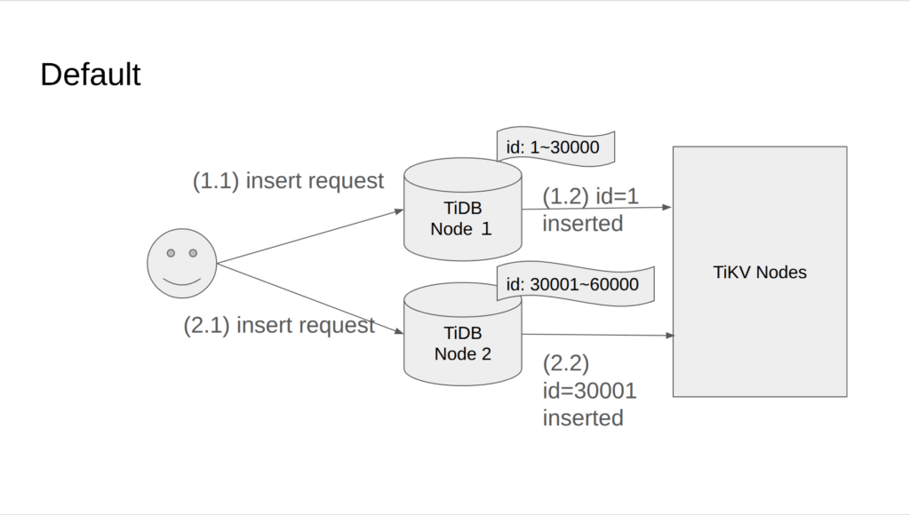
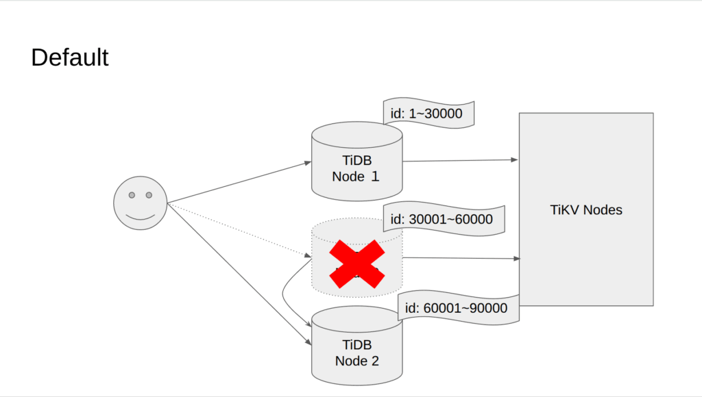
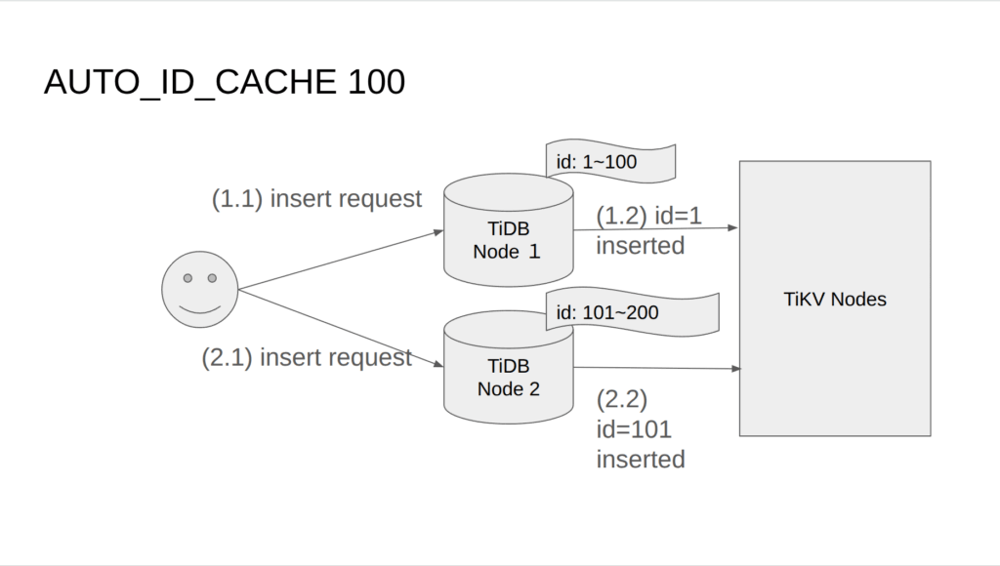
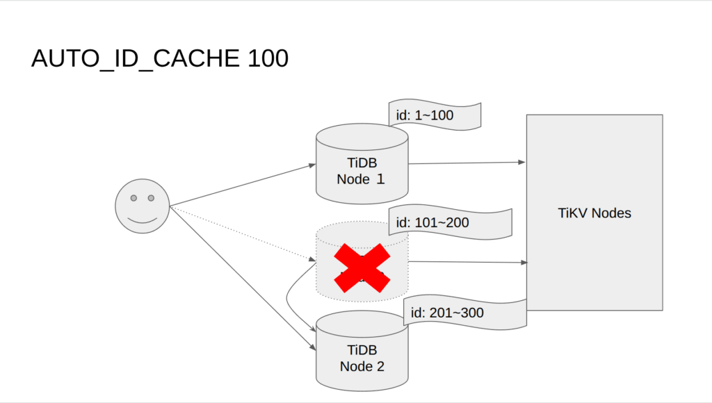
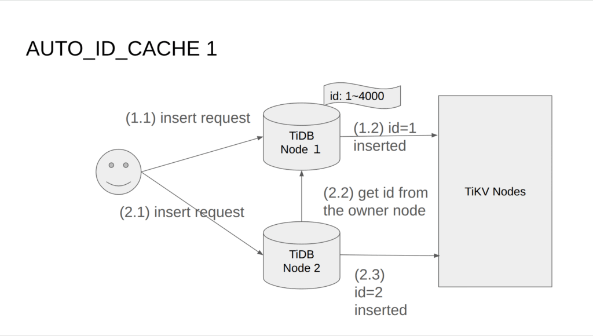
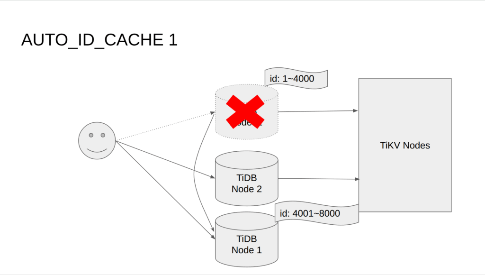

## はじめに

TiDBはクラスタ化された分散ノードが協調動作することでスケーラビリティを実現しています。

一方でスケーラビリティを重視してノードを分散させるようにしたことで、デフォルトのAUTO\_INCREMENTの動作ではIDは1, 30001, 2, 30002のように値が飛び飛びで採番されます。

本記事では分散SQLであるTiDBにおけるauto\_incrementの設定・動作例・懸念点を整理した上で、実際にローカルでTiDBを動かしながら検証を行います。

## TiDBのAUTO\_INCREMENTの概要

TiDBのauto\_incrementの基本的な概念は以下の公式ドキュメントで説明されていますが、ややこしいので改めて整理します。

[https://docs.pingcap.com/ja/tidb/stable/auto-increment](https://docs.pingcap.com/ja/tidb/stable/auto-increment)

TiDBのAUTO\_INCREMENTは主に以下の3種類存在します。

1. AUTO\_INCREMENT(デフォルト)

3. AUTO\_INCREMENT(AUTO\_ID\_CACHE 2以上を設定)

5. AUTO\_INCREMENT(AUTO\_ID\_CACHE 1設定, 通称MySQL互換モード)

### AUTO\_INCREMENT(デフォルト)

デフォルトのAUTO\_INCREMENTではクラスタ内に立ち上げているそれぞれのTiDBノードに3万ずつのIDのキャッシュが割り振られます。

```
Node 1: 1 ~ 30,000
Node 2: 30,001 ~ 60,000
```

3万という数値はautoid.goにてvar defaultStep = int64(30000)として定義されていることを確認できます。  
[https://github.com/pingcap/tidb/blob/bce559b421ad7436c05f61f6222e11cb6c01adbe/pkg/meta/autoid/autoid.go#L281](https://github.com/pingcap/tidb/blob/bce559b421ad7436c05f61f6222e11cb6c01adbe/pkg/meta/autoid/autoid.go#L281)

INSERTの実行時にアクセスしたTiDBノードが保有している採番帯に応じて番号が割り振られていくため、IDは単調増加しません。

例えばNode1とNode2に交互にINSERTがリクエストされた場合、以下のように番号が割り振られます。

```
1
30001
2
30002
```



またTiDB Serverが再起動した場合は、キャッシュを破棄して未使用のIDを3万だけ確保するので、番号が更に飛びます。

```
1
30001
2
30002

~ failover ~ 
3
60001
```



### AUTO\_INCREMENT(AUTO\_ID\_CACHE 2以上を設定)

TiDBのAUTO\_INCREMENTにはAUTO\_ID\_CACHEというパラメータが存在しており、テーブルを作成する際にノードにキャッシュするIDの数を指定できます。

```
CREATE TABLE t1 (
    id BIGINT PRIMARY KEY AUTO_INCREMENT,
    created_at DATETIME NOT NULL DEFAULT NOW()
) AUTO_ID_CACHE = 100;
```

ここでAUTO\_ID\_CACHE 100と指定した場合、各TiDB Serverノードには100ずつのIDがキャッシュされるようになります。

```
Node 1: 1 ~ 100
Node 2; 101 ~ 200
```

2ノード存在するTiDB Serverに交互にINSERTが実行された場合は以下のようにIDが割り振られます。

```
1,
101,
2,
102
```



またTiDB Serverが再起動した場合はすでに確保したキャッシュを破棄して新たにIDをAUTO\_ID\_CACHEの指定するだけキャッシュします。

```
1,
101,
2,
102,

~ failover ~

201,
3,
202,
4
```



### AUTO\_INCREMENT(AUTO\_ID\_CACHE 1設定, 通称MySQL互換モード)

最後に他の設定値と異なる挙動を見せるのが、AUTO\_ID\_CACHE 1の設定です。

この設定では1つのTiDB Serverが採番ノードに選ばれて、そのノードに4000だけIDがキャッシュされます。  

単一のノードが採番ノードとして選択されている処理は、autoid.goのNewAllocator()で利用されているnewSinglePointAlloc()というメソッドにて確認できます。  
[https://github.com/pingcap/tidb/blob/bce559b421ad7436c05f61f6222e11cb6c01adbe/pkg/meta/autoid/autoid.go#L625](https://github.com/pingcap/tidb/blob/bce559b421ad7436c05f61f6222e11cb6c01adbe/pkg/meta/autoid/autoid.go#L625)

INSERT時はどのノードにリクエストが飛んできても採番ノードを経由して採番するようになるため、IDは単調増加します。

```
1
2
3
4
```



またTiDBサーバが再起動した場合はキャッシュを破棄して、再度4000だけIDを確保するため、それだけIDが飛びます。

```
1
2
3
4

~ fail over ~

4001
4002
```



なお、この4000という謎の数についてはautoid.goのbatchという変数にて確認できます。SAさん曰く適当に決めているんじゃないかとのことです。  
  
const batch = 4000  
[https://github.com/pingcap/tidb/blob/bce559b421ad7436c05f61f6222e11cb6c01adbe/pkg/autoid\_service/autoid.go#L422-L423](https://github.com/pingcap/tidb/blob/bce559b421ad7436c05f61f6222e11cb6c01adbe/pkg/autoid_service/autoid.go#L422-L423)

単調増加性が確保されるのは良い点ですが、採番オーナーとなるノードはTiDB Clusterで1つだけとなるため、採番オーナーとなるTiDB Serverが性能上のボトルネックになります。

PingCapのSAさんによるとv8.5時点では異なるテーブル・データベースでAUTO\_ID\_CACHEを設定しても採番オーナーとなるTiDB Serverはクラスタで1つになるとのことでした。  
  
AUTO\_ID\_CACHEを乱用すると分散DBであるメリットが得られなくなるため、注意を要する設定と言えるでしょう。

### AUTO\_INCREMENT設定のまとめ

|  | 採番ノードの数 | キャッシュする番号の数 | TiDB Serevr再起動時の番号飛び | 単調増加性 | 性能懸念 |
| --- | --- | --- | --- | --- | --- |
| デフォルト | TiDB Serverノード数に一致 | 各ノードに3万ずつ | 3万 | なし |  |
| AUTO\_ID\_CACHE 1 | 1つ | 採番ノードに4000 | 4000 | あり | 採番オーナとなるTiDB Serverがボトルネックになる |
| AUTO\_ID\_CACHE 2以上 | TiDB Serverノード数に一致 | 各ノードにAUTO\_ID\_CACHE設定値だけ | AUTO\_ID\_CACHE設定値だけ | なし |  |

## 検証概要

検証の概要としては、全く同じ構成のテーブルに以下のAUTO\_INCREMENT設定を入れた上で、そのテーブルにINSERTを実行することでIDの挙動を確認します。

1. デフォルト動作

3. AUTO\_ID\_CACHE 1

5. AUTO\_ID\_CACHE 2

7. AUTO\_ID\_CACHE 0

またINSERTの実行シナリオは以下の通りです。

1. TiDB Server port=4000, 4001に交互にinsertを実行

3. TiDB Server再起動後にinsertを実行

## 検証環境

- OS: Ubuntu 24.04.2 LTS

- TiDB: v8.5.3

## TiDB環境準備

### Clusterの立ち上げ

  
まずはtiup playgroundでクラスターをローカルに立ち上げます。

```
$ tiup playground \
--tag auto_increment \
--db 2 \
--kv 1 \
--pd 1

Checking updates for component playground...
A new version of playground is available: v1.16.1 -> v1.16.4

    To update this component:   tiup update playground
    To update all components:   tiup update --all

Note: Version constraint  is resolved to v8.5.3. If you'd like to use other versions:

    Use exact version:      tiup playground v7.1.0
    Use version range:      tiup playground ^5
    Use nightly:            tiup playground nightly

Start pd instance: v8.5.3
Start tikv instance: v8.5.3
Start tidb instance: v8.5.3
Start tidb instance: v8.5.3
Waiting for tidb instances ready
127.0.0.1:4000 ... Done
127.0.0.1:4001 ... Done
Start tiflash instance: v8.5.3
Waiting for tiflash instances ready
127.0.0.1:3930 ... Done

🎉 TiDB Playground Cluster is started, enjoy!

Connect TiDB:    mysql --comments --host 127.0.0.1 --port 4001 -u root
Connect TiDB:    mysql --comments --host 127.0.0.1 --port 4000 -u root
TiDB Dashboard:  http://127.0.0.1:2379/dashboard
Grafana:         http://127.0.0.1:3000
```

### テーブル作成

次にtestデータベースに以下のテーブルを作成します。

- td: デフォルトのAUTO\_INCREMENTを設定

- t0: AUTO\_ID\_CACHE0を設定

- t1; AUTO\_ID\_CACHE1を設定

- t2: AUTO\_ID\_CACHE2を設定

```
-- Default AUTO_INCREMENT behavior
DROP TABLE IF EXISTS td;
CREATE TABLE td (
    id BIGINT PRIMARY KEY AUTO_INCREMENT,
    created_at DATETIME NOT NULL DEFAULT NOW()
);

-- AUTO_ID_CACHE = 0
DROP TABLE IF EXISTS t0;
CREATE TABLE t0 (
    id BIGINT PRIMARY KEY AUTO_INCREMENT,
    created_at DATETIME NOT NULL DEFAULT NOW()
) AUTO_ID_CACHE = 0;

-- AUTO_ID_CACHE = 1
DROP TABLE IF EXISTS t1;
CREATE TABLE t1 (
    id BIGINT PRIMARY KEY AUTO_INCREMENT,
    created_at DATETIME NOT NULL DEFAULT NOW()
) AUTO_ID_CACHE = 1;

-- AUTO_ID_CACHE = 2
DROP TABLE IF EXISTS t2;
CREATE TABLE t2 (
    id BIGINT PRIMARY KEY AUTO_INCREMENT,
    created_at DATETIME NOT NULL DEFAULT NOW()
) AUTO_ID_CACHE = 2;
```

## デフォルト動作

### TiDB Server port=4000, 4001に交互にinsertを実行

```
-- 4000port
mysql> INSERT INTO td VALUES ();

-- 4001port
mysql> INSERT INTO td VALUES ();

-- 4000port
mysql> INSERT INTO td VALUES ();

-- 4001port
mysql> INSERT INTO td VALUES ();

mysql> select * from td order by created_at asc;
+-------+---------------------+
| id    | created_at          |
+-------+---------------------+
|     1 | 2025-11-03 16:43:27 |
| 30001 | 2025-11-03 16:43:41 |
|     2 | 2025-11-03 16:43:45 |
| 30002 | 2025-11-03 16:43:47 |
+-------+---------------------+
4 rows in set (0.00 sec)
```

各ノードに3万ずつ番号がキャッシュされており、どのノードにINSERTがリクエストされるかによって割り振られる番号が異なっていることがわかります。

### TiDB Server再起動後にinsertを実行

次はTiDB Serverを再起動した後にINSERTを実行してみます。

```
-- Ctrl-Cを押してplaygroundを停止後に再度同じtagで起動する

-- 4000port
mysql> INSERT INTO td VALUES ();

-- 4001port
mysql> INSERT INTO td VALUES ();

-- 4000port
mysql> INSERT INTO td VALUES ();

-- 4001port
mysql> INSERT INTO td VALUES ();
```

selectして結果を確認してみると、3万ずつキャッシュされたIDが破棄されて新たにキャッシュしたIDから番号が割り振られていることがわかります。

```
mysql> select * from td order by created_at;
+-------+---------------------+
| id    | created_at          |
+-------+---------------------+
|     1 | 2025-11-03 16:43:27 |
| 30001 | 2025-11-03 16:43:41 |
|     2 | 2025-11-03 16:43:45 |
| 30002 | 2025-11-03 16:43:47 |
| 60001 | 2025-11-03 16:49:42 |
| 90001 | 2025-11-03 16:49:52 |
| 60002 | 2025-11-03 16:50:07 |
| 90002 | 2025-11-03 16:50:11 |
+-------+---------------------+
8 rows in set (0.00 sec)
```

## AUTO\_ID\_CACHE 1(MySQL互換モード)の動作

次にAUTO\_ID\_CACHE 1の動作を確認しましょう。

### TiDB Server port=4000, 4001に交互にinsertを実行

AUTO\_ID\_CACHE 1を設定したt1にinsertを実行していきます。

```
-- 4000port
mysql> INSERT INTO t1 VALUES ();

-- 4001port
mysql> INSERT INTO t1 VALUES ();

-- 4000port
mysql> INSERT INTO t1 VALUES ();

-- 4001port
mysql> INSERT INTO t1 VALUES ();
```

結果を確認するとIDが単調増加していることがわかります。

```
mysql> select * from t1 order by created_at asc;
+----+---------------------+
| id | created_at          |
+----+---------------------+
|  1 | 2025-11-03 16:53:20 |
|  2 | 2025-11-03 16:53:28 |
|  3 | 2025-11-03 16:53:31 |
|  4 | 2025-11-03 16:53:34 |
+----+---------------------+
4 rows in set (0.00 sec)
```

### TiDB Server再起動後にinsertを実行

こちらも同様にTiDBを再起動してinsertを実行してみます。

```
-- 4000port
mysql> INSERT INTO t1 VALUES ();

-- 4001port
mysql> INSERT INTO t1 VALUES ();

-- 4000port
mysql> INSERT INTO t1 VALUES ();

-- 4001port
mysql> INSERT INTO t1 VALUES ();
```

結果を確認すると4000番だけIDが飛びますが、その後は値が単調増加していることがわかります。

```
mysql> select * from t1 order by created_at asc;
+------+---------------------+
| id   | created_at          |
+------+---------------------+
|    1 | 2025-11-03 16:53:20 |
|    2 | 2025-11-03 16:53:28 |
|    3 | 2025-11-03 16:53:31 |
|    4 | 2025-11-03 16:53:34 |
| 4001 | 2025-11-03 16:57:07 |
| 4002 | 2025-11-03 16:57:13 |
| 4003 | 2025-11-03 16:57:29 |
| 4004 | 2025-11-03 16:57:32 |
+------+---------------------+
8 rows in set (0.00 sec)
```

## AUTO\_ID\_CACHE 2の動作

### TiDB Server port=4000, 4001に交互にinsertを実行

```
-- 4000port
mysql> INSERT INTO t2 VALUES ();

-- 4001port
mysql> INSERT INTO t2 VALUES ();

-- 4000port
mysql> INSERT INTO t2 VALUES ();

-- 4001port
mysql> INSERT INTO t2 VALUES ();

-- 4000port
mysql> INSERT INTO t2 VALUES ();

-- 4001port
mysql> INSERT INTO t2 VALUES ();
mysql> INSERT INTO t2 VALUES ();
mysql> INSERT INTO t2 VALUES ();
```

結果を確認すると、ノードごとに交互に値が割り振られていることがわかります。

```
mysql> select * from t2 order by created_at asc;
+----+---------------------+
| id | created_at          |
+----+---------------------+
|  1 | 2025-11-03 16:59:42 |
|  3 | 2025-11-03 16:59:45 |
|  2 | 2025-11-03 16:59:49 |
|  4 | 2025-11-03 16:59:54 |
|  5 | 2025-11-03 17:01:03 |
|  7 | 2025-11-03 17:01:06 |
|  8 | 2025-11-03 17:02:21 |
|  9 | 2025-11-03 17:02:23 |
| 10 | 2025-11-03 17:02:24 |
+----+---------------------+
9 rows in set (0.00 sec)
```

### 再起動後

```
-- 4000port
mysql> INSERT INTO t2 VALUES ();

-- 4001port
mysql> INSERT INTO t2 VALUES ();

-- 4000port
mysql> INSERT INTO t2 VALUES ();

-- 4001port
mysql> INSERT INTO t2 VALUES ();
```

こちらは再起動しても特に大きな変化はありませんでした。

```
mysql> select * from t2 order by created_at asc;
+----+---------------------+
| id | created_at          |
+----+---------------------+
|  1 | 2025-11-03 16:59:42 |
|  3 | 2025-11-03 16:59:45 |
|  2 | 2025-11-03 16:59:49 |
|  4 | 2025-11-03 16:59:54 |
|  5 | 2025-11-03 17:01:03 |
|  7 | 2025-11-03 17:01:06 |
|  8 | 2025-11-03 17:02:21 |
|  9 | 2025-11-03 17:02:23 |
| 10 | 2025-11-03 17:02:24 |
| 11 | 2025-11-03 17:04:14 | -- 再起動後
| 13 | 2025-11-03 17:04:19 |
| 12 | 2025-11-03 17:04:26 |
| 14 | 2025-11-03 17:04:28 |
+----+---------------------+
13 rows in set (0.00 sec)
```

## AUTO\_ID\_CACHE 0の動作

AUTO\_ID\_CACHE 0の際の動作はデフォルトのAUTO\_INCREMENTと全く変わりませんでした。

### TiDB Server port=4000, 4001に交互にinsertを実行

```
-- 4000port
mysql> INSERT INTO t0 VALUES ();

-- 4001port
mysql> INSERT INTO t0 VALUES ();

-- 4000port
mysql> INSERT INTO t0 VALUES ();

-- 4001port
mysql> INSERT INTO t0 VALUES ();
```

```
mysql> select * from t0 order by created_at asc;
+-------+---------------------+
| id    | created_at          |
+-------+---------------------+
|     1 | 2025-11-03 17:06:36 |
| 30001 | 2025-11-03 17:06:42 |
|     2 | 2025-11-03 17:06:45 |
| 30002 | 2025-11-03 17:06:49 |
+-------+---------------------+
4 rows in set (0.00 sec)
```

### 再起動後

```
-- 4000port
mysql> INSERT INTO t0 VALUES ();

-- 4001port
mysql> INSERT INTO t0 VALUES ();

-- 4000port
mysql> INSERT INTO t0 VALUES ();

-- 4001port
mysql> INSERT INTO t0 VALUES ();
```

```
mysql> select * from t0 order by created_at asc;
+-------+---------------------+
| id    | created_at          |
+-------+---------------------+
|     1 | 2025-11-03 17:06:36 |
| 30001 | 2025-11-03 17:06:42 |
|     2 | 2025-11-03 17:06:45 |
| 30002 | 2025-11-03 17:06:49 |
| 60001 | 2025-11-03 17:08:05 |
| 90001 | 2025-11-03 17:08:08 |
| 60002 | 2025-11-03 17:08:11 |
| 90002 | 2025-11-03 17:08:13 |
+-------+---------------------+
8 rows in set (0.01 sec)
```

## 検証まとめ

|  | 単調増加性 | ノードにキャッシュされるIDの数 | TiDB Server再起動時の挙動 | 動作例 |
| --- | --- | --- | --- | --- |
| デフォルト | なし | 各TiDB Serverに30,000ずつ | 古いキャッシュを破棄して30,000ずつ再度キャッシュする | 1   30001   2   30002   ~ 再起動 ~   60001   3   60002   4 |
| AUTO\_ID\_CACHE 0 | 同上 | 同上 | 同上 | 同上 |
| AUTO\_ID\_CACHE 1 | あり | 1つのTiDB Serverに4000ずつ | 古いキャッシュを破棄して再度4,000キャッシュする | 1   2   3   4   ~ 再起動 ~   4001   4002 |
| AUTO\_ID\_CACHE 2 | なし | 各TiDB Serverに2ずつ | 古いキャッシュを破棄して再度2ずつキャッシュする | 1   3   2   4   ~ 再起動 ~   5   7   6   8 |
