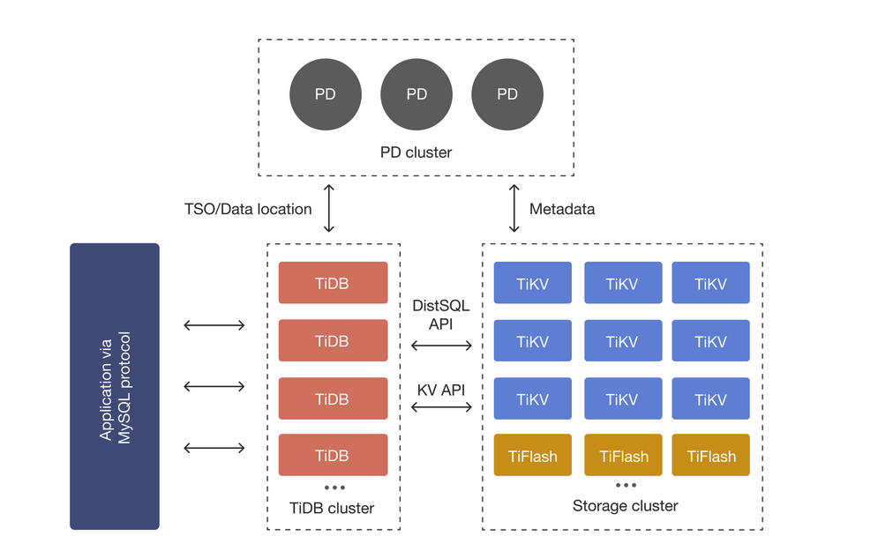
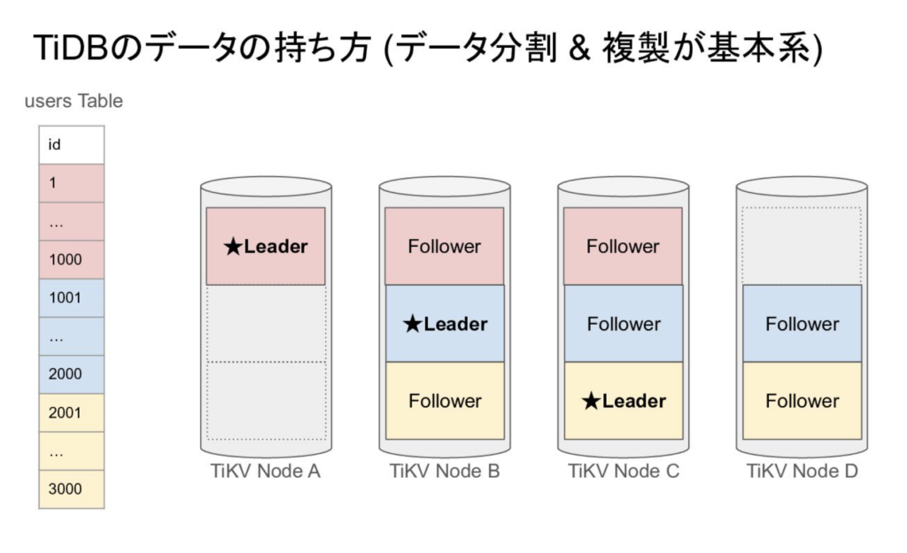

## ざっくりまとめ

1. 【前提】
    - shutdownを伴うTiDBクラスター操作には、TiDB Serverのスケールアップ/ダウン/イン、TiDB Clusterのアップグレードなどがある
    
    - TiDBではshutdownを伴う操作に対して、1ノードずつローリングアップデートする方式を取ることで、無停止でのクラスター操作を実現している

3. 【問題】
    - ただし、ノード変更中は1ノード少ない状態になるため、クラスター全体のリソースは一時的に少なくなる
    
    - それによりCPU/Memory等のリソース不足やコネクション不足を招くことがある

5. 【解決策】事前にスケールアウトしてノード数を増やすことで、クラスター全体のキャパシティを平常時より増やしておく

## TiDBのアーキテクチャ

この記事を見ている人はきっとTiDBの基本的なアーキテクチャはご存知の方が多いと思いますので、さらっとご紹介します。

TiDBは複数のインスタンスが協調動作することで処理が行われる分散システムになっています。



イメージとしてはマイクロサービスアーキテクチャに近いです。

クエリ実行時はクライアントから**「コンピュートノードであるTiDB Server」**にリクエストが飛びます。

次に、TiDB Serverで構文解析/実行計画の生成/最適化を行った後に**「ストレージノードであるTiKV Server」**にデータの読み書きのリクエストをします。

そこからTiKV内でKeyValue形式で保存されたidと行を取得し、TiDB Serverにレスポンスを返し、そこからクライアントにレスポンスを返すという流れでクエリが処理されます。

クライアント -> フロントエンド -> バックエンド -> DBという流れで処理されるマイクロサービスアーキテクチャっぽい感じですね。

[https://docs.pingcap.com/tidb/stable/tidb-architecture](https://docs.pingcap.com/tidb/stable/tidb-architecture)

## TiDBは1ノードダウンしても動き続ける

唯一のライターノードが存在するRDBと異なり、TiDBではテーブルを水平分割したグループ(region)ごとに、1つのストレージノードが読み書きのリーダーとなるかが決まっています。



そしてこのregionのデータは3つのノードに分散しているため、リーダーが死んだ場合は別のノードがリーダになることで、DBクラスター自体は無停止で動き続けられるようになります。

## ローリングアップデートによる無停止でのクラスター操作

このように1ノードが死んでも他のノードで処理を続行できるという仕組みがあるおかげで、TiDBはDBバージョンアップグレードやスケールアップ/ダウン/インなどノードを再起動しなければならない操作をクラスターを止めることなく実施できるようになっています。

具体的には、操作対象のノードを一つ選択し、そのノードに対するリクエストを遮断し、ノード変更を行うということを繰り返す「ローリングアップデート」を行なっています。

```
flowchart LR
    subgraph Clients
        C1[C1]
        C2[C2]
    end

    subgraph PC[TiProxy Nodes]
        P1[P1]
        P2[P2]
    end

    subgraph TiDB[TiDB Nodes]
        D1["D1<br/>shutdown 待機中"]
        D2[D2]
    end

    C1 ==>|tx 処理中| P1
    C2 ==>|新規tx| P2
    P1 ==>|継続tx| D1
    P2 ==>|新規tx| D2
    P1 -.->|新規txはルーティング不可| D1
```

[https://pingcap.co.jp/blog/achieving-zero-downtime-upgrades-tidb](https://pingcap.co.jp/blog/achieving-zero-downtime-upgrades-tidb)

## 一時的にノード数が減ることによる影響

「無停止でクラスター操作できて最高！」という感じがしますが、ローリングアップデート時は操作対象ノードへの新規処理のルーティングが止められるため、平時と比べて1ノード少ない状態になります。

つまりクラスターのキャパシティはアップデート前より低くなります(ここ重要)。

## 不足するのはCPU/メモリだけではない

これによりCPU/メモリのリソースが不足するということはすぐに思いつくと思うのですが、DBコネクションも同様に不足する自体が起き得ます。

そしてTiDB Serverのキャパシティが足りていても、コネクション不足は発生します。

ここで「え、TiDBって接続数の上限ないんじゃないの？」と思った、そこのあなた！

TiDB Docsを読んでいて偉いです。

TiDB DocsのLimitationsという資料にはしっかりと「Connections」は「unlimited」だと書かれています。

[https://docs.pingcap.com/ja/tidbcloud/tidb-limitations](https://docs.pingcap.com/ja/tidbcloud/tidb-limitations)


うん、ちゃんとunlimitedだと書いている。

## DB接続数の上限は普通にある

ですが、TiDB Cloud Dedicated(v8.5.5)では、普通にDB接続数の上限が`max_connections` というシステム変数で設定されます。

うん、なんで？

SAさんに話を聞いてみると、「物理的な制約は当然あるので、TiDB Serverのメモリに応じて各TiDB Serverノードのmax\_connectionsが自動設定されます」とのことでした。

DB接続数が無制限というのは、**あくまでTiDBノードを追加していけばそれに応じてクラスターの接続上限が増えていく**という話であり、それぞれのノードについては接続上限が明確に決められているという仕様がTiDB Cloud Dedicatedにはあるのでした(ドキュメントには書いていなかった😢)。

詳しい話は以下の私のブログを参照してください。

https://yukiotechblog.com/tidb-cloud-max-connection-is-not-unlimited/#toc1

## クラスター操作時は1ノード分DB接続数が少なくなる

ということでTiDB Serverのshutdownを伴うクラスター操作をすると1ノード分のDB接続数が少なくなります。

そうするとAPサーバ起動時にコネクションが取得できずに起動失敗したりといった影響が出てきます。

## shutdownを伴うクラスター操作時はスケールアウトも検討しよう

ということで、shutdownを伴うクラスター操作時はまずはノードの台数を増やした上で操作をすることで、全体としてはキャパシティが多い状態を保てるようにしましょう。

ローリングアップデートに詳しい人であれば、常識なのかもしれませんが、私は見落としていました。

解決策だけ見ると「何だそんなことか」という感じですが、意外にやらかしがちなポイントではないでしょうか。

おしまい
