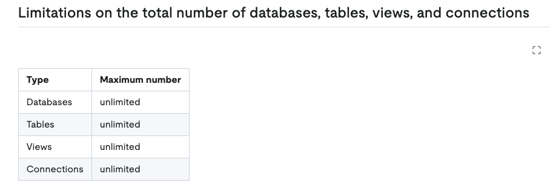
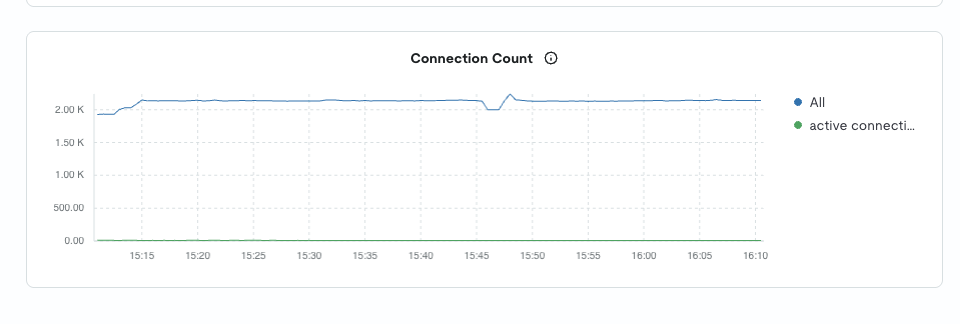
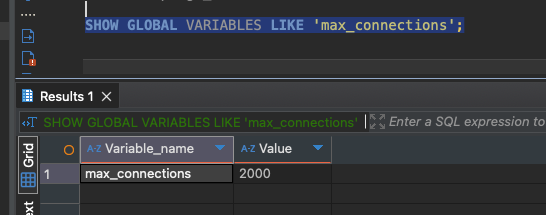

本記事は「TiDB Cloud Dedicated v8.5.5」を対象とした記事です。  
サーバレスタイプやSelf hostedタイプのTiDBとは仕様が異なる場合があります。

## TiDB Cloudの最大コネクション数の制限はunlimited

TiDB Cloudには様々な制限がありますが、最大コネクション数についてはunlimitedとあります。

[https://docs.pingcap.com/ja/tidbcloud/tidb-limitations](https://docs.pingcap.com/ja/tidbcloud/tidb-limitations)



## max\_connectionsパラメータ

unlimitedだといいつつ、1TiDBインスタンスあたりのコネクション数をパラメータ設定することが可能です。

v6.2.0まではmax-server-connectionsというパラメータで、v6.2.0以降はmax\_connectionsで指定可能だそうです。

ちなみに初期値は0とのことで、これは制限がされていないことを意味すると思われます。

> max-server-connections
> 
> - The maximum number of concurrent client connections allowed in TiDB. It is used to control resources.
> 
> - Default value: 0
> 
> - By default, TiDB does not set limit on the number of concurrent client connections. When the value of this configuration item is greater than 0 and the number of actual client connections reaches this value, the TiDB server rejects new client connections.
> 
> - Since v6.2.0, the TiDB configuration item instance.max\_connections or the system variable **max\_connections** is used to set the maximum number of concurrent client connections allowed in TiDB. max-server-connections still takes effect. But if max-server-connections and instance.max\_connections are set at the same time, the latter takes effect.

[https://docs.pingcap.com/tidb/stable/tidb-configuration-file](https://docs.pingcap.com/tidb/stable/tidb-configuration-file)

## ある日、ジョブ起動時にコネクションが貼れずにダウン

ある日、SpringBatchのジョブを起動した際に、コネクションが貼れずにSpringBootを初期化できずに起動に失敗するということがありました。

```
Caused by: org.springframework.beans.factory.UnsatisfiedDependencyException: Error creating bean with name 'dataSourceScriptDatabaseInitializer' defined in class path resource 
<div></div>
[org/springframework/boot/autoconfigure/sql/init/DataSourceInitializationConfiguration.class]: Unsatisfied dependency expressed through method 'dataSourceScriptDatabaseInitializer' parameter 0: Error creating bean with name 'dataSource' defined in class path resource 
<div></div>
[net/walletstation/batch/config/DataSourceConfig.class]: Failed to instantiate 
<div></div>
[javax.sql.DataSource]: <span style="text-decoration: underline;">Factory method 'dataSource' threw exception with message: Failed to initialize pool: Too many connections</span>
```

```
Caused by: org.springframework.beans.factory.UnsatisfiedDependencyException: Error creating bean with name 'dataSourceScriptDatabaseInitializer' defined in class path resource 

[org/springframework/boot/autoconfigure/sql/init/DataSourceInitializationConfiguration.class]: Unsatisfied dependency expressed through method 'dataSourceScriptDatabaseInitializer' parameter 0: Error creating bean with name 'dataSource' defined in class path resource 

[net/walletstation/batch/config/DataSourceConfig.class]: Failed to instantiate 

[javax.sql.DataSource]: <span style="text-decoration: underline;">Factory method 'dataSource' threw exception with message: Failed to initialize pool: Too many connections</span>
```

あれ、TiDBはコネクション数無制限じゃなかったのか、、？

## TiDB Cloud管理画面のMetricsを確認

そこでTiDB管理画面で「Connection Count」というメトリクスを確認し、どれほどの接続がDBにはられているのかを確認しました。



大体2000くらいのコネクションが貼られていることがわかります。

少なくは無いような数に見えますが、無制限という謳い文句からするとそこまで多い数には見えません。

## APサーバでは最大5~10程度

一方でジョブ側では最大接続数は5~10に設定していたため、APサーバ側でコネクションを取りすぎているというわけではなさそうでした。

## 本当にunlimitedなのか？？

「本当にmax\_connectionsはunlimitedなのか？」と思った私は以下のコマンドを実行して設定値を確認しました。

```
SHOW GLOBAL VARIABLES LIKE 'max_connections';
```

```
SHOW GLOBAL VARIABLES LIKE 'max_connections';
```

## コネクション上限の設定値は2000だった

すると、なんと設定値は2000となっていました。



うん、なんで？

## 物理的な制約は当たり前にある

ということでPingCapのSAさんに問い合わせてみたところ、以下の回答をいただきました。

1. `max_connections`はTiDB Serverインスタンスに接続可能なコネクション上限を示す。

3. ただし物理的リソース上限を超えて接続することはできない(当たり前)

5. max\_connectionsはクラスター作成時にスペックに応じた値が設定される

7. TiDB Serverノードを増やす、スケールアップすることでクラスターのコネクションキャパシティは上がる

9. そのためmax\_connectionsとしての定義域としては上限を設けない形としている

まぁ物理的なリソース制約を超えた接続はできないことは当たり前ですが、max\_connectionsがスペックに応じて設定されるのは初耳でした。

## 本番環境ではどうか？

「おいおいおい、無制限だという前提で生きていたのに、設定されてんのかーい」ということで本番環境の値も見に行きました。

そうしたら本番環境では4000に設定されていました。

利用数は500程度だったので現時点では特に問題にならなさそうではありました。

## 他社環境ではどうか？

他社環境ではどうかということでブログを漁っているとレバテックさんの記事では4000程度に設定されていたとのことでした。

https://zenn.dev/levtech/articles/connection-pooling-with-tidb

## max\_connections = 0の時は無制限

ドキュメントにもありますがmax\_connectionsが0の時は無制限として扱われます。

[https://github.com/pingcap/tidb/blob/a9f907afcbf3f4d9d073b768df08f600e0357262/pkg/server/server.go#L848](https://github.com/pingcap/tidb/blob/a9f907afcbf3f4d9d073b768df08f600e0357262/pkg/server/server.go#L848)

```
func (s *Server) checkConnectionCount() error {
	// When the value of Instance.MaxConnections is 0, 
	// the number of connections is unlimited.
	if int(s.cfg.Instance.MaxConnections) == 0 {
		return nil
	}
<div></div>
	conns := s.ConnectionCount()
<div></div>
	if conns >= int(s.cfg.Instance.MaxConnections) {
		logutil.BgLogger().Error("too many connections",
			zap.Uint32("max connections", s.cfg.Instance.MaxConnections), zap.Error(servererr.ErrConCount))
		return servererr.ErrConCount
	}
	return nil
}

```

```
func (s *Server) checkConnectionCount() error {
	// When the value of Instance.MaxConnections is 0, 
	// the number of connections is unlimited.
	if int(s.cfg.Instance.MaxConnections) == 0 {
		return nil
	}

	conns := s.ConnectionCount()

	if conns >= int(s.cfg.Instance.MaxConnections) {
		logutil.BgLogger().Error("too many connections",
			zap.Uint32("max connections", s.cfg.Instance.MaxConnections), zap.Error(servererr.ErrConCount))
		return servererr.ErrConCount
	}
	return nil
}
```

## コネクション数のチェックタイミング

コネクション数のチェックタイミングは2026/04/28時点ではセッションをオープンにしたタイミングでチェックしていそうでした。

[https://github.com/pingcap/tidb/blob/a9f907afcbf3f4d9d073b768df08f600e0357262/pkg/server/conn.go#L814](https://github.com/pingcap/tidb/blob/a9f907afcbf3f4d9d073b768df08f600e0357262/pkg/server/conn.go#L814)

```
func (cc *clientConn) openSession() error {
	var tlsStatePtr *tls.ConnectionState
	if cc.tlsConn != nil {
		tlsState := cc.tlsConn.ConnectionState()
		tlsStatePtr = &tlsState
	}
	ctx, err := cc.server.driver.OpenCtx(cc.connectionID, cc.capability, cc.collation, cc.dbname, tlsStatePtr, cc.extensions)
	if err != nil {
		return err
	}
	cc.SetCtx(ctx)
<div></div>
	err = cc.server.checkConnectionCount()
	if err != nil {
		return err
	}
	return nil
}

```

```
func (cc *clientConn) openSession() error {
	var tlsStatePtr *tls.ConnectionState
	if cc.tlsConn != nil {
		tlsState := cc.tlsConn.ConnectionState()
		tlsStatePtr = &tlsState
	}
	ctx, err := cc.server.driver.OpenCtx(cc.connectionID, cc.capability, cc.collation, cc.dbname, tlsStatePtr, cc.extensions)
	if err != nil {
		return err
	}
	cc.SetCtx(ctx)

	err = cc.server.checkConnectionCount()
	if err != nil {
		return err
	}
	return nil
}
```

## まとめ

| コネクション上限の設定項目 | max\_connections      TiDB Serverインスタンスに接続可能なコネクション上限を示す |
| --- | --- |
| コネクション上限の確認方法 | SHOW GLOBAL VARIABLES LIKE 'max\_connections'; |
| TiDB Docsにおける、「コネクション数がunlimited」が表す意味 | システム設定値の定義域として上限がないという意味。      TiDB Serverをノード追加をしていくことでクラスターの接続許容量が増えるため、システム設定値としては制限がないとされている。 |
| 実質的なコネクション上限の存在 | 当たり前だが、物理的なリソース上限を超えた接続をすることはできない |
| 初期設定されるタイミング | クラスター作成時にTiDB Serverのスペックに応じた値が設定される。 |
| TiDB Cloudにおけるmax\_connectionsの算出式 | 不明      8 vCPU 32GB x 2 NodesでTiDB Serverを建てた場合は4000だった。      一方で16GBで作成した際は2000だった。 |
| クラスター変更時の挙動 | クラスター変更時に値が変更されるのかどうかについては、問い合わせ中 |
| APサーバ起動時にコネクション不足である場合の挙動    | SpringBootではAPサーバ側のコネクションプールを初期化できずに、起動失敗する。      \[javax.sql.DataSource\]: Factory method 'dataSource' threw exception with message: Failed to initialize pool: Too many connections |
