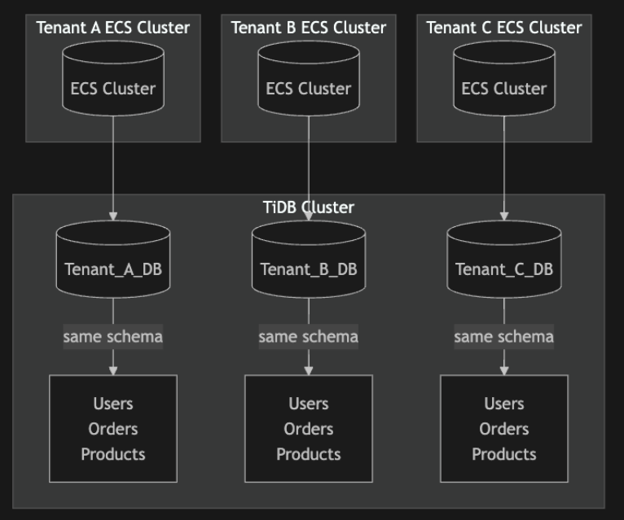
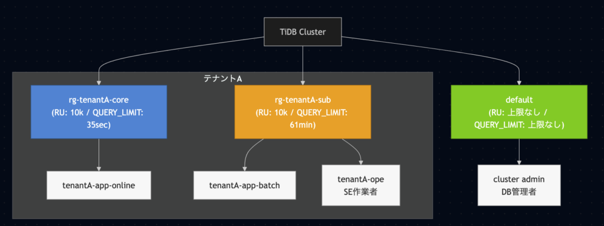

## はじめに

スケーラブルかつ高可用性・強整合性という特徴を持った分散DBであるTiDBにはユーザごとに論理的にリソース上限を設けることが可能である。

今回はリソース上限を設ける仕組みであるResource Groupの構成例について示す。

## 想定するシステム

想定しているシステムは以下のようにテナントごとにインスタンス/スキーマ分離をしているマルチテナント方式を採用しているものとする。

## スコープ外「Node Groupによるコンピュートノードのリソース分離」

TiDBクラスターはコンピュートノード(TiDB Server)とストレージノード(TiKV Server)、管理ノード(PD Server)の主に3種類のノードで構成される。

[https://docs.pingcap.com/tidb/stable/tidb-architecture](https://docs.pingcap.com/tidb/stable/tidb-architecture)

Resource GroupはこのうちストレージノードであるTiKVのリソースを分離するための機能である。

そのため、コンピュートノードについてもリソース分離をする場合はNode Groupという機能を別途利用する必要がある。

ただ、本記事はResource Groupにスコープを絞って議論したいため、以降ではNode Groupについては言及しないこととする。

TiDB Serverはステートレスなノードであるため、高負荷になった場合にすぐにスケールアウトすることで対応可能である。  
  
筆者のTiDB Cloudの環境ではTiDB Serverを1Node追加する際にかかった時間は役5分程度であった。  
  
これはTiDB Serverがステートレスなノードであり、EC2を立ち上げるだけの時間しか準備にかからないことが背景としてある。

一方でTiKV ServerはTiDB Cloudにおいては3ノードずつしかスケールアウトすることができず、またデータを持つノードであるため、スケールアウトしてから既存ノードのデータが新ノードへ転送されるまで十分なパフォーマンス改善効果は得られない。  
  
目安としてPingCap社のSAさんからはスケールアウトしてから6時間程度はデータ転送にかかるという話を伺っている。  
  
この事からリソース分離戦略を練る上でResource Groupによるストレージノードのリソース分離の方が重要度が高いと思われる。

## テナント内のノイジーネイバー問題

マルチテナント運用をする上で気をつけるべきこととしてノイジーネイバー問題がある。

例えば大規模なテナントAの処理によって、他のテナントがリソース不足になり処理に影響が及ぶといったことを防ぐ必要がある。

## 1テナント/コア・サブリソースグループ構成

そこでTiDBの機能「Resource Group」を用いてテナントごとにリソース上限を設けるようにした例が以下の図である。

アプリケーションで利用するユーザをワークロードの特性ごと(オンライン処理・バッチ処理)に分け、リソースグループについても重要度に合わせてコア/サブの2つで管理するようにしている。

想定しているシステムではオンラインの処理がコアドメインの処理として最重要のcoreリソースグループに区分けしており、バッチ処理等とリソース分離している。

またクエリーがKILLされるQUERY\_LIMITの閾値についてもResource Group単位で指定可能であるため、ここではアプリケーション側で設定しているDBのソケットタイムアウト値+@を設定値としている。

## オプション「コアのリソースグループのさらなる分割」

先ほどのリソースグループ分け以外のオプションとしてさらにコアのリソースグループを分割するということも考えられる。

例えばオンライン処理の中でもエンドユーザに提供しているAPIと管理ユーザに提供しているAPIが存在すると仮定する。

その場合、管理ユーザの処理をエンドユーザの処理からリソース分離したいとなった場合は、rg-online-end-user、rg-online-admin-userのように分けるアプローチも考えられる。

一方で、リソースグループを細かくすればするほどリソースグループ管理自体が煩雑かするため、どこまでグループ分けをするかは議論の余地がある。

## 補足「QUERY\_LIMITに到達した際の挙動」

TiDBではAPサーバ側でDBソケットタイムアウトとなったとしてもクエリーがゾンビプロセスのように残ってしまう(2026/04/01 v8.5で確認)。

そのためQUERY\_LIMITを設定して、遅くともN秒でプロセスをキルするといったことを明示的に指定する必要がある。

ここではQUERY\_LIMITをアプリケーション側で設定しているDBのソケットタイムアウト値+@に設定した場合の挙動例を示す。

- ソケットタイムアウト値: API(30sec)、バッチ(60min)

- QUERY\_LIMIT: API(35sec)、バッチ(61min)

その前提でQUERY\_LIMITに到達した際の挙動は以下の通りである。

1. ClientがAPサーバへAPIコール

3. APサーバからTiDBへSQL発行

5. ソケットタイムアウトの時間(30sec)が経過

7. APサーバ側でタイムアウトエラーが発生し、Clientにエラーレスポンスが返却される

9. QUERY\_LIMITの時間(35sec)が経過

11. TiDB側でクエリをkillする

他のRDBMSではソケットタイムアウトになった段階で同時にクエリがキルされる挙動が一般的かと思うが、TiDBではこの点についてケアする必要がある。
