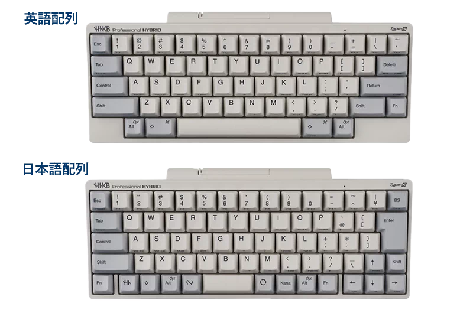
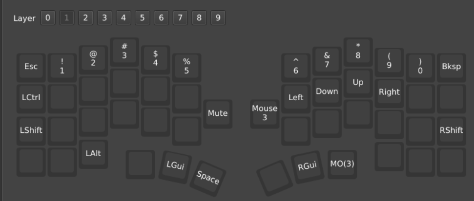
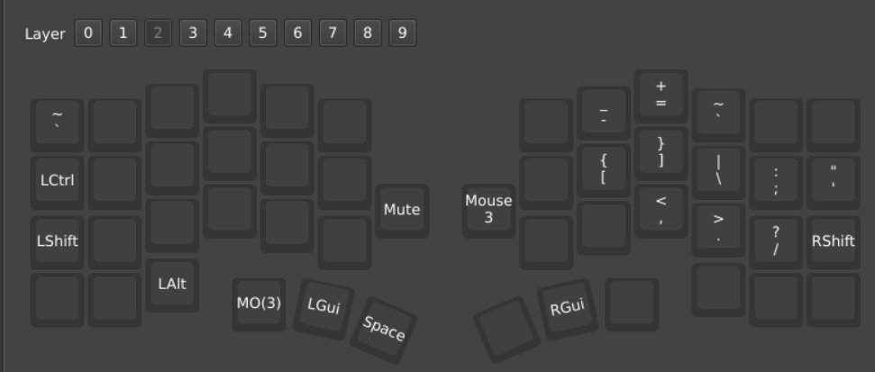
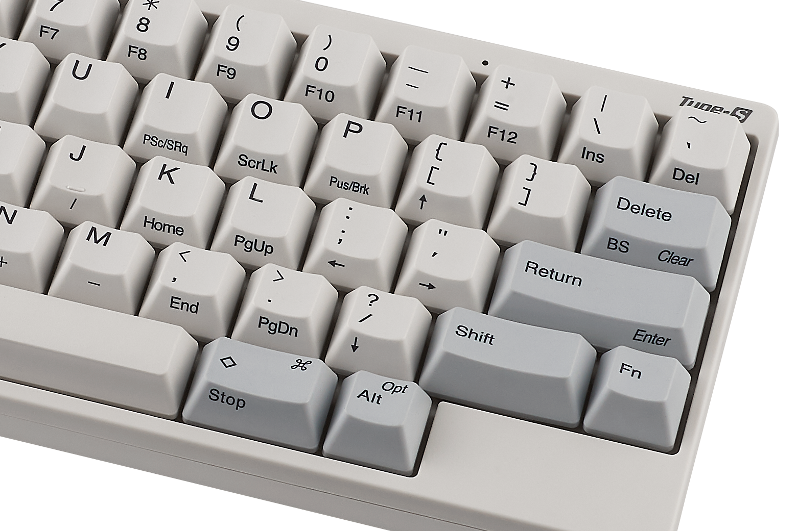

## HHKBからCornixLPにすんなり移行！とはなりませんでした

私は元々HHKBユーザでしたが、より体に優しく、見た目もHHKBに匹敵するくらいかっこいいキーボードを求めてCornixLPに行き着きました。

https://yukiotechblog.com/migration-from-hhkb-to-cornix/

ただ、スムーズに移行できたわけではなく、それなりに壁にぶつかったので、どのように乗り越えたのかを記録しておきたいと思います。

これから分割キーボードやキー数の少ないキーボードにチャレンジしてみたいという方の参考になれば嬉しいです。

## CornixLPに慣れるには様々な壁がある

CornixLPというかキー数の少ない分割キーボードを使えるようになるには様々な壁があります。

## 壁1: カラムスタッガード配列問題

### キーの縦並びが揃っている

まずCornixLPはカラムスタッガード配列という特殊なキーの並び方をしています。

通常のキーボードであれば、キーの縦方向は横にずれた並び方をしています。

例えば、HHKBを見てみるとわかると思いますが、T/G/Bのキーは少しずつ横にずれて並んでいます。

画像引用元: [HHKB, あこがれのHHKB英語配列に挑戦してみた！](https://happyhackingkb.com/jp/life/hhkb_life110.html)

一方でカラムスタッガード配列であるCornixでは縦方向のキーが揃うようにならんでいます。

### 触り続ければ数時間から数日で慣れる

このズレについて、最初の数時間はなかなか慣れませんでした。

例えば、私はHHKBではCのキーは左手の人差し指で入力していましたが、Cornixではその位置にVのキーが来るようになります。

そのため、慣れるまではタイプミスが頻発しました。

ただ、これについては数時間から数日ほど触ると慣れてくるので、心配せず使い続けてください。

## 壁2: 記号キー入力問題

### キー数の少ないCornixではレイヤーキーと組み合わせて記号入力をする

ここが最大の壁になります。

CornixLPは48キー程度にしかないため、HHKBのように数字キーや記号キー専用のキーがありません。

そのためレイヤーキーというキーを押しながら他のキーを入力することで数字や記号の入力を行います。

これが慣れないんですよね、、、

例えば、レイヤーキーを押さない場合は、Qキーはただの「Q」だけど、レイヤーキーを押すと「1」として認識されるということです。

以下スクリーンショットはレイヤー1キーを押した際の私のキーマッピングであり、最上段のキーが数字キーになっていることがわかると思います。

### 最初はデフォルトで使っていたが、全然覚えられない

最初はCornixLPのデフォルトの配置で使っていましたが、これが全然慣れませんでした、、、

キーマッピングをスクショしておき、それをチラチラカンペしながら使うみたいな感じになり、非常にしんどかったです。

### 解決策: キーの横並びをHHKB/Macbookライクに揃えることで移行差分を減らす

この移行差分を減らす方法として、「記号キーも横並びはmacbook/hhkbと揃うように配置」した所、かなり快適になりました。

以下スクショは私のレイヤー2のキーマッピングであり、`[]\`のキーの横並びの位置関係が揃っているのがわかると思います。

なお`;'`について`[]\`と横並びになってしまったのは、差分を埋めきれなかった点になります(くやしい)。

このようにすることで、ある記号キーを一つ覚えれば、そのキーの左右のキーは今まで使っていたキーボードと同じになるため、覚えるべきことが一つ減り、要領良く慣れていくことができます。

また、既存のキーボードがカンペのようになるのも地味に便利でおすすめです。

### それでも一週間はしんどい、2週間目から遅いが入力は問題なくできる

ただ、それでも最初の一週間はしんどかったですw

ここもひたすら慣れの問題ではあるので、諦めてアンラーニングするのが良いかと思います。

また、下手に既存のキーボードと併用するよりも覚悟を決めてCornixを触り続けたほうが結果としてすぐに慣れるかなと思います。

## 壁3: 矢印キー問題

### HHKB US配列の矢印キー入力は神

次の壁は矢印キーをどうするかです。

HHKB US配列はご存知の通り右下のFNキーを入力しながら、`[;'?`キーを同時押しして矢印入力する方式により、ホームポジションから大きく手を動かさずに済むようになっています。

画像引用元: [HHKB, HHKB博士に聞く！購入前に知っておきたいHHKBの基礎～配列編～](https://happyhackingkb.com/jp/life/hhkb_life16.html)

これ、めちゃくちゃ快適ですよね〜

大好きな仕様です。

### Cornixデフォルトでは右下に矢印キーがある

一方でCornixのデフォルト設定だとよくあるキーボードのように右下にある矢印キーを入力させるようになっており、入力時にホームポジションから大きく外れることになってしまいます。

通常のキーボードに慣れている人であれば、むしろこのほうが移行差分が少なくて良いのかもしれませんが、私はもっと快適に矢印入力できるようにしたいなぁと感じました。

### レイヤーキー + h/j/k/lにリマップ

そこで、レイヤーキーとh/j/k/lを合わせて、vimのキーマッピングに似せるようにしました。

HHKB US配列とは異なる形にはなりますが、ホームポジションから一歩も動かずに矢印入力できるようになりました。

慣れるとめちゃめちゃ快適です。

## 壁4: Cornixと他キーボードとのスイッチングコスト問題

最後の壁はCornixと他分割キーボードとのスイッチングコスト問題です。

### Cornixが故障した場合、すぐに移行先キーボードが手に入るとは限らない

2026年7月現在、Cornixは制限なく注文できるようになりました。

ただし、郵送は数カ月後になるとのことなので、もしCornixを1台しか持っていない場合、故障時にCornixがすぐに手に入るわけではありません。

### Cornixが販売され続けられるとも限らない

またCornixなど新興のキーボードはHHKBと異なり急に販売が終了するというのも十分考えられます。

分割キーボードというニッチなターゲット向けの商品ですので、いつ採算が取れなくなって販売終了し、手に入らなくなるかわからないと思っておいたほうが良いと思います。

### 全てのキーを使わないキーマップにする

ということで、他の分割キーボードにも移行しやすいようなキーマッピングにするのが良いのではないかと考えました。

例えば、有名な分割キーボードには以下のものがあります。

- mona2 = キー数: 42
- clow44 = キー数: 44
- Keychron Orca Echo = キー数: 49

Cornixはキー数が48キーであるので、すべて割り当てて使うようにすると他の有名な分割キーボードには移行しにくくなります。

そのため、多くとも42キーのみ使うように私はマッピングしています。

### 右親指のキーはmona2、Orca Echoのために空けておく

またmona2、Orca Echoでは右親指部分はトラックボールが配置されているのでキー数が少ないです。

そのため私はあえて、Cornixの右親指のキーを一つ使わないようにしています。

もったいない気もしますが、移行しやすくするためだと思い、このような設定にしています。

## おわりに

もっと良い方法があるかもしれませんが、今回紹介したような工夫をして使い続けることで約1ヶ月程度でCornixに慣れることができました。

もっともっとCornixや分割キーボードのユーザが増えて市場が大きくなって、様々な製品が増えると良いですね。

## おまけ: 私のCornixの配列設定ファイル

なお、私のCornixの配列設定は以下リポジトリからDLできます。

https://github.com/YukihiroArakawa/nixos-config/tree/main/backups/vial

見たい人がいればぜひ。
