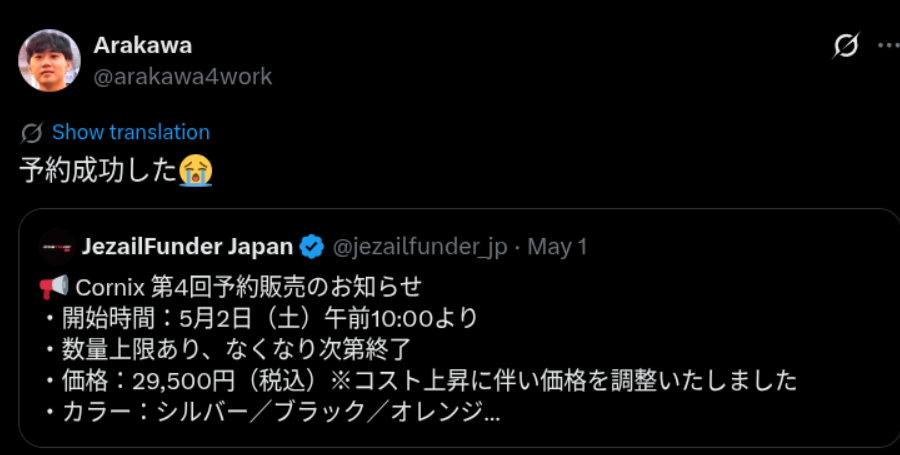
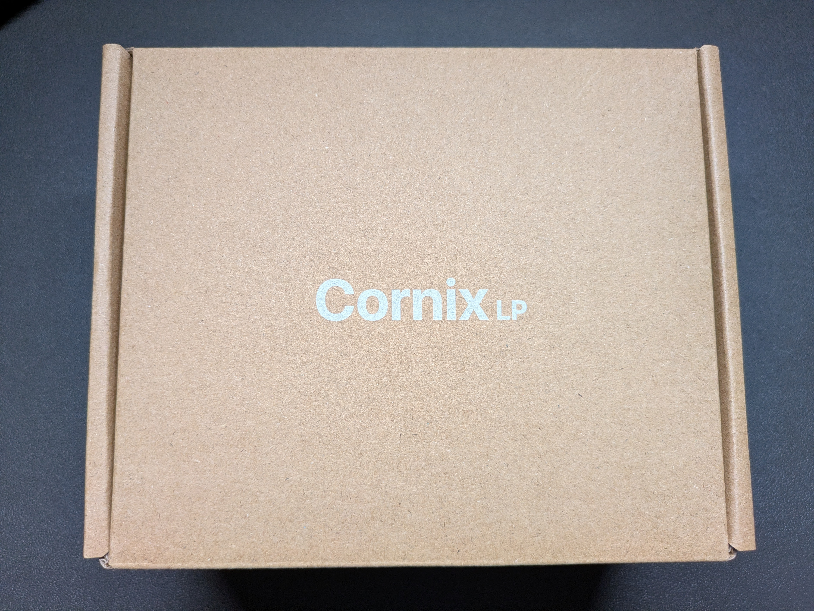
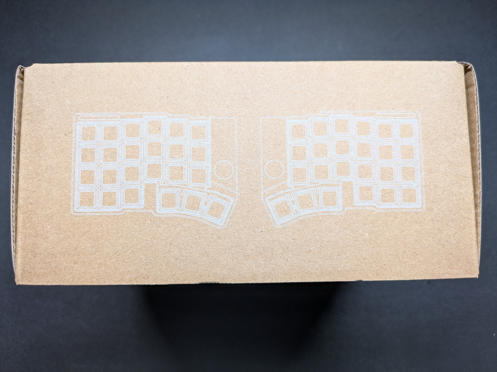
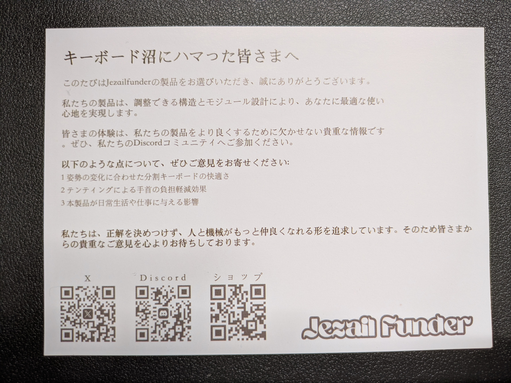

## HHKB最高！これぞ至高のキーボード

私は元々HHKBシリーズのキーボードを愛用していました。

静電容量無接点方式によるスコスコとした底打ち感のある気持ちの良い打鍵感。

深めのキーストローク。

fnキーとI/L/K/Jキーを同時押しして矢印入力する方式により、ホームポジションから大きく手を動かさずに済む無駄のなさ。

重厚かつ美しい見た目。

機能性と美しさを兼ね備えた本当にすばらしいキーボードとして気に入ってました。

自分のソフトウェアエンジニア人生を支えてくれた相棒として今でも大好きなキーボードです。

## 肩こり、眼精疲労により長時間作業ができなくなってきた

このように大好きなHHKBを使いながらソフトウェアエンジニアとしてガシガシ働いていたわけですが、年々肩こりや眼精疲労などが酷くなってきました。

元々は仕事の後に趣味でプログラミングをしたりしていましたが、段々と億劫になってきました。

その代わりに技術書を読んでインプットをする時間を増やすようになりましたが、やはりデスクでもっと開発をしてアウトプットを出したいという思いは頭の片隅にずっとありました。

## 分割キーボードの情報が次々と

そんな中、YouTubeを見ていたら、ccusage作者のryoppippiさんが「分割キーボードはいいぞ! 俺は分割キーボードがあるから1日16時間開発ができている！」と言っているのを目にしました。

https://www.youtube.com/watch?v=Ls5FmNoLLws&t

分割キーボードを使うことで肩が開くため、肩こり軽減に有効らしいということです。

「本当か？」と思いましたが、今後長いエンジニア人生を歩むうえで道具に投資をして少しでも快適に働けるようにしたいと思い、分割キーボードに関する情報を漁るようになりました。

## 分割キーボードは自分で組み立てなければいけないものが多いし、そもそも売っていない

「さぁどの分割キーボードを買おうか」と思い色々調べてみると、そもそも自分ではんだ付けして組み立てなければいけないものばかりが出てきました。

ryoppippiさんが使っているcrow44やトラックボール付きのキーボードであるmonaなど良さそうなものはありますが、それらはすべてはんだ付けを自分でしなければならないということで非常にめんどくさいなと感じました。

また、そもそもこれらのキーボードは個人が作っているものが多く人気も高いため入手困難ということで、かなりの購入ハードルの高さでした。

## どうやら完成品の分割キーボードがあるらしい

組み立てないといけないの厳しすぎる〜と思っていたら、KyoheiさんというエンジニアがCornix LPという分割キーボードを使っているという情報を目にしました。

https://www.youtube.com/watch?v=RPobvGLuwYg

なんとCornix LPは完成品ということではんだ付けが不要であり、アルミ削り出しの美しいボディに一目惚れしてしまいました。

## なんとか購入

しかし完成品かつビルドクオリティが高い分割キーボードは市場に多く出回っているわけではなく、Cornix LPもなかなか購入することができませんでした。

[JezailFunder](https://x.com/jezailfunder_jp) というCornixの販売代理店のXアカウントをフォローし、定期的に来る数量制限付きの予約販売情報を待ちながらなんとか購入することができました。

予約できた瞬間は本当に嬉しかったです。

## とにかく見た目が美しい

予約から1ヶ月後にやっと届きました。

箱の側面にはCornixのキーボードが印刷されており、開ける前からワクワクが止まりませんでした。

開封後、まずその見た目の美しさに感動しました。

薄くコンパクトでありながら、アルミ削り出しであることで安っぽさを一切感じさせない。

そして、内部部品が少しだけ透けて見えるオシャレさ。

裏側も細部に至って完成度が高いです。

## 肩こり、眼精疲労がなくなり業務後のエンジニアリングに没頭できるように

最初こそ分割キーボードやキー数の少なさに慣れませんでしたが、数週間ほど使うと元々の80%ほどのパフォーマンスは出せるようになってきました。

そして、何より嬉しかったのは、肩こりや眼精疲労が無くなったことです。

それにより業務後に開発を行えるようになり、毎日が非常に楽しいです。

このブログも元々はレンタルサーバー上にホスティングしてWordPressで作っていましたが、Cloudflare Pagesにインフラを移行してアプリケーション側はSvelteに作り変えるところまでやってしまいました。

プログラミング始めたての時のような無心で物を作る楽しさが生活に戻ってきました。

## ケンジントンの大玉トラックボールと一緒に愛用

そして、一ヶ月ほどCornixを利用した現在は、ケンジントンの大玉トラックボールをCornixの内側におくスタイルに落ち着いています。

Cornixの内側に配置することで、分割キーボードは自然な肩幅で操作できる位置に配置し、必要なときだけトラックボールでマウス操作するようにしています。

## キーボード沼への誘い

というわけで、HHKBで完全に抜けたと思っていたキーボード沼にまんまと戻ってきてしまいました。

2026年はkeychronからもorca echoというキーボードが発売されるようですし、しばらくキーボードに使うお金が増えそうです。

分割キーボード界隈がもっと盛り上がって完成度の高い製品がすぐに手に入るようになってほしいので、お金を惜しまず色々試していこうかなと思います。

以上。
