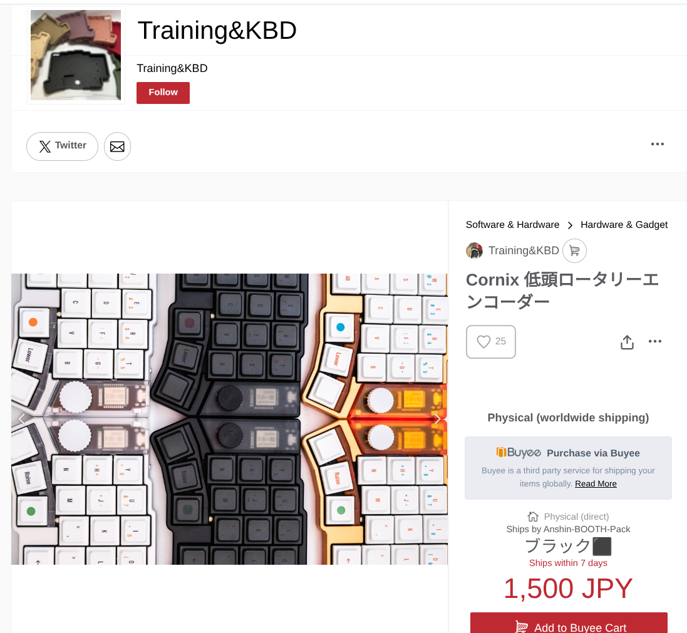
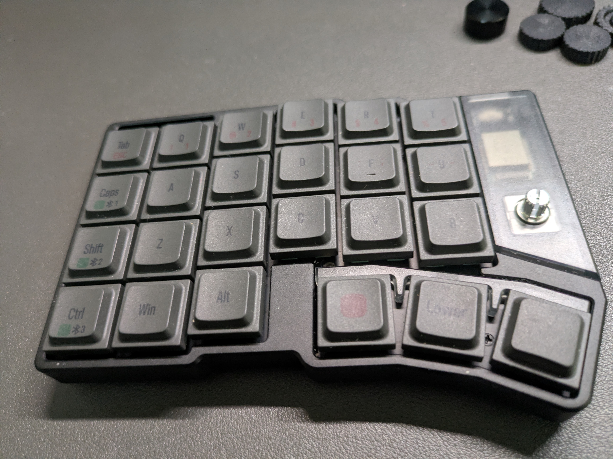

## Cornixの入力体験は大満足

Cornix LPに入門して、はや2ヶ月。

すっかり慣れきって「もう、分割式以外ありえない！」というくらいキー数が少ない分割キーボードの良さを知ることができました。

コトコトとした打鍵感もいいですし、ホームポジションを崩さずに数字入力ができるのも最高で、左右のキーボードについているロータリーエンコーダで音量/画面の明るさ等をスムーズに上下できるのも地味に便利です。

## Cornixのロータリーエンコーダがガジェットポーチに引っかかる

一方でCornixを運搬する際に地味に悩みがあります。

それが、「ガジェットポーチにしまう際、ロータリーエンコーダが邪魔」という問題です。

Cornixは超かっこいい見た目をしており、中でも金属製のロータリーエンコーダもかなり渋くてcoolです。

ただ、そのロータリーエンコーダがキーボードのキーよりも高くなっているため、Cornixの底面をくっつけてポーチにしまう際にロータリーエンコーダがポーチから出っ張る感じがあり、あまり美しい状態ではありませんでした。

## 低頭ロータリーエンコーダを購入

ということで、低頭のロータリーエンコーダを導入しました。

BOOTHというサイトで「Training&KBD」という方から購入しました。

https://training-kbd.booth.pm/items/8590370

送料込みで1700円ほどかかりました。

ロータリーエンコーダ4つで1700円ということでお安い値段設定ではありませんが、試行錯誤しながら3Dプリントするのは面倒そうだったので、ありがたく購入させていただきました。

大小2セット入っており1個あたり400円くらいなのでむしろ安く感じてきました(?)。

## デフォルトのロータリーエンコーダを外す

ロータリーエンコーダをどうやって外すのか、めっちゃ迷ったのですが、キープラーを使って思い切って引き抜いたら外れました。

結構力を使って引き抜いたので、壊れないか心配になりましたが、外れました。

改めて引き抜かれたデフォルトのロータリーエンコーダを眺めてみると美しいですね。

金属筐体が光に反射して扇状に見えます。

## 装着

さっそく小サイズ、大サイズをそれぞれ装着してみたところ、大サイズはエンコーダを回しやすそうではあるものの打鍵中に触ってしまいそうなサイズ感だったので、ひとまず私は小サイズで運用することにしました。

## ガジェットポーチにもいい感じに収まっている

コクヨのハコビズという自立するスマートなガジェットポーチにもすっぽりと収まりました。

チャックを閉じると若干膨らんでいるように見えますが、これはデフォルト状態のCornixをしまっていたことでできた癖だと思われるため、実際はそこまでの出っ張り感はありません。

## おわりに

低頭ロータリーエンコーダに変更してみましたが、なかなかに良いです。

KeychronのOrca Echoを持ち運び用に予約注文しました。それが届くまではCornixを持ち運ぶことが多いため、低頭ロータリーエンコーダが大活躍しそうです。

作者の方、ありがとうございます。
